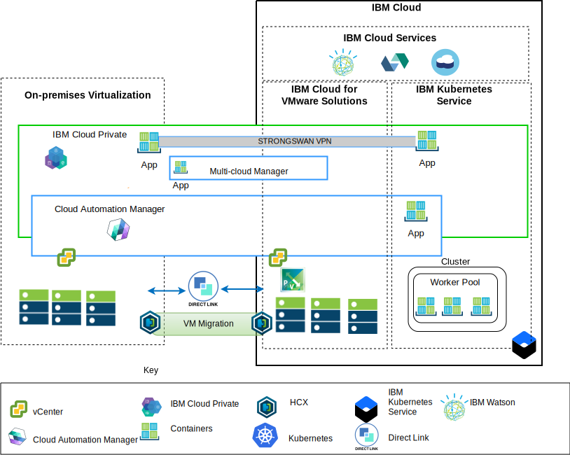

---

copyright:

  years:  2016, 2019

lastupdated: "2019-02-15"

---

# Architecture overview
{: #vcsiks-arch-overview}

The {{site.data.keyword.vmwaresolutions_full}} offerings provide automation to deploy VMware technology components in {{site.data.keyword.CloudDataCents_notm}} across the globe. The architecture consists of a single cloud region and supports the ability to extend into more cloud regions that are located in another geography or into another {{site.data.keyword.cloud_notm}} pod within the same data center.

You can manually deploy the {{site.data.keyword.icpfull_notm}} and Cloud Automation Manager (CAM) products into your on-premises virtualization platform,
enabling cloud management from on-premises locations. Alternatively, {{site.data.keyword.icpfull_notm}}
and CAM are offered as service extensions to an existing or new VMware
vCenter Server on {{site.data.keyword.cloud_notm}} deployment, via automation, enabling
cloud management from {{site.data.keyword.cloud_notm}}.

{{site.data.keyword.icpfull_notm}} is an application platform for developing and managing on-premises,
containerized applications. {{site.data.keyword.icpfull_notm}} is an integrated environment for managing
containers that includes the container orchestrator Kubernetes, a
private image repository, a management console, and monitoring
frameworks.

IBM Multi-Cluster Manager provides user visibility, application-centric
management (policy, deployments, health, operations), and policy-based
compliance across clouds and clusters. With IBM Multi-Cluster Manager,
you have control of your Kubernetes clusters. You can ensure that your
clusters are secure, operating efficiently, and delivering the service
levels that applications expect.

{{site.data.keyword.cloud_notm}} Automation Manager is a multi-cloud, self-service management
platform that runs on {{site.data.keyword.cloud_notm}} Private that empowers Developers and
administrators to meet business demands. Cloud Automation Manager
Service Composer allows you to expose hybrid cloud services in the IBM
Cloud Private catalog.

## IBM Cloud side cloud management platform
{: #vcsiks-arch-overview-ibm-cloud-side}

The following diagram displays {{site.data.keyword.icpfull_notm}} and CAM deployed with the {{site.data.keyword.cloud_notm}}
infrastructure, with connections to the on-premises vCenter and {{site.data.keyword.containerlong_notm}} service deployed on {{site.data.keyword.cloud_notm}}. Users can deploy virtual machines (VMs) on-premises and VMs into vCenter Server
instances and containers to the {{site.data.keyword.icpfull_notm}} and {{site.data.keyword.containerlong_notm}} cluster.

Figure 1. Cloud management from cloud side

In the diagram, CAM logically creates cloud connections to the vCenters,
cloud providers, {{site.data.keyword.icpfull_notm}}, and {{site.data.keyword.containerlong_notm}} environments. {{site.data.keyword.icpfull_notm}} Clusters must be
deployed to each data center or cloud environment, with MCM providing the
mechanism to connect the {{site.data.keyword.icpfull_notm}} clusters into a single management view.

{{site.data.keyword.icpfull_notm}} can be deployed with NSX-V or NSX-T components. {{site.data.keyword.icpfull_notm}} with NSX-V,
enables the {{site.data.keyword.icpfull_notm}} VMs to run on the VXLAN network and use
Kubernetes Calico internal networking.

{{site.data.keyword.icpfull_notm}} with NSX-T, allowing users to control and configure networking,
subnet, policies from central UI (NSX-T Manager). For information about the differences between NSX-V and NSX-T, see the [{{site.data.keyword.cloud_notm}} VCS Networking reference architecture](/docs/services/vmwaresolutions/archiref/
vcsnsxt/vcsnsxt-intro.html).

## On-premises cloud management platform
{: #vcsiks-arch-overview-on-premises}

The following diagram displays {{site.data.keyword.icpfull_notm}} and CAM deployed in the on-premises
infrastructure, with connections to the vCenter and {{site.data.keyword.containerlong_notm}} deployed on {{site.data.keyword.cloud_notm}}. Users can deploy VMs and containers
on-premises, VMs into vCenter Server instances and containers
to the {{site.data.keyword.containerlong_notm}} cluster.

Figure 2. Cloud management from on-premises side

The strongSwan VPN is used to established connectivity with the deployed
{{site.data.keyword.containerlong_notm}} containers. strongSwan eventually might be replaced with Direct-link
connectivity.

In the diagram, CAM logically creates cloud connections to the vCenters,
cloud providers, {{site.data.keyword.icpfull_notm}}, and {{site.data.keyword.containerlong_notm}} environments. {{site.data.keyword.icpfull_notm}} clusters must be
deployed to each data center or cloud environment, with MCM providing the
mechanism to connect the {{site.data.keyword.icpfull_notm}} clusters into a single management view.

## Related links
{: #vcsiks-arch-overview-related}

* [vCenter Server on {{site.data.keyword.cloud_notm}} with Hybridity Bundle overview](/docs/services/vmwaresolutions/archiref/vcs?topic=vmware-solutions-vcs-hybridity-intro)
