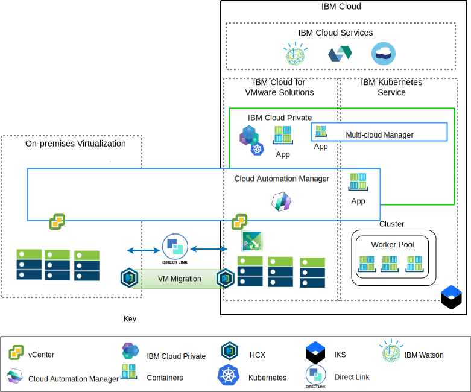

---

copyright:

  years:  2016, 2018

lastupdated: "2018-10-30"

---

# Architecture overview
The IBM Cloud for VMware offerings provide automation to deploy VMware
technology components in IBM Cloud data centers across the globe. The
architecture consists of a single cloud region and supports the ability
to extend into more cloud regions that are located in another
geography and/or into another IBM Cloud pod within the same data center.

The IBM Cloud Private (ICP) and Cloud Automation Manager (CAM) products
can be manually deployed into your on-premises virtualization platform,
enabling cloud management from on-premises locations. Alternatively, ICP
and CAM are offered as service extensions to an existing or new VMware
vCenter Server on IBM Cloud (VCS) deployment, via automation, enabling
cloud management from IBM Cloud.

ICP is an application platform for developing and managing on-premises,
containerized applications. It is an integrated environment for managing
containers that includes the container orchestrator Kubernetes, a
private image repository, a management console, and monitoring
frameworks.

IBM Multi-Cluster Manager provides user visibility, application-centric
management (policy, deployments, health, operations), and policy-based
compliance across clouds and clusters. With IBM Multi-Cluster Manager,
you have control of your Kubernetes clusters. You can ensure that your
clusters are secure, operating efficiently, and delivering the service
levels that applications expect.

IBM Cloud Automation Manager is a multi-cloud, self-service management
platform running on IBM Cloud Private that empowers developers and
administrators to meet business demands. Cloud Automation Manager
Service Composer allows you to expose hybrid cloud services in the IBM
Cloud Private catalog.

## IBM Cloud side cloud management platform

Figure 1. Cloud management from cloud side

The above diagram represents ICP and CAM deployed with the IBM Cloud
infrastructure, with connections to the on-premises vCenter and IBM
Kubernetes Service (IKS) service deployed on IBM Cloud. Users are able
to deploy virtual machines on-premises and virtual machines into VCS
instance and containers to the ICP and IKS cluster.

In the diagram, CAM logically creates cloud connections to the vCenters,
cloud providers, ICP, and IKS environments. ICP Clusters should be
deployed to each data center/cloud environment, with MCM providing the
mechanism to connect the ICP clusters into a single management view.

ICP can be deployed with NSX-V or NSX-T components. ICP with NSX-V,
enables the ICP virtual machines to run on the VXLAN network and utilize
Kubernetes Calico internal networking.

ICP with NSX-T, allowing users to control and configure networking,
subnet, policies from central UI (NSX-T Manager). Visit the [IBM Cloud
VCS Networking reference architecture](../vcsnsxt/vcsnsxt-intro.html)
for the differences between NSX-V and NSX-T.

## On-premises cloud management platform

Figure 2. Cloud management from on-premises side

The above diagram represents ICP and CAM deployed in the on-premises
infrastructure, with connections to the vCenter and IKS deployed on IBM
Cloud. Users are able to deploy virtual machines and containers
on-premises, virtual machines into vCenter Server instance and containers
to the IKS cluster.

The strongSwan VPN is used to established connectivity with the deployed
IKS containers, eventually this might be replaced with Direct-link
connectivity.

In the diagram, CAM logically creates cloud connections to the vCenters,
cloud providers, ICP, and IKS environments. ICP clusters should be
deployed to each data center/cloud environment, with MCM providing the
mechanism to connect the ICP clusters into a single management view.

### Related links

* [VCS Hybridity Bundle overview](../vcs/vcs-hybridity-intro.html) 
