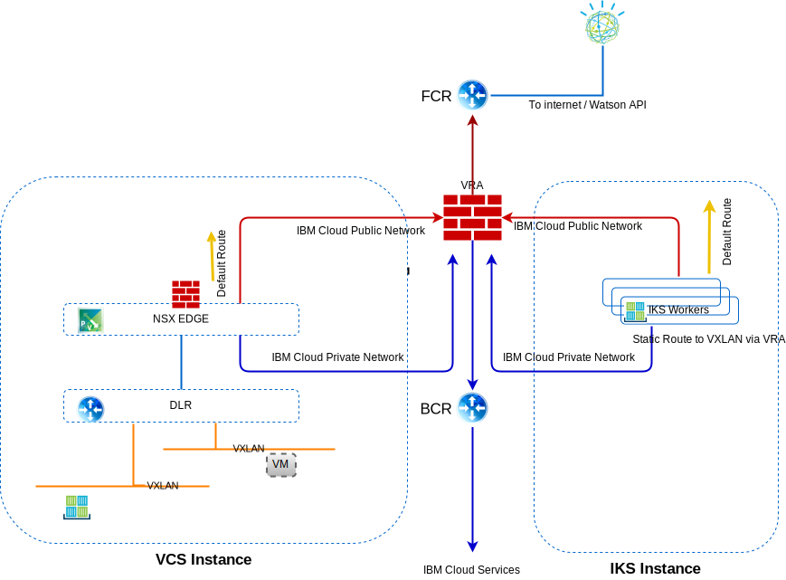

---

copyright:

  years:  2016, 2019

lastupdated: "2019-02-15"

---

# Networking, backup, disaster recovery, and scalability
{: #vcsiks-overview-network}

## Networking
{: #vcsiks-overview-network-networking}

{{site.data.keyword.cloud}} has two networks. The public network allows servers to be reached from the internet and the private network allows servers to communicate with each other over a high-speed backbone in all {{site.data.keyword.CloudDataCents_notm}}.

By default, {{site.data.keyword.containerlong_notm}} sets up the cluster with access to a public VLAN and a private VLAN.
- A public IP address for each worker node, which gives worker nodes a public network interface.
  - All outbound network traffic is allowed for all worker nodes.
  - Inbound network traffic is blocked except for a few ports. These ports are opened so that IBM can monitor network traffic and automatically install security updates for the Kubernetes master.
- A private IP address for each worker node, which gives worker nodes a private network interface
- An automatic, secure OpenVPN connection between all worker nodes and the master node

Figure 1. vCenter Server and {{site.data.keyword.containerlong_notm}} network

### IBM Cloud Kubernetes Service and vCenter Server integration
{: #vcsiks-overview-network-iks-vcs-integration}

Currently, the following scenarios integrate {{site.data.keyword.containerlong_notm}} and VMware vCenter Server on {{site.data.keyword.cloud_notm}} networking:
- **VRA Routing** - This scenario requires that the {{site.data.keyword.containerlong_notm}} worker nodes are deployed onto the same VLAN as the vCenter Server instance. This allows an ESG to be BGP peered with VRA and enable routing from the overlay to the underlay network between vCenter Server and {{site.data.keyword.containerlong_notm}}. A static route is needed on the {{site.data.keyword.containerlong_notm}} worker nodes for each VXLAN network to route these requests back to the BCR/VRA to correctly route.
- **strongSwan VPN** – This scenario uses the standard {{site.data.keyword.containerlong_notm}}-to-enterprise connectivity solution. A strongSwan container provides a VPN gateway for the cluster that forwards packets to remote networks across an IPSec
tunnel to the remote gateway. This remote gateway is an ESG on the vCenter Server instance. On the gateways, routes are configure sending all cluster and service IP ranges to the StrongSwan container and all vCenter Server BYOIP addresses to the ESG. The target IP addresses for the gateways are the private portable IP address of the load balancer service that is assigned to the strongSwan container and the private portable IP address of the ESG.

#### IBM Cloud Kubernetes Service networking VLANs
{: #vcsiks-overview-network-iks-vlans}

The following information applies to public VLAN subnets:
- The primary public subnet determines the public IP addresses that are assigned to worker nodes during cluster creation. Multiple clusters in on the same VLAN can share one primary public subnet.
- The portable public subnet is bound to one cluster only and provides the cluster with eight public IP addresses. Three IPs are reserved for network functions. One IP is used by the default public Ingress ALB and four IPs are used to create public load balancer networking services.
- Portable public IPs are permanent, fixed IP addresses that are used to access load balancer services over the internet.

The following information applies to private VLAN subnets:
- The primary private subnet determines the private IP addresses that are assigned to worker nodes during cluster creation. Multiple clusters in on the same VLAN can share one primary private subnet.
- The portable private subnet is bound to one cluster only and provides the cluster with eight private IP addresses. Three IPs are reserved for network functions. One IP is used by the default private Ingress ALB and four IPs are used to create private load balancer networking services.
- Portable private IPs are permanent, fixed IP addresses that are used to access load balancer services over the internet.

#### Calico network plugin
{: #vcsiks-overview-network-calico}

Every Kubernetes cluster is set up with a network plug-in called Calico.

Default network policies are set up to secure the public network interface of every worker node in the {{site.data.keyword.containerlong_notm}}. If you have unique security requirements or you have a multizone cluster with VLAN spanning enabled, you can use Calico and Kubernetes to create network policies for a cluster. With Kubernetes network policies, you can specify the network traffic that you want to allow or block to and from a pod within a cluster. 

To set more advanced network policies such as blocking inbound (ingress) traffic to LoadBalancer services, use Calico network policies.

Kubernetes network policies specify how pods can communicate with other pods and with external endpoints. Traffic can also be filtered based on pod and namespace labels. Kubernetes network policies are applied by using kubectl commands or the Kubernetes APIs. When these policies are applied, they're automatically converted into Calico network policies and Calico enforces these policies.

Calico network policies for Kubernetes are a superset of the Kubernetes network policies and are applied by using calicoctl commands.

Calico policies add the following features:
- Allow or block network traffic on specific network interfaces regardless of the Kubernetes pod source or destination IP address or CIDR.
- Allow or block network traffic for pods across namespaces.
- Block inbound (ingress) traffic to LoadBalancer or NodePort Kubernetes services.

Calico enforces these policies, including any Kubernetes network policies that are automatically converted to Calico policies, by setting up Linux iptables rules on the Kubernetes worker nodes. Iptables rules serve as a firewall for the worker node to define the characteristics that the network traffic must meet to be forwarded to the targeted resource.

### Traffic flows
{: #vcsiks-overview-network-traffic-flows}

#### External user on the internet to a web tier hosted in a container in IBM Cloud Kubernetes Service
{: #vcsiks-overview-network}

1. The external user makes a request to the web tier by using the URL.
2. DNS is used to determine the IP address. This IP address is an {{site.data.keyword.cloud_notm}} public address on a portable subnet that is assigned to the ALB or Ingress Service.
3. The public network automatically forwards the request to worker node hosting the ALB or Ingres Service.
4. The worker node forwards the request to the internal cluster IP address and port number of the ALB or Ingress Service. This internal cluster IP address is accessible inside the cluster only.
5. Within the worker node, kube-proxy routes the request to the ALB or Ingress Service.
6. If the application is on the same worker node, then iptables is used to determine which internal interface is used to forward the request. If the app is on a different worker node, then the Calico vRouter routes to the applicable worker node, by using IP-in-IP encapsulation only if the worker node is on a different subnet.

#### Web tier hosted in a container in IBM Cloud Kubernetes Service to database tier hosted in a virtual machine in vCenter Server
{: #vcsiks-overview-network-web-tier}

Endpoint resources are created that detail external database virtual machines (VMs) that include the NAT IP address and port number of the mysql database VMs, for example.

- kind: Endpoints
- apiVersion: v1
- metadata:
  - name: mysqldb
- subsets:
  - addresses:
      - ip: 10.x.x.x
  - ports:
      - port: 3306

The Endpoint resource can have several addresses that are listed, and Kubernetes will round-robin between those addresses.  

Service resources are used to create an IP and a DNS name in kube-dns for services:

- kind: Service
- apiVersion: v1
- metadata:
  - name: mysqldb
- labels:
  - name: mysqldb
- spec:
  - ports:
    - protocol: TCP
    - port: 3306

#### Flow
{: #vcsiks-overview-network-flow}

1. The web tier running in a container in {{site.data.keyword.containerlong_notm}} makes a request to the database running on a VM in the vCenter Server instance by calling mysqldb. Kubernetes resolves this name to an IP address and send this request out of the cluster with a destination IP address of the NAT'ed IP of the database server (10.x/26) and a source IP of the worker node (10.x/26).
2. As the destination IP address isn't on the same subnet as the worker node, it is forwarded to the {{site.data.keyword.cloud_notm}} BCR.
3. The BCR routes the request and place the request on the **Private A** VLAN, Customer Workloads subnet, on which the customer-nsx-edge is connected.

This NSX Edge has:
- Firewall rule that allows this connection.
- DNAT rule that changes the destination IP address from the 10.x address to the 192.168 address used for the database server.
4. The ESG then forwards to the DLR.
5. The DLR places the request onto the required VXLAN.
6. The database VM receives the request.

## Backup and DR
{: #vcsiks-overview-network-backup-dr}

### vCenter Server backup
{: #vcsiks-overview-network-vcs-backup}

As part of {{site.data.keyword.vmwaresolutions_short}}, Veeam backup software is
optionally deployed on an {{site.data.keyword.cloud_notm}} virtual server instance (VSI) that uses
{{site.data.keyword.cloud_notm}} Endurance storage outside the VMware cluster. The purpose of
this software is to back up the management components in this solution.

### NSX backup
{: #vcsiks-overview-network-nsx-backup}

Proper backup of all NSX components is crucial to restore the system to
its working state if failure occurs. It isn't sufficient to back up the
NSX VMs. The NSX backup function within the NSX manager must be employed
for a proper backup. This backup requires that an FTP or SFTP server is
specified for the repository of NSX backup data. The NSX Manager backup
contains all of the NSX configuration, including controllers, logical
switching and routing entities, security, firewall rules, and everything
else that you configure within the NSX Manager UI or API. The vCenter
database and related elements like the virtual switches are backed up
separately. The NSX configuration must be backed up along with a
vCenter backup.

### Backup and DR for IBM Cloud Kubernetes Service
{: #vcsiks-overview-network-backup-dr-iks}

Backups of the etcd database are provided to the customer as part of the
managed service, any application data must be backed by yourself.

## Scalability
{: #vcsiks-overview-network-scalability}

### vCenter Server scalability
{: #vcsiks-overview-network-vcs-scalability}

After the deployment of the initial hosts, the user can
scale out the compute capacity from within the {{site.data.keyword.vmwaresolutions_short}}
portal. This scale out of the environment follows one of three paths:
- Addition of new sites managed by separate vCenter Servers.
- Addition of new clusters.
- Addition of new hosts to an existing cluster.

#### Multi–site deployments
{: #vcsiks-overview-network-multi-site}

VMware on {{site.data.keyword.cloud_notm}} can use IBM Cloud’s world–wide data center presence
and integrated network backbone to allow for various cross–geography use
cases to be deployed and functioning within a fraction of the time it
would take to build such an infrastructure from scratch.

#### Scale out with new cluster
{: #vcsiks-overview-network-scale-out-new-cluster}

The user can also scale out the compute capacity by creating a new
cluster from within the console, ordering the hosts, and the new hosts
are automatically added to the new cluster. This option creates an extra
cluster in the environment and gives users the ability to physically and
logically segregate management workloads from application workloads, the
ability to segregate workloads based on other characteristics (for
example, Microsoft SQL database cluster), and the ability to deploy
applications in highly available topologies.

#### Scale out existing cluster
{: #vcsiks-overview-network-scale-out-existing-cluster}

The user can scale out an existing cluster by ordering hosts from within
the console and the new hosts are automatically added to the cluster.
Users might need to adjust the HA reservation policy for the cluster
based on their reservation requirements.

### IBM Cloud Kubernetes Service expansion
{: #vcsiks-overview-network-iks-expansion}

Users can provision an {{site.data.keyword.containerlong_notm}} environment via the I{{site.data.keyword.cloud_notm}} Portal to
extend or use a container environment. Application deployments into {{site.data.keyword.containerlong_notm}}
can be done via:
  - {{site.data.keyword.containerlong_notm}} connection and services are developed in CAM and published to
{{site.data.keyword.icpfull_notm}} catalog.
  - Multi-Cloud Manager future enhancement to manage {{site.data.keyword.containerlong_notm}} instances.
  - Helm command line interface.
  - Use Multizone clusters to increase high availability.

[Planning your cluster and worker node setup](/docs/containers/cs_clusters_planning.html#plan_clusters) explains the options and process to design a solution to meet your requirements.

## Security and compliance
{: #vcsiks-overview-network-sec-compliance}

When it comes to meeting strict industry guidelines, {{site.data.keyword.cloud_notm}} has done the work for you, fostering true compliance. [Compliance on the {{site.data.keyword.cloud_notm}}](https://www.ibm.com/cloud/compliance) provides details on the specific compliance certifications, global regulations, alignments, and frameworks for security and privacy. [Security for {{site.data.keyword.containerlong_notm}}](/docs/containers/cs_secure.html#security) details {{site.data.keyword.containerlong_notm}} security features.

## Related links
{: #vcsiks-overview-network-related}

* [vCenter Server on {{site.data.keyword.cloud_notm}} with Hybridity Bundle overview](/docs/services/vmwaresolutions/archiref/vcs/vcs-hybridity-intro.html)
