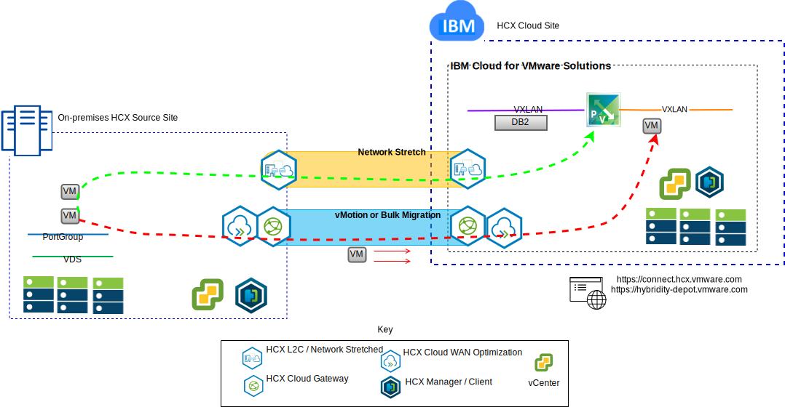

---

copyright:

  years:  2016, 2018

lastupdated: "2018-10-30"

---

# Use cases

## Workload migration to IBM Cloud
Acme Skateboards wants to seamlessly extend their on-premises VMware SDDC into a VCS instance on IBM Cloud. They need to keep their business up and running and keep their downtime to a minimum. Reconfiguring their applications to run in the cloud is not an optimal solution.

VMware Hybridity on IBM Cloud service enables the creation of seamless connections between IBM Cloud and an on-premises VMware virtualized datacenter.

The vCenter Server with Hybridity Bundle offering from IBM Cloud enables secure connections between the peer on-premises source site and the IBM Cloud target site.

Figure 1. VMware Hybridity services

This creates a loosely coupled interconnectivity between on-premises and IBM Cloud and enables capabilities such as:
- **Simple interconnectivity** – logical network connections are established easily over any physical connection including public internet, private VPN, or IBM Cloud Direct Link.
- **Layer 2 extension** – on-premises networks are extended into the cloud including on-premises subnets and IP addressing.
- **Encryption** – network traffic is securely encrypted between the peer sites.
- **Network optimization** – selects the best connection and efficiently floods the connection so that network traffic is moved as fast as possible.
- **Data deduplication** – as much as 50% reduction in network traffic can be achieved.
- **Intelligent routing** – when a workload is moved, proximity routing can change the network path (that is, gateway) so that network traffic uses the target site gateway and does not “hairpin” back to the originating site.
- **Zero downtime migration** – a running virtual machine can be moved to (or back from) the cloud by using vMotion.
- **Scheduled migration** – any number of virtual machines can be replicated to the destination site and then activated on that site at a designated time to replace the systems running on the originating site.
- **Migration of security policies** – if NSX is used on-premises any security policies, firewalls, etc. are moved along with the workload.

Using this solution Acme Skateboards successfully migrated their on-premises VMware workloads to the IBM Cloud meeting their requirements of little to no downtime and no application reconfiguration.

## Hybrid architecture deployment

Acme Skateboards wants to deploy a hybrid architecture on IBM Cloud consisting of VCS and ICP, for their journey to application modernization. Their requirements are to run their databases on virtual machines, the applications and web services in containers, and use a common set of tools for network and security management.

Figure 2. Acme Skateboards hybrid application

IBM Cloud for VMware solutions provides automation to deploy VMware technology components in IBM Cloud data centers across the globe. The architecture consists of a single cloud region and supports the ability to extend into more cloud regions that are located in another geography and/or into another IBM Cloud pod within the same data center.

The IBM Cloud Private (ICP) and Cloud Automation Manager (CAM) products are manually deployed into your on-premises virtualization platform, enabling cloud management from the on-premises location. Alternatively, ICP and CAM are offered as a service extension to an existing or new VCS deployment, via automation, enabling cloud management from IBM Cloud.

The diagram below represents ICP running on top of a VCS instance. NSX-V is configured with a dedicated switch/VXLAN, a DLR, and an ESG specifically for the ICP overlay network, routing is set up through the ESG for access to the underlay network.

Using the IBM Cloud automation, Acme Skateboards can provision a hybrid solution that encompasses VMware on IBM Cloud to run their database VMs and ICP on VMware on IBM Cloud to run their apps and front-end web services in containers. NSX gives them a common set of management tools for network and security in the overlay network.

### Related links
* [VCS Hybridity Bundle overview](../vcs/vcs-hybridity-intro.html)
