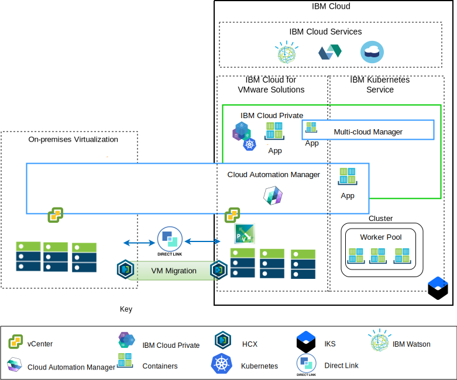

---

copyright:

  years:  2016, 2019

lastupdated: "2019-03-13"

subcollection: vmware-solutions

---

# Application modernization overview
{: #vcsnsxt-appmod}

The following diagram shows the application modernization reference architecture that Acme Skateboards deploy and is described in depth in this series of documents.

Figure 1. Architecture overview

This hybrid architecture allows Acme Skateboards to:
- Migrate VMware virtual machines (VMs) from on-premises to {{site.data.keyword.cloud}} with little or no downtime and no application reconfiguration.
-	Enable them to start the application modernization journey by allowing them to focus on containerizing the simpler web interfaces and middleware while also allowing more complex databases to stay as VMs.
-	Use Cloud Automation Manager (CAM) to script Infrastructure as code (IaC) to compose and orchestrate services that are made from both VMs and containers to integrate with their DevOps toolchains and their ITSM solution.

Focusing on the network architecture, the reference architecture has the following key components:
- **On-premise virtualization** – A VMware cluster that currently hosts the Acme Skateboards VMs. It's these VMs that are currently hosting the applications that will be modernized. This cluster is required to meet the prerequisites as documented in the [VMware HCX on {{site.data.keyword.cloud_notm}} solution architecture](https://test.cloud.ibm.com/docs/services/vmwaresolutions/services?topic=vmware-solutions-hcx-archi-intro#hcx-archi-intro) to allow customers to migrate VMs into the VMware vCenter Server on {{site.data.keyword.cloud_notm}} instance running on {{site.data.keyword.cloud_notm}}, and back if required.
- **VMware vCenter Server on IBM Cloud** – vCenter Server provides the fundamental VMware building blocks: vSphere, vCenter Server, NSX-V, and storage options that include vSAN or {{site.data.keyword.cloud_notm}} Endurance storage, needed to automatically deploy a VMware Software Defined Data Center (SDDC) solution. This VMware cluster is the target of the migrated VMs and some of the modernized applications in containers hosted in {{site.data.keyword.icpfull_notm}}.

Key components of the architecture are:
- **NSX-V** - NSX-V provides the network virtualization layer in vCenter Server that provides a network overlay for Acme Skateboards VMs. NSX-V enables BYOIP and isolates the workload networks from the {{site.data.keyword.cloud_notm}} networks. NSX-V is programmed by HCX to create the networks that Acme Skateboards extends from on-premises.
- **{{site.data.keyword.icpfull_notm}}** - {{site.data.keyword.icpfull_notm}} is an application platform for developing and managing containerized applications. It's an integrated environment that includes the container orchestrator Kubernetes, a private image repository, a management console, monitoring frameworks and a graphical user interface that provides a centralized location from where Acme Skateboards can deploy, manage, monitor, and scale their applications. The vCenter Server instance hosts the {{site.data.keyword.icpfull_notm}} components, master nodes, worker nodes, and so on, running them as VMs.
- **IBM Cloud Automation Manager** – CAM is an enterprise ready infrastructure as code (IaC) platform that provides a single pane of glass to provision virtual machine-based workloads alongside Kubernetes based workloads by using templates. CAM is a Dockerized application that runs on an {{site.data.keyword.icpfull_notm}} installation and is tightly integrated for authorization, RBAC, and other functions.
- **{{site.data.keyword.containerlong_notm}}** – {{site.data.keyword.containerlong_notm}} enables Acme Skateboards to deploy their modernized applications in Docker containers that run in Kubernetes clusters. The master modes are fully managed by IBM while the worker nodes in the worker pool are deployed into the same {{site.data.keyword.cloud_notm}} account as their vCenter Server instance. Worker nodes are bare metal, public, or dedicated virtual server instances. Calico is installed and configured automatically in {{site.data.keyword.containerlong_notm}}. Calico provides secure network connectivity for containers and is configured in {{site.data.keyword.containerlong_notm}} to use IP-in-IP encapsulation to encapsulate packets that travel across subnets. Calico uses NAT for outgoing connections from the containers.
- **Direct Link** – {{site.data.keyword.cloud_notm}} Direct Link uses Acme Skateboard’s WAN provider to connect their data center to {{site.data.keyword.cloud_notm}} providing a reliable, low latency, secure network connection. This connection provides:
  - Access to the cloud hosted applications from your Enterprise users.
  - Inter VM traffic between on-premises VMs and cloud VMs.
  - Traffic between legacy systems in the on-premises data center and cloud VMs.

## Key benefits to Acme Skateboards
{: #vcsnsxt-appmod-benefits}

- Accelerated delivery of IT projects to developers and lines of business by reducing the time that it takes for procurement, architecture, implementation, and deployment of resources from weeks or even months, to hours. Application time to value decreases if customers need to wait until networking or security teams can order services like load balancers, firewalls, switches, and routers.
- Enhanced security with dedicated bare metal servers in a hosted private cloud, including private network service endpoint deployment to {{site.data.keyword.cloud_notm}} services such as {{site.data.keyword.containerlong_notm}} and KMIP.
- Consistent management and governance of the deployed hybrid cloud by providing full administrative access to virtualization management, preserving your existing VMware tools, scripts, and investments in training.
- VMware expertise at global scale with IBM Professional and Managed Services spanning 30+ {{site.data.keyword.CloudDataCents_notm}} worldwide.

Customers moving toward cloud native application platforms such as {{site.data.keyword.icpfull_notm}} and {{site.data.keyword.containerlong_notm}} are focused on speed and innovation and don’t always have security and networking in mind.

This reference architecture shows how VCS, {{site.data.keyword.icpfull_notm}}, and {{site.data.keyword.containerlong_notm}} move Acme Skateboards securely along the application modernization journey.

## Related links
{: #vcsnsxt-appmod-related}

* [vCenter Server on {{site.data.keyword.cloud_notm}} with Hybridity Bundle overview](/docs/services/vmwaresolutions/archiref/vcs?topic=vmware-solutions-vcs-hybridity-intro)
