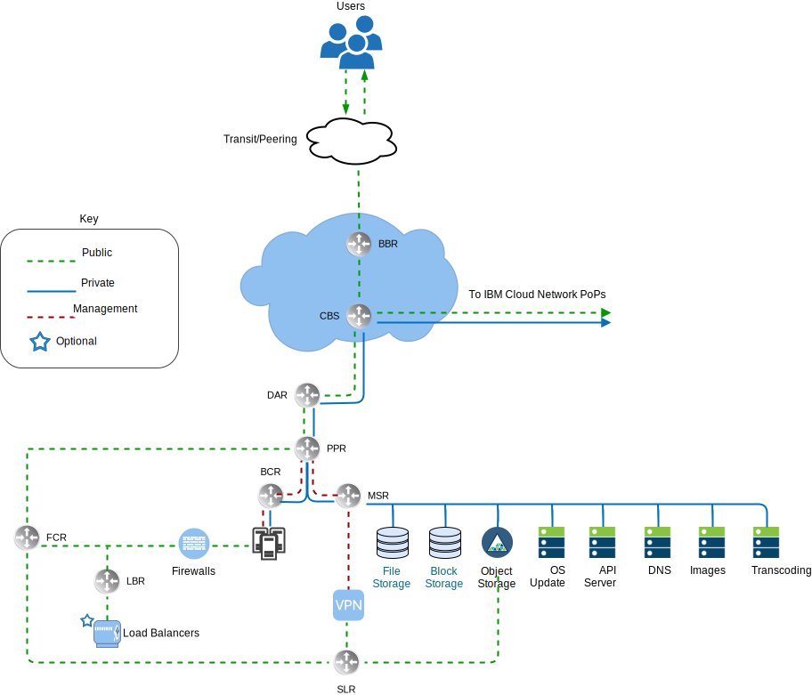
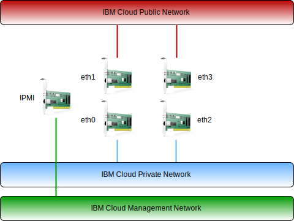

---

copyright:

  years:  2016, 2019

lastupdated: "2019-03-19"

subcollection: vmware-solutions

---

# IBM Cloud networking overview
{: #vcsnsxt-overview-ic4vnetwork}

{{site.data.keyword.cloud}} handles physical networking. The following information describes the physical network that is provided by the {{site.data.keyword.cloud_notm}} and physical host connections (VLANs, MTU) associated with the physical hosts described previously.

The physical network of {{site.data.keyword.cloud_notm}} is separated into three distinct networks: public, private, and management.

Figure 1. {{site.data.keyword.cloud_notm}} high-level network view

## Public network
{: #vcsnsxt-overview-ic4vnetwork-public-net}

{{site.data.keyword.CloudDataCents_notm}} and network points of presence (PoP) have more than one 1 Gbps or 10-Gbps connections to top tier transit and peering network carriers. Network traffic from anywhere in the world connects to the closest network PoP and travels directly across the network to its data center minimizing the number of network hops and handoffs between providers. Inside the data center, 1 Gbps or 10-Gbps network bandwidth is provided to individual servers via a pair of peered, aggregated front-end customer switches (FCS). These aggregated switches are attached to a pair of separate routers (that is, front-end customer routers, FCR) for L3 networking. This multitier design allows the network to scale across racks, rows, and pods within an {{site.data.keyword.CloudDataCent_notm}}.

## Private network
{: #vcsnsxt-overview-ic4vnetwork-private-net}

All {{site.data.keyword.CloudDataCents_notm}} and PoPs are connected by the private network backbone. This private network is separate from the public network, and it enables connectivity to services in {{site.data.keyword.CloudDataCents_notm}} around the world. Moving data between data centers is done vusing more than one 10 Gbps or 40-Gbps connections to the private network. Similar to the public network, the private network is multi tiered in that servers and other infrastructure are connected to aggregated backend customer switches (BCS). These aggregated switches are attached to a pair of separate routers (that is, backend customer routers, BCR) for L3 networking. The private network also supports the ability to use jumbo frames (MTU 9000) for physical host connections.

## Management network
{: #vcsnsxt-overview-ic4vnetwork-mgmt-net}

Along with the public and private networks, each {{site.data.keyword.cloud_notm}} server is connected to an out–of–band management network. This management network, accessible via VPN, allows Intelligent Platform Management Interface (IPMI) access to the server independently of its CPU, firmware, and operating system for maintenance and administration purposes.

## Primary and portable IP blocks
{: #vcsnsxt-overview-ic4vnetwork-ip-blocks}

{{site.data.keyword.cloud_notm}} allocates two types of IP addresses to be used within the  {{site.data.keyword.cloud_notm}} infrastructure:
* Primary IP addresses are assigned to devices, bare metal, and virtual servers provisioned by {{site.data.keyword.cloud_notm}}. Users shouldn't assign any IP addresses in these blocks.
* Portable IP addresses are provided for the user to assign and manage as needed.

Primary or Portable IP addresses can be made routable to any VLAN within the customer account if the account is configured as a virtual routing and forwarding (VRF) account.

## Virtual Routing and Forwarding
{: #vcsnsxt-overview-ic4vnetwork-vrf}

{{site.data.keyword.cloud_notm}} accounts can also be configured as a Virtual Routing and Forwarding (VRF) account. A VRF account enables automatic global routing between subnet IP blocks within the account. All accounts with Direct-Link connections must be converted to, or created as, a VRF account.

## Physical host connections
{: #vcsnsxt-overview-ic4vnetwork-host-connect}

Each physical host within the design has two redundant pairs of 10-Gbps Ethernet connections into each {{site.data.keyword.cloud_notm}} Top of Rack (ToR) switch (public and private). The adapters are set up as individual connections (unbonded) for a total of 4 × 10-Gbps connections. This allows each networking interface card (NIC) connection to work independently of the others.

Figure 2. Physical host connections 

## VLANs
{: #vcsnsxt-overview-ic4vnetwork-vlans}

The VMware on {{site.data.keyword.cloud_notm}} offerings are designed with three VLANs (one public and two private) assigned upon deployment. The public VLAN is assigned to eth1 and eth3, while the private connections are assigned to eth0 and eth2. It's important to note that the public and the first private VLAN created and assigned to this design are untagged by default. Later, the additional private VLAN is trunked on the physical switch ports and tagged within the VMware port groups that are consuming these subnets.

As stated previously, the private network consists of two VLANs within this design. Three subnets are allocated to the first of these VLANs (here designated Private VLAN A). The first is a primary private IP subnet range {{site.data.keyword.cloud_notm}} assigns to the physical hosts. The second subnet is used for management virtual machines (for example, vCenter Server Appliance, Platform Services Controller). The third is used for the VXLAN Tunnel Endpoints (VTEPs) assigned to each host by using NSX Manager.

Along with Private VLAN A, a second private VLAN (here designated Private VLAN B) exists to support VMware features such as vSAN and vMotion, and for connectivity to network-attached storage (NAS). As such, the VLAN is divided into two or three portable subnets. The first subnet is assigned to a kernel port group for vMotion traffic. The remaining subnet or subnets are used for storage traffic and when using vSAN one is assigned to kernel port groups used for vSAN traffic. When using NAS one is assigned to a port group dedicated to NFS traffic. All subnets configured as part of a vCenter Server automated deployment use {{site.data.keyword.cloud_notm}}-managed ranges. This is to ensure that any IP address can be routed to any data center within the {{site.data.keyword.cloud_notm}} account that is used if required currently or in the future.

Table 1. VLAN and subnet summary

VLAN 	|Subnet Type 	|Description
---|---|---
Public 	|Primary 	|Assigned to physical hosts for public network access. Not used upon initial deployment.
Public	|Portable 	|Assigned for uplink and NAT usage on the customer-nsx-esg.
Public	|Portable 	|Assigned for uplink NAT usage on the mgmt-nsx-esg.
Public	|Portable 	|Assigned for uplink NAT usage on the hcx-mgmt-esg, if the Hybridity Bundle is selected.
Private A 	|Primary 	  |Assigned to physical hosts assigned by {{site.data.keyword.cloud_notm}}. Used by the management interface for vSphere management traffic.
Private A 	|Portable 	|Assigned to virtual machines functioning as management components.
Private A 	|Portable 	|Assigned to NSX VTEP.
Private A 	|Portable 	|Assigned to HCX for internal usage, if the Hybridity Bundle is selected.
Private A 	|Portable 	|Assigned for uplink usage on the customer-nsx-esg.
Private A 	|Portable 	|Assigned to HCX, if the Hybridity Bundle is selected.
Private B	  |Primary	  |Not used upon initial deployment.
Private B 	|Portable 	|Assigned for vSAN if in use.
Private B 	|Portable 	|Assigned for NAS if in use.
Private B 	|Portable 	|Assigned for vMotion.

This design is implemented with physical hosts and virtual system instances (VSI) on VLANs and configured to point to the {{site.data.keyword.cloud_notm}} BCR (backend “private network” customer router) as the default route. While vCenter Server instances enable the use of software defined networking. Any network overlays created by NSX that include routing to VLAN subnets aren't known by the {{site.data.keyword.cloud_notm}}-managed routers and you might need to create static routes, firewall rules, and NAT rules to properly manage the network flows.

The private network connections are configured to use jumbo frames with MTU size of 9000, which improves performance for large data transfers such as storage and vMotion. This is the maximum MTU allowed within VMware and by {{site.data.keyword.cloud_notm}}. The public network connections use a standard Ethernet MTU of 1500. This must be maintained as any changes might cause packet fragmentation over the internet.

## Related links
{: #vcsnsxt-overview-ic4vnetwork-related}

* [vCenter Server on {{site.data.keyword.cloud_notm}} with Hybridity Bundle overview](/docs/services/vmwaresolutions/archiref/vcs?topic=vmware-solutions-vcs-hybridity-intro)
