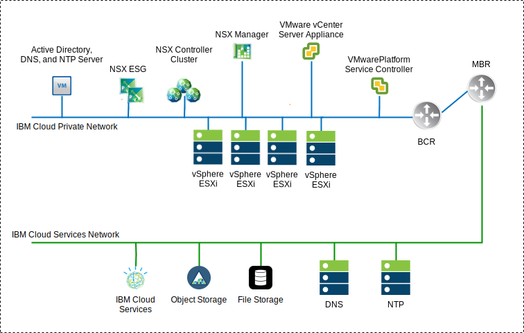
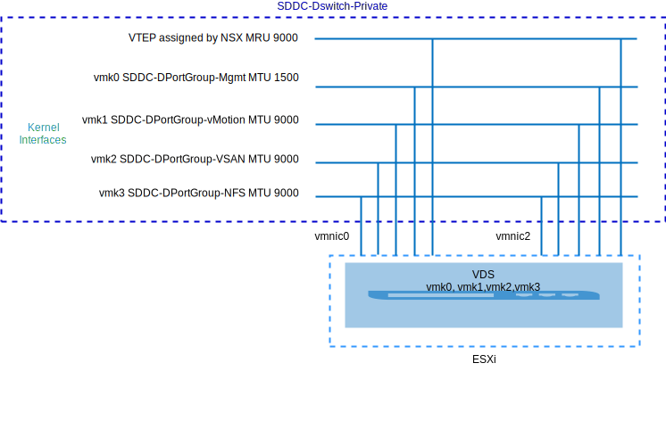
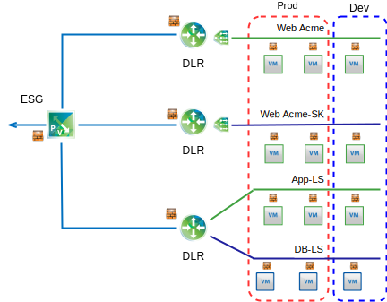

---

copyright:

  years:  2016, 2019

lastupdated: "2019-02-19"

subcollection: vmwaresolutions

---

# NSX-V overview
{: #vcsnsxt-overview-ic4vnsxv}

Network virtualization provides a network overlay that exists within the virtual layer. NSX-V provides the architecture with features such as rapid provisioning, deployment, reconfiguration, and destruction of on-demand virtual networks. This design uses the vSphere distributed switch (vDS) and VMware NSX for vSphere to implement virtual networking.

In this design, the NSX Manager is deployed on the initial cluster. The NSX Manager is assigned a VLAN backed IP address from the private portable address block that's designated for management components and it's also configured with the DNS and NTP servers previously documented.

Table 1. NSX-V Manager virtual appliance specifications

Attribute | Specification
---|---
NSX Manager | Virtual appliance
Number of vCPUs | 4
Memory | 16 GB
Disk | 60 GB on the management NFS share
Disk type | Thin provisioned
Network | **Private A** portable designated for management components

The NSX-V Manager following network overview shows the placement of the NSX Manager in relation to the other components in this architecture.

Figure 1. NSX-V Manager network overview

After initial deployment, the {{site.data.keyword.cloud}} automation deploys three NSX Controllers within the initial cluster. The controllers are assigned an IP address from the **Private A** portable subnet that is designated for management components. VM–VM anti–affinity rules are created such that controllers are separated among the hosts in the cluster. The initial cluster must be deployed with a minimum of three nodes to ensure high availability for the controllers.

Along with to the controllers, the {{site.data.keyword.cloud_notm}} automation prepares the deployed vSphere hosts with NSX VIBS that enable the use of a virtualized network (VXLAN) via the use of VXLAN Tunnel Endpoints (VTEP). The VTEPs are assigned IP addresses from the IP address range of the **Private A** portable subnet that is specified for VTEPs. The VXLAN traffic resides on the untagged VLAN and is assigned to the private virtual distributed switch (vDS). Later, a segment ID pool is assigned and the hosts in the cluster are added to the transport zone. Only unicast is used in the transport zone since IGMP snooping isn't configured within the {{site.data.keyword.cloud_notm}}.

NSX Edge Services Gateway (ESG) pairs are then deployed. For all deployments one gateway pair is used for outbound traffic from automation components that reside on the private network. VMware vCenter Server on {{site.data.keyword.cloud_notm}} instances include a second gateway, which is known as the customer–managed edge, that is deployed and configured with an uplink to the public network and an interface that is assigned to the private network. Any required NSX component such as Distributed Logical Routers (DLR), logical switches, and firewalls can be configured by the administrator.

## Distributed switch design
{: #vcsnsxt-overview-ic4vnsxv-distributed-switch}

The design uses a minimum number of virtual distributed switches (vDS). The hosts in the cluster are connected to public and private networks. They're configured with two virtual distributed switches. The use of two switches follows the physical network separation of the public and private networks that are implemented within {{site.data.keyword.cloud_notm}}.

A total of two distributed switches are configured. The first is for public network connectivity (SDDC-Dswitch-Public) and the second is for private network connectivity (SDDC-Dswitch-Private).
Separating different types of traffic is required to reduce contention and latency. Separate networks are also required for access security. VLANs are used to segment physical network functions. This design uses three VLANs. Two for private network traffic and one for public network traffic.

Table 2. VLAN traffic mapping

VLAN |Designation |Traffic Type
---|---|---
VLAN1 | Public | Available for internet access
VLAN2 | Private A | ESXi Management, Management, VXLAN (VTEP)
VLAN3 | Private B | vSAN, NFS, vMotion

Traffic from workloads travels on NSX logical switches. The vSphere cluster uses two vSphere Distributed Switches (vDS) for the converged cluster.

Table 3. Converged cluster distributed switches

vSphere Distributed Switch Name |Function |Network I/O Control |Load Balancing Mode |Physical NIC Ports |MTU
---|---|---|---|---|---
SDDC-Dswitch-Private | ESXi management Virtual SAN vSphere vMotion VXLAN Tunnel Endpoint (VTEP) NFS | Enabled | Route Based on Explicit Failover (vSAN, vMotion). Originating Virtual Port (all else) | 2 | 9,000 (Jumbo Frames)
SDDC-Dswitch-Public | External management traffic (North–South) | Enabled |Route Based on Originating Virtual Port | 2 | 1,500 (default)

Table 4. Distributed switch port group teaming and failover setting

Parameter | Setting
---|---
Load balancing | Route based on the originating virtual port \*
Failover detection | Link status only
Notify switches | Enabled
Failback | Enabled
Failover order | Active uplinks: Uplink1, Uplink2 \*

\* The vSAN port group uses explicit failover with active or standby because it does not support load balancing of vSAN storage traffic.
{:note}

Figure 2. Cluster VM kernel interface port group-mapping

Table 5. Cluster virtual switch port groups, VLANs, and teaming policy

vSphere Distributed Switch	|Port Group Name	|Teaming	|Uplinks	|VLAN ID
---|---|---|---|---
SDDC-Dswitch-Private	|SDDC-DPortGroup-Mgmt	|Originating virtual port	|Active: 0, 1	|VLAN1
SDDC-Dswitch-Private	|SDDC-DPortGroup-vMotion	|Originating virtual port	|Active: 0, 1	|VLAN2
SDDC-Dswitch-Private	|SDDC-DPortGroup-VSAN	|Explicit failover	|Active: 0 Standby: 1	|VLAN2
SDDC-Dswitch-Private	|SDDC-DPortGroup-NFS	|Originating virtual port	|Active: 0, 1	|VLAN2
SDDC-Dswitch-Private	|Automatically generated by NSX	|Originating virtual port	|Active: 0, 1	|VLAN1
SDDC-Dswitch-Public	  |SDDC-DPortGroup-External	|Originating virtual port	|Active: 0, 1	|VLAN3

## NSX-V
{: #vcsnsxt-overview-ic4vnsxv-nsx-v}

This design specifies the configuration of NSX components but does'nt apply any network overlay component configuration. It's left up to the customer to design the network overlay based on their needs.

The following components are configured:
-	Management servers and controllers are installed and integrated into the vCenter web user interface.
-	ESXi agents are installed and VTEP IP addresses are configured per ESXi host.
-	VTEP configuration, controller configuration, VXLAN configuration (transport zone).
-	NSX Edge Services Gateway (ESG) appliances for use by management components.
-	For vCenter Server only, NSX Edge Services Gateway (ESG) appliances for customer use.

What is NOT configured:
-	Virtual distributed routers.
-	Micro segmentation.
-	VXLANs.
-	Linked NSX Management to other VMware instances.

### NSX-V security
{: #vcsnsxt-overview-ic4vnsxv-nsx-v-security}

NSX for vSphere enables organizations to divide the data center into distinct security segments, down to the level of the individual workload independent of where the workload is running. IT teams can define policies for each workload based on application and user context, which ensures immediate responses to threats inside the data center and enforcement down to the application.

The following are some key NSX components:
-	The NSX distributed stateful firewall is embedded in the hypervisor kernel for up to 20 Gbps of firewall capacity per hypervisor host. Provides north-south firewall capability via NSX Edge.
-	NSX enables the creation of dynamic security groups and associated policies to more than just IP address and MAC. These policies include vCenter objects and tags, operating system type, and Layer 7 application information to enable micro-segmentation based on the context of the application.
-	Identity-based policy that uses login information from VMs, Active Directory, and Mobile Device Management integration allows for security based on the user including session level security in remote and virtual desktop environments.
- Application Rule Manager and Endpoint Monitoring enable end to end network traffic flow visualization up to Layer 7, allowing application teams to identify both intra- and inter-data center end points, and respond by creating the appropriate security rules.
- Support for management, control plane, and data plane integration with third-party vendors such as next generation firewalls, IDS/IPS, agentless antivirus, switching, advanced security, and more.

The following diagram shows a high-level diagram of how you can implement some of the micro-segmentation features of NSX-V by creating security groups. In this example, production and development are the security groups and security rules are assigned based on those groups.

Figure 3. NSX-V security 

## Related links
{: #vcsnsxt-overview-ic4vnsxv-related}

* [vCenter Server on {{site.data.keyword.cloud_notm}} with Hybridity Bundle overview](/docs/services/vmwaresolutions/archiref/vcs?topic=vmware-solutions-vcs-hybridity-intro)
