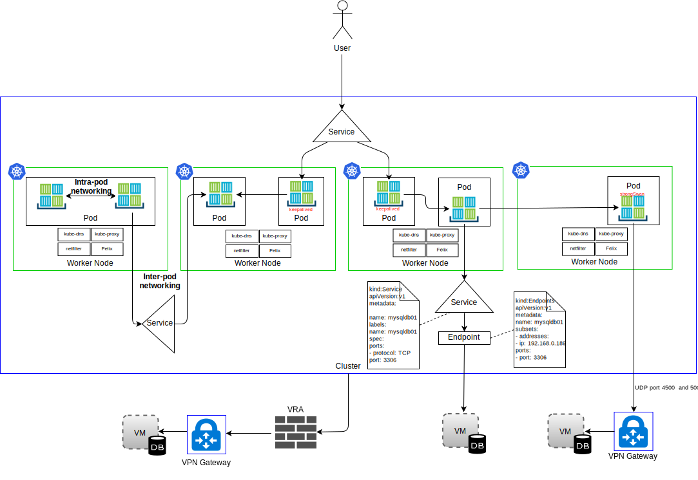

---

copyright:

  years:  2016, 2019

lastupdated: "2019-02-15"

subcollection: vmware-solutions

---

# IBM Cloud Kubernetes Service
{: #vcsnsxt-overview-iks}

## IBM Cloud Kubernetes Service overview
{: #vcsnsxt-overview-iks-ovw}

The {{site.data.keyword.containerlong_notm}} provides an isolated and secure platform for managing containers. This platform is portable, extensible, and self-healing if a failover occurs.

The architecture consists of the following key components:
-	**{{site.data.keyword.cloud}} account** – Worker nodes are deployed into an {{site.data.keyword.cloud_notm}} account. The master node is deployed in a central Cloud Account that is managed by IBM.
-	**Cluster** - A Kubernetes cluster consists of one or more worker nodes.
-	**Worker nodes** – A worker node is a bare metal, or a virtual server instance hosted in an IBM account. When you provision a worker node, you determine the resources that are available to the containers that are hosted on that worker node. The worker nodes include an IBM-managed Docker Engine, separate compute resources, networking, and a storage volume service.
-	**Master node** - Worker nodes are managed by a Kubernetes master node that centrally controls and monitors all Kubernetes resources in the cluster. This master node is managed by IBM.

{{site.data.keyword.containerlong_notm}} has the following concepts:
-	**Service** - A service is a Kubernetes resource that groups a set of pods and provides network connectivity to these pods without displaying the actual private IP address of each pod. You can use a service to make your app available within your cluster or to the public internet.
-	**Deployment** - A deployment is a Kubernetes resource where you might specify information about other resources or capabilities that are required to run your app, such as services, persistent storage, or annotations. You document a deployment in a configuration YAML file, and then apply it to the cluster. The Kubernetes master configures the resources and deploys containers into pods on the worker nodes with available capacity. Define update strategies for your app, including the number of pods that you want to add during a rolling update and the number of pods that can be disabled at a time. When you perform a rolling update, the deployment checks whether the update is working and stops the rollout when failures are detected.
-	**Pod** - Every app in a cluster is deployed, run, and managed by a Kubernetes resource that is called a pod. Pods represent small deployable units in a Kubernetes cluster and are used to group the containers that must be treated as a single unit. In most cases, each container is deployed in its own pod. An application might require a container and other helper containers to be deployed into one pod so that those containers are addressable by using the same private IP address.
-	**Application** - An app might refer to a complete app or a component of an app. You might deploy components of an app in separate pods or separate worker nodes.

Kubernetes don't dictate a particular networking solution.

The Kubernetes network model states three fundamental requirements:
* Containers can communicate with all other containers without NAT
* Nodes can communicate with all containers (and vice versa) without NAT
* The IP a container sees itself is the same IP as others see it.

### Namespaces
{: #vcsnsxt-overview-iks-namespaces}

Namespaces are a fundamental aspect of container networking. Namespaces are a feature of the Linux kernel that partitions kernel resources such that one set of processes sees one set of resources, while another set of processes sees a different set of resources. Resources include mount points, processIDs, network stack, IPC, and user IDs. Each namespace has a private set of IP addresses, its own routing table, socket listing, connection tracking table, firewall, and other network-related resources.

### Container Network Interface
{: #vcsnsxt-overview-iks-container-network-interfaces}

Kubernetes uses the Container Network Interface (CNI) as its plug-in-oriented networking solution. It consists of a specification and libraries for writing plug-ins to configure network interfaces in Linux containers. The CNI specification is lightweight as it deals only with the network connectivity of containers and the garbage collection of resources after containers are deleted.

The following two central definitions are in the context of CNI in Kubernetes:
- **Pod** - Synonymous with a Linux network namespace. The unit of scheduling in Kubernetes is a pod that is a tightly coupled set of one or more containers that are always colocated (scheduled onto a node as a unit). A pod can't be spread over more than one worker node.
- **Network** - A uniquely addressable group of entities that can communicate with one another. These entities might be an individual container, a machine, or some other network device such as a router.

For the CNI to add a container to a network, the container runtime must first create a new network namespace for the container and then start one or more of the defined plug-ins. The network configuration is in JSON format and includes mandatory fields such as name, type, and plug-in type–specific fields. A CNI plug-in is expected to assign an IP address to the interface and set up network routes relevant for it. {{site.data.keyword.containerlong_notm}} uses Calico as the network plug-in for CNI. Calico assigns each workload an IP address. In {{site.data.keyword.containerlong_notm}}, Calico uses IP-in-IP tunneling so that the container network IP addresses are hidden from the {{site.data.keyword.cloud_notm}} Network.

From a network traffic perspective, we differentiate between four types in {{site.data.keyword.containerlong_notm}}, as shown in the following diagram.

Figure 1. Container network traffic types

- **Intra-pod networking** – Also known as container to container communications. All containers within a pod share a network namespace, the same IP address and see each other on localhost. Traffic for each app is differentiated with a different port number. The Developer must make sure that containers within a pod don't conflict with each other with the used ports. Within a pod, there exists a so-called infrastructure container. This is the first container that the kubelet launches, and it acquires the pod’s IP and sets up the network namespace. Then, all the other containers in the pod join the infrastructure container’s network and IPC namespace. The container has network bridge mode that is enabled and all the other containers in the pod join this namespace via container mode. If the infrastructure container dies, kubelet kills all the containers in the pod and then reprovisions, typically with a new IP address. We won't provide any more detail on this traffic flow in this document.

- **Inter-pod networking** – Also known as “pod-to-pod” communications. The following are the three types of east–west traffic:
  - Pods can directly communicate with other pods on the same subnet. In {{site.data.keyword.containerlong_notm}}, each pod has an IP address that is assigned from an {{site.data.keyword.containerlong_notm}} provided range. Each worker node is assigned a subnet on provisioning. Pod to pod communication without proxies, tunneling, or NAT occurs with pods in the same subnet and host.
  - Pods can directly communicate with other pods on different subnets. IP-in-IP encapsulation is automatically configured in {{site.data.keyword.containerlong_notm}} to encapsulate only packets that are traveling across subnets. This encapsulation hides the pod network address space from the {{site.data.keyword.cloud_notm}} network. The encapsulation uses the IP address from the {{site.data.keyword.cloud_notm}} primary private subnet.
  - Pods can use services to communicate with other pods, which are known as pod to service communications. However, pods that can directly communicate with other pods as per the two previous points pods are mortal. They are born and when they die they aren't resurrected. Replica sets create and destroy pods dynamically such as when scaling up or down. While each pod gets its own IP address, even those IP addresses cannot be relied upon to be stable over time. Preferably, Developers use a service construct for communication, where, a stable virtual IP address is used that can be discovered via DNS.

- **Ingress** - Refers to routing traffic from external users or apps to pods. A service provides a stable virtual IP (vIP) address for a set of pods. While pods are ephemeral, services allow clients to reliably discover and connect to the containers running in the pods by using the vIP. This vIP is not an actual IP address that is connected to a network interface. Its purpose is purely to act as the stable endpoint to forward traffic to one or more pods. Accessing a pod from outside the cluster is a bit more challenging. Kubernetes aims to provide highly available, high-performance load balancing for services.
There are three options for North-South traffic in {{site.data.keyword.containerlong_notm}}:

  - **NodePort** - The NodePort service is considered suitable for testing or if you need public or private access for only a short amount of time. A NodePort service opens a port on a worker node over both the private and public IP address of the worker node. You must use a Calico preDNAT network policy if you want to block either public or private. The public and private IP addresses of the worker node are not permanent.
  - **LoadBalancer** - The portable public and private IP addresses that are assigned to the load balancer are permanent and do not change when a worker node is re-created in the cluster. You can customize your load balancer by exposing any port that your app requires. A load balancer service with a portable private IP address still has a public node port open on every worker node. You must use a Calico preDNAT network policy to block public node ports on it.
  - **Ingress services** - The ALB uses a secured and unique public or private entry point to route incoming requests to your apps. The ALB listens for incoming HTTP or HTTPS, TCP, or UDP service requests. It forwards requests across the application pods based on the rules that you defined in the ingress resource. When you create a cluster, one public and one private ingress application load balancer (ALB) are created automatically. Because the public ALB is enabled, and the private ALB is unavailable by default, you must disable the public ALB and enable the private ALB.

- **Egress** - Refers to calling external resources outside of the pods such as APIs or consuming resources from VMs. Egress options:
    - Define a service resource for a system running outside of the cluster. An Endpoint resource is created that details the external system; IP address and port number. The Endpoint resource can have several addresses that are listed, and Kubernetes will round-robin between those addresses like between pods that are running inside the cluster. Then, a Service resource is used to create a Cluster IP and a DNS name in kube-dns for the service.
    - Use the stongSwan IPSec VPN you can connect to applications that are external to the cluster. By the use of a Helm chart, a strongSwan IPSec VPN service inside of a Kubernetes pod is deployed and configured. When VPN connectivity is established, routes are automatically configured on all of the worker nodes in the cluster. These routes allow two-way connectivity through the VPN tunnel between pods on any worker node and the remote system. If the pod fails, the cluster restarts the pod, however, you might experience a short downtime while the new pod starts and the VPN connection is reestablished. A portable public or private IP address is used for the strongSwan VPN service. The local.subnet setting can use the cluster pod subnet, the cluster service subnet or the public or private portable subnet. Remap cluster subnets can be achieved by using the localSubnetNAT setting. Alternatively, the cluster IP addresses can be hidden behind a single IP address by setting enableSingleSourceIP to true. To remap the remote network subnets, use the remoteSubnetNAT setting.
    - An {{site.data.keyword.cloud_notm}} Virtual Router Appliance can be deployed as a VPN gateway to securely connect to an external network. Public or private network traffic can be routed through the VRA. The VRA creates an encrypted IPSec tunnel to the remote VPN gateway.

## IBM Cloud Kubernetes Service components
{: #vcsnsxt-overview-iks-components}

Worker nodes are managed by a Kubernetes master node that centrally controls and monitors all Kubernetes resources in the cluster. When a Developer deploys the resources for a container, the master node decides which worker node to deploy those resources on, taking into account the deployment requirements and available capacity in the cluster. The master and the worker nodes communicate with each other through secure TLS certificates and an openVPN connection via the {{site.data.keyword.cloud_notm}} public network. The Developers access the kube-apiserver, hosted on the Master Node via the internet.

The kubelet in the worker node watches the kube-apiserver in the master node for updates and reports the status. The kubelet is a pod that runs on every worker node and is responsible for monitoring the health of pods that run on the worker node and for watching the events that the Kubernetes API server sends. Based on the events, the kubelet creates or removes pods, issues liveness and readiness probes, and reports back the status of the pods to the Kubernetes API server.

From a network perspective the following components are deployed on the worker node:

-	**openvpn-client** - The OpenVPN client works with the OpenVPN server to securely connect the master to the worker node. This component operates in the kube-system namespace.
-	**Calico node** - The Calico node is a container that bundles together the various components that are required for networking containers with Calico. This component operates in the kube-system namespace.
-	**Calico policy controller** - The Calico policy controller watches inbound and outbound network traffic for compliance with set network policies. If the traffic is not allowed in the cluster, access to the cluster is blocked. The Calico policy controller is also used to create and set network policies for a cluster. This component operates in the kube-system namespace.
-	**Calico CNI** - The Calico container network interface (CNI) manages the network connectivity of containers and removes allocated resources when a container is deleted.
-	**Calico IPAM** - The Calico IPAM manages IP address assignment for containers.
-	**kube proxy** - The Kubernetes network proxy is a daemon that runs on every worker node and that forwards or load balances TCP and UDP network traffic for services that run in the cluster. This component operates in the kube-system namespace.
-	**kube DNS**  - Kubernetes DNS schedules a DNS pod and service on the cluster. Containers automatically use the DNS service's IP to resolve DNS names in their searches for other pods and services. This component operates in the kube-system namespace.
-	**Ingress ALB** - Ingress is a Kubernetes service that you can use to balance network traffic workloads in your cluster by forwarding public or private requests to multiple apps in your cluster. To expose your apps over the public or private network, you must create an Ingress resource to register your apps with the Ingress application load balancer (ALB). Multiple apps can then be accessed by using a single URL or IP address. This component operates in the ibm-system namespace.
-	**Load balancer** - A load balancer is a Kubernetes service that can be used to balance network traffic workloads in your cluster by forwarding public or private requests to an app. This component operates in the ibm-system namespace.

### Calico
{: #vcsnsxt-overview-iks-calico}

{{site.data.keyword.containerlong_notm}} uses Calico as its network provider. Calico uses a Layer 3 approach rather than overlay networks. Through the CNI plug-ins, Calico integrates with Kubernetes to provide a networking that users that use an approach of using a pure IP network combined with Border Gateway Protocol for route distribution.

Calico provides a L3 fabric solution and instead of a vSwitch, Calico uses a vRouter function in each compute node. The vRouter leverages the existing L3 forwarding capabilities of the Linux kernel. Calico connects each workload via the vRouter directly to the infrastructure network. The vRouter function makes use of BGP to advertise the routes to pods hosted in each worker node. Each vRouter announces all the endpoints that it's attached to, to all the other vRouters using BGP.

In Calico, IP packets to or from a pod are routed and firewalled by the Linux routing table and iptables infrastructure on the worker node.

-	For a workload that is sending packets, Calico ensures that the worker node is always returned as the next hop MAC address regardless of whatever routing the workload itself might configure.
-	For packets addressed to a workload, the last IP hop is that from the destination workload’s worker node to the workload itself.

Figure 2. Calico CNI

The previous diagram shows the following Calico components:
-	**calicoctl** - command-line interface.
-	**CNI plug-in**
-	**key/value store** - holds Calico’s policy and network configuration state. Calico uses etcd to provide the communication between components and as a consistent data store, which ensures Calico can always build an accurate network. The etcd component is distributed across the entire deployment. It is divided into two groups of machines: the core cluster, and the proxies.
-	**calico/node** - A “helper” container that bundles together the various components that are required for networking:
 -	**Felix** - the primary Calico agent that runs on each machine that hosts endpoints. It is responsible for programming routes and ACLs, and anything else that is required on the host, to provide the wanted connectivity for the endpoints on that host.
 - **BIRD** - BIRD is an open source BGP client that is used to exchange routing information between hosts. When Felix inserts routes into the Linux kernel FIB, the BGP client picks them up and distributes them to the other nodes in the deployment. This ensures that traffic is efficiently routed around the deployment.
 - **Confd** - The confd templating engine monitors the etcd datastore for any changes to BGP configuration and some top-level global default configuration such as AS Number, logging levels, and IPAM information. It then dynamically generates BIRD configuration files based on the data in etcd, triggered automatically from updates to the data. When the configuration file changes, confd triggers BIRD to load the new files.

As the {{site.data.keyword.cloud_notm}} Private network forwards {{site.data.keyword.cloud_notm}} IP addressing schemas only, Calico is required to use IP-in-IP encapsulation of the inter-workload traffic in {{site.data.keyword.containerlong_notm}} to hide the pod network IP addresses. {{site.data.keyword.containerlong_notm}} uses IP-in-IP cross subnet mode.

### Calico in IBM Cloud Kubernetes Service
{: #vcsnsxt-overview-iks-calico-iks}

Calico is installed and configured automatically in {{site.data.keyword.containerlong_notm}}. Default policies are created to protect the Kubernetes cluster, with the option to create your own policies to protect specific services. IP-in-IP encapsulation is automatically configured to encapsulate only packets traveling across subnets and uses NAT for outgoing connections from your containers. Workload-to-WAN Traffic is also enabled automatically in the {{site.data.keyword.containerlong_notm}}, so no additional configuration of Calico is necessary.

#### Network scalability with Calico
{: #vcsnsxt-overview-iks-net-scalability-calico}

Calico is built on a distributed scale-out architecture that gives it the ability to smoothly scale from a single Developer notebook to large enterprise deployments and uses the standard Linux data plane to deliver bare metal performance for virtual workloads.

#### Security with Calico
{: #vcsnsxt-overview-iks-sec-calico}

Calico uses a set of policies that controls every component of the system, these policies can be configured to allow services and container instances to talk to each other only when needed. It uses IP addresses to identify container instances and creates policies based on these addresses. Kubernetes integration with Calico is infrastructure aware and can scale security policies based on changes with infrastructure.

#### Integration with Calico
{: #vcsnsxt-overview-iks-integration-calico}

Calico provides a highly scalable networking and network policy solution for connecting Kubernetes pods based on the same IP networking principles as the internet. It can be deployed without encapsulation or overlays to provide high performance, high scale data center networking. Calico provides fine-grained, intent-based Network security policy for Kubernetes pods via its distributed firewall. Calico can also run in policy enforcement mode along with other networking solutions such as Flannel, also known as canal, or native GCE networking.

## IBM Cloud Kubernetes Service Networking
{: #vcsnsxt-overview-iks-networking}

By default, {{site.data.keyword.containerlong_notm}} sets up the cluster with access to a public VLAN and a private VLAN with the following.
- A public IP address for each worker node, which gives worker nodes a public network interface. By default:
  -	All outbound network traffic is allowed for all worker nodes.
  -	Inbound network traffic is blocked except for a few ports. These ports are opened so that IBM can monitor network traffic and automatically install security updates for the Kubernetes master.
-	A private IP address for each worker node, which gives worker nodes a private network interface.
-	An automatic, secure OpenVPN connection between all worker nodes and the master node.

The first time a cluster is created in a zone, a public VLAN, and a private VLAN in that zone are automatically provisioned for you in the {{site.data.keyword.cloud_notm}} infrastructure account. For every subsequent cluster created in that zone, you can reuse the same public and private VLAN because multiple clusters can share VLANs.

Worker nodes can be connected to both a public VLAN and the private VLAN, or to the private VLAN only. If you want to connect your worker nodes to a private VLAN only, you can use the ID of an existing private VLAN or create a private VLAN and use the ID during cluster creation.

IP subnets for worker nodes and pods, are also automatically provisioned onto VLANs. Subnets provide network connectivity to the cluster components by assigning IP addresses to them. The following subnets are automatically provisioned on the default public and private VLANs:
-	**Public VLAN subnets:**
    - The primary public subnet determines the public IP addresses that are assigned to worker nodes during cluster creation. Multiple clusters in on the same VLAN can share one primary public subnet.
    - The portable public subnet is bound to one cluster only and provides the cluster with 8 public IP addresses. 3 IPs are reserved for network functions. 1 IP is used by the default public Ingress ALB and 4 IPs can be used to create public load balancer networking services. Portable public IPs are permanent, fixed IP addresses that can be used to access load balancer services over the internet.
-	**Private VLAN subnets:**
    - The primary private subnet determines the private IP addresses that are assigned to worker nodes during cluster creation. Multiple clusters in on the same VLAN can share one primary private subnet.
    - The portable private subnet is bound to one cluster only and provides the cluster with 8 private IP addresses. 3 IPs are reserved for network functions. 1 IP is used by the default private Ingress ALB and 4 IPs can be used to create private load balancer networking services. Portable private IPs are permanent, fixed IP addresses that can be used to access load balancer services over the internet.

## Related links
{: #vcsnsxt-overview-iks-links}

* [vCenter Server on {{site.data.keyword.cloud_notm}} with Hybridity Bundle overview](/docs/services/vmwaresolutions/archiref/vcs?topic=vmware-solutions-vcs-hybridity-intro)
