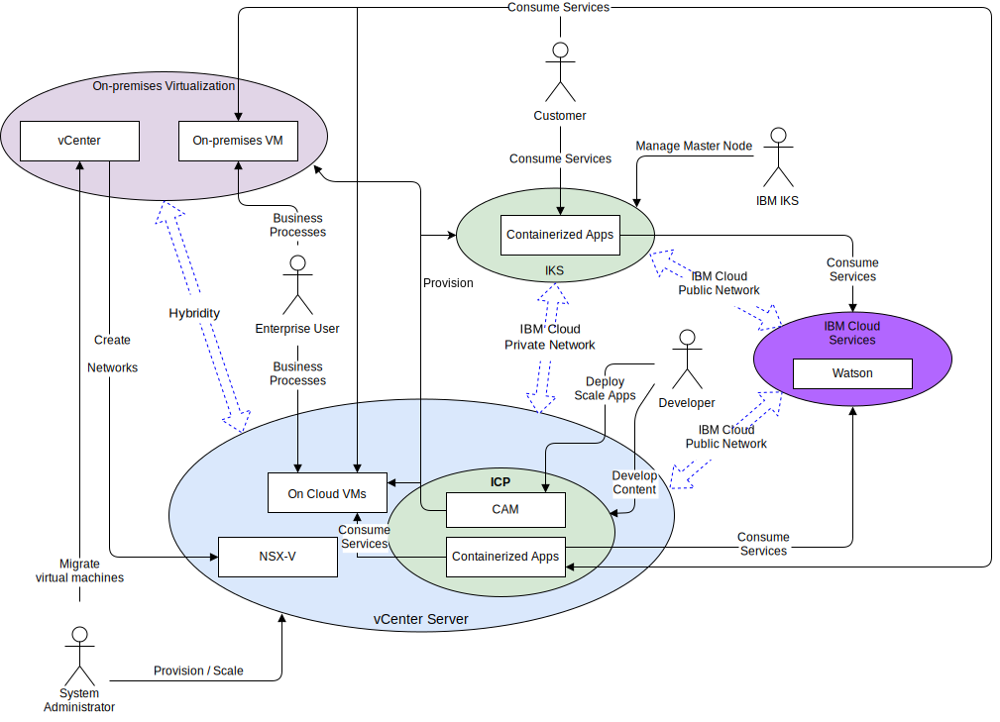

---

copyright:

  years:  2016, 2019

lastupdated: "2019-03-13"

subcollection: vmware-solutions

---

# System context
{: #vcsnsxt-systemcontext}

The system context diagram defines the key elements of a system, the boundary of the system and the entities that interact with it along with the interactions. It is a high-level diagram that provides the reader with an initial view of the system.

Figure 1. System context

The four core components, from a network perspective, are as follows:
- **On-premises virtualization** - a VMware environment that is hosted on the client’s premises or a third party and currently hosts the virtual machines (VMs) running the applications to be modernized. It's the source environment for VM migrations and is loosely coupled to {{site.data.keyword.cloud}} via VMware HCX.
- **vCenter Server** – an {{site.data.keyword.vmwaresolutions_short}} instance that is the target for migrated VMs from the on-premises environment. Together with the on-premises virtualization it forms a hybrid environment that allows VMs to move seamlessly from one environment to the other.
- **{{site.data.keyword.containerlong_notm}}** - uses Kubernetes as the container orchestration solution. IBM operates and manages the Kubernetes master node while the worker nodes are deployed to customer-managed infrastructure. IBM provides management tools for operating system patch deployment, Docker engine upgrades, and new Kubernetes versions. The {{site.data.keyword.containerlong_notm}} provides an isolated and secure platform for managing containers that is portable, extensible, and self-healing in case of failovers.
- **IBM Cloud Private** - an application platform for developing and managing containerized applications. It is an integrated environment that includes the container orchestrator Kubernetes, a private image repository, a management console, monitoring frameworks and a graphical user interface, which provides a centralized location from where you can deploy, manage, monitor, and scale applications.
- **IBM Cloud Services** - a wide range of services available from {{site.data.keyword.cloud_notm}} that are consumable. Service options include analytics, AI, and IoT as examples.

## Actors
{: #vcsnsxt-systemcontext-actors}

The system context diagram identifies the following actors.

Table 1. Actors

Actor  |  Description
---|---
System administrator |The system administrators are the enterprise VMware resources who use vCenter and the HCX plug-in. They identify candidates for migration, stretch networks, migrate VMs and manage NSX-V. They use the {{site.data.keyword.cloud_notm}} console to provision VMware vCenter Server on {{site.data.keyword.cloud_notm}} instances and to scale capacity.
Developer	| The Developers are the enterprise skilled container resources who use the {{site.data.keyword.containerlong_notm}}, {{site.data.keyword.icpfull_notm}}, and CAM consoles and APIs to create and manage containers. They create the new services as part of application modernization.
Enterprise User | This enterprise resource requires network access to the applications to complete business processes such as updating content.
Customer | The customer is an external actor who wants to consume services from the enterprise. For Acme Skateboards, it is a skater who wants to purchase skating products. The Customer requires secure internet access to the catalog.
{{site.data.keyword.containerlong_notm}} | This is an IBM resource who manages the {{site.data.keyword.containerlong_notm}} Master Node of the service.

## Systems
{: #vcsnsxt-systemcontext-systems}

The system context diagram identifies the following systems.

Table 2. Systems

Actor | Description
---|---
vCenter | The vCenter is the primary interface for the system administrator to manage the on-premises VMs and access the HCX plug-in to stretch networks and migrate VMs. With vCenter Server with Hybridity Bundle the systems administrator can seamlessly integrate on-premises vSphere networks into the vCenter Server instance that runs on {{site.data.keyword.cloud_notm}}. Hybrid networking extends the on-premises networks into the {{site.data.keyword.cloud_notm}} allowing customers to migrate their applications into a vCenter Server instance that runs on {{site.data.keyword.cloud_notm}} and back to on-premises if required. For more details on the vCenter Server with Hybridity Bundle, see [VMware HCX on {{site.data.keyword.cloud_notm}} solution architecture](/docs/services/vmwaresolutions/services?topic=vmware-solutions-hcx-archi-intro#hcx-archi-intro).
On-premise VMs | The on-premises VMs host the applications migrating to the cloud. Initially, they are migrated as VMs and then via the application modernization journey migrated from VMs to containers.
On cloud VMs | On cloud VMs host applications that were migrated from on-premises. They communicate with on-premises applications via the stretched L2 network. For this reference architecture and in this example for Acme Skateboards, one of the on cloud VMs is a database server, which is part of the online presence workload.
NSX-V | NSX-V on vCenter Server provides the software defined overlay network that is managed by the system administrator. The overlay network is the target for HCX stretched networks as it handles traffic from the VMs for {{site.data.keyword.icpfull_notm}}. NSX-V provides the reference architecture with features such as deployment, reconfiguration, and destruction of on-demand virtual networks and micro-segmentation services within VMware by using vSphere distributed switches (vDS). For more information, see [NSX–V overview](/docs/services/vmwaresolutions/archiref/vcsnsxt?topic=vmware-solutions-vcsnsxt-overview-ic4vnsxv).
CAM | {{site.data.keyword.cloud_notm}} Automation Manager (CAM) runs on {{site.data.keyword.icpfull_notm}} and provides a single pane of glass to provision VM-based workloads alongside Kubernetes based workloads by using templates. CAM allows the Developer to:   - Provision workloads on vCenter Server, {{site.data.keyword.icpfull_notm}}, or {{site.data.keyword.containerlong_notm}}.  - Compose and orchestrate services that are made out of both VMs and containers.   - Integrate their DevOps toolchains and day-2 ITSM solution.
Containerized Applications | The apps that went through the application modernization journey and are now running as containers. For this reference architecture and in this example for Acme Skateboards, one of the containerized apps is a web server, which is part of the online presence workload.
Watson | For this reference architecture and in this example for Acme Skateboards, Watson represents the AI service that is used in the “Concept Car” architecture.

## Related links
{: #vcsnsxt-systemcontext-related}

* [vCenter Server on {{site.data.keyword.cloud_notm}} with Hybridity Bundle overview](/docs/services/vmwaresolutions/archiref/vcs?topic=vmware-solutions-vcs-hybridity-intro)
