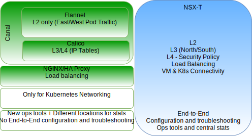

---

copyright:

  years:  2016, 2018

lastupdated: "2018-10-29"

---

# Technical preview of VMware NSX-T on VCS

## Overview of NSX–T

VMware NSX-T is designed to address application frameworks and architectures that have heterogeneous endpoints and technology stacks. In addition to vSphere, these environments can include other hypervisors, KVM, containers, and bare metal. NSX-T allows IT and development teams to choose the technologies best suited for their applications. NSX-T is also designed for management, operations, and consumption by development organizations in addition use by IT.

In this design, the NSX-T management infrastructure is deployed on the initial VCS cluster or it is deployed to an existing cluster.

NSX-T Manager is assigned an IP address from the private portable address block that is designated for management components and configured to use the common DNS and NTP servers.

An extra cluster is deployed and used as Hypervisor Transport nodes, along with either vSAN or NFS storage used as the workload data store. Table 1 summarizes the requirements for a medium size environment.

Table 1. NSX-T component specifications

Resources	|NSX-T Manager	|Controller x 3	|Edge x 2	|Bare Metal Edge*
---|---|---|---|---
Medium size	|Virtual appliance	|Virtual appliance	|Virtual appliance	|Physical Server*
Number of vCPUs	|4	|4	|4	|8
Memory	|16 GB	|16 GB	|8 GB	|32 GB
Disk	|140-GB vSAN or the management NFS share.	|120-GB vSAN or the management NFS share.	|120-GB vSAN or the management NFS share.	|200 GB
Disk type	|Thin provisioned	|Thin provisioned	|Thin provisioned	|Physical
Network	|Private A portable designated for management components.	|Private A portable designated for management components.	|Private A portable designated for management components.	|Private A portable designated for management components.

\* **Note**: Check the hardware compatibility list for specific requirements.

Figure 1. NSX-V and T management component layout

### Initial configuration

The IBM Cloud automation deploys the NSX-T Manager, a controller cluster that consists of three controllers and an edge cluster within the initial VCS cluster. All components are assigned IP addresses from the Private A portable subnet.

VM–VM anti–affinity rules are created such that controllers are separated among the hosts in the cluster. Note that the initial cluster is deployed with a minimum of three nodes to ensure high availability for the controllers.

The IBM Cloud automation also deploys two more vSphere hosts for the NSX-T Manager and installs the NSX-T software (VIBs) on them. It also creates the host and edge uplink profiles, the NIOC profile, and defines the IP pool that is used for Tunnel Endpoint (TEP) communication. Refer to the uplink profile definition table, and the NIOC profile definitions table for details.

The IP addresses defined in the pools are from the Private A portable IP address range. VLAN and overlay transport zones are created, and the two extra ESXi hosts are configured as transport nodes for both zones. Currently, the equivalent uplink profiles are assigned. An N-VDS switch is created on the ESXi hosts and assigned to uplink1 and uplink2.

At the time, of this writing two extra VLANs are required to accommodate the teaming, failover, and uplink policies for vmkernel port migration from the vDS port group to NSX-T logical VLAN switches. The logical VLAN switches are created with the appropriate VLAN IDs and the vmkernel ports are migrated.

NSX-T creates vmk10, which is used for the encapsulation interface and vmk50, which is used for intra Tier0 transit and intra Tier0-Tier1 transit subnets on the ESXi hosts. By default, the 169.254.0.0/28 subnet is used for intra Tier0 transit and 100.64.0.0/16 subnet for Tier0-Tier1 transit.

Table 2. Uplink profile definition

Uplink profile	|Specification
---|---
LAGs	|None defined currently.
Teaming	|Failover: Active = Uplink1 = vmnic0, Standby= Uplink2 = vmnic2
Transport VLAN	|0
MTU	|9000

Table 3. NIOC profile definition

Traffic Type/Traffic name	|Limit (%)	|Shares	|Reservation (%)
---|---|---|---
Management traffic	|Unlimited	|20	|0
Virtual machine traffic	|Unlimited	|30	|0
Fault tolerant traffic	|Unlimited	|50	|0
vSphere replication traffic	|Unlimited	|50	|0
iSCSI traffic	|Unlimited	|50	|0
vSphere Data Protection backup traffic	|Unlimited	|50	|0
vMotion traffic	|Unlimited	|50	|0
NFS traffic	|Unlimited	|100	|0
vSAN traffic	|Unlimited	|100	|0

Figure 2. Logical VLAN switch to vmkernel interface

## NSX-T

This design specifies the configuration of NSX-T components, the VLAN, and overlay transport zones but does not apply any overlay network component configuration. It is left up to the customer to design the network overlay based on their needs.

The following is configured:
-	Management servers and controllers are installed.
-	ESXi agents are installed and a TEP IP address pool is configured for transport nodes.
-	Transport nodes are configured for both VLAN and overlay transport zones.
-	N-VDS is created on the ESXi transport nodes.
-	VMkernel ports are migrated from VSS/VDS to N-VDS.
-	Tier 0 router for use by management components.

What is NOT configured:
-	Overlay Logical Switches.
-	Micro segmentation.
-	Linked NSX management to other VMware instances.

### VCS with NSX-V and NSX-T

The original VCS cluster contains all the management components for NSX-V and NSX-T along with the vCenter Server appliances. The hosts in this cluster are prepared for NSX-V as described in [NSX-V overview](vcsnsxt-overview-ic4vnsxv.html). The hosts in the second cluster are prepared for NSX-T and configured as transport nodes. This configuration gives customers the ability to migrate from NSX-V to NSX-T if they choose to do so.

### NSX-T versus NSX-V

This section highlights the major difference between the VMware SDN products, NSX-V, and NSX-T. Both solutions provide micro-segmentation within a VMware environment, NSX-T takes it a bit further as outlined below.

For detailed architectural differences, see [VMware NSX-T Reference Design Guide](https://communities.vmware.com/servlet/JiveServlet/download/37591-3-195840/VMware%20NSX-T%20Reference%20Design%20Guide.pdf) (PDF download).

#### NSX for vSphere

NSX-V is designed for vSphere deployments only and is architected so a single NSX-V Manager is tied to a single VMware vCenter Server instance. Basically, if you need network virtualization within your VMware environment NSX-V is the appropriate solution.

NSX-V highlights:
-	VMware-centric.
-	Designed for SDN within vSphere (single pain of glass for network virtualization in the vSphere UI).
-	Uses VXLAN encapsulation protocol (supported by most third-party vendors).
-	Physical NICs are not owned by NSX-V they are assigned to the virtual distributed switches (vDS) SDDC-Dswitch-Private and SDDC-Dswitch-Public.
-	Terminology differences Distributed Logical Router (DLR) for east-west traffic and Edge Service Gateway (ESG) for north-south traffic.

#### NSX Transformers

NSX-T is a stand-alone solution for vCenter and vSphere environments, but it also supports KVM, public cloud, containers, and can be integrated into frameworks like IKS and ICP, Redhat OpenShift, Pivotal, and others. This gives you the ability to manage your SDN across multiple hypervisors, containers, and clouds.

NSX-T highlights:
-	Stand-alone product. vCenter is not required.
-	Multi-hypervisor support:
    - Controllers can be deployed on KVM or ESXi.
    - Edges can be deployed as virtual or bare metal.
-	Container integration (NSX-T CNI plug-in).
-	OpenSwitch (OvS) support.
- Multi-tiered optimized routing:
    - Route Advertisement at Tier 1 router.
    - Route Redistribution at Tier 0 router.
-	Uses Geneve encapsulation protocol.
-	Physical NICs are owned by NSX-T Transport node and assigned to the N-VDS.
-	Terminology differences Tier-1 Logical Router for east-west traffic and Tier-0 Logical Router for north-south traffic.

## Calico

Calico is built on a distributed scale-out architecture giving it the ability to smoothly scale from a single developer notebook to large enterprise deployments and uses the standard Linux data plane to deliver bare metal performance for virtual workloads. Calico is made up of several interdependent components:
-	Felix, a daemon that runs on every node that hosts an endpoint, container, or a VM. Felix is responsible for interface management, route and acl programming, routing to the endpoint, traffic validation between endpoints, and state reporting, basically health of the network for the host it’s managing.
- Orchestrator Plugin, which binds orchestrator plug-in to Calico, in this case the Kubernetes plug-ins, provides API translation from Kubernetes to Calico, and feedback from Calico back into Kubernetes on failed network setup of endpoints.
-	etcd, provides the communication between components and stored in a consistent data store, which ensures Calico can always build an accurate network.
-	BIRD, provides BGP client functions on every node that also hosts Felix. When Felix inserts a route into the Linux kernel the BGP client picks up the routes and distributes them to other nodes in the deployment. In large environments a BGP route reflector is also deployed which acts as a central point for BGP clients to connect. This prevents each client from needing to talk to every other client and distribute the routes to the other nodes in the deployment.

Figure 3. Calico overview

### NSX-T and Calico

#### NSX-T component details

The NSX-T architecture has built-in separation of the data plane, control plane, and management plane. This separation delivers multiple benefits, including scalability, performance, resiliency, and heterogeneity. Key architecture highlights include the following:
-	Management plane: NSX-T management plane is designed from the ground up with advanced clustering technology, which allows the platform to process large-scale concurrent API requests.
-	Control plane: NSX-T control plane keeps track of the real-time virtual networking and security state of the system. NSX-T control plane separates the control plane into a central clustered control plane (CCP) and a local control plane (LCP). This simplifies the job of the CCP significantly and enables the platform to extend and scale for heterogeneous endpoints.
-	Data plane: The NSX-T data plane introduces a host switch (rather than relying on the vSwitch), which decouples it from the compute manager and normalizes networking connectivity. All create, read, update, and delete (CRUD) operations are performed via the NSX-T Manager.

#### Differences between Calico and NSX

Calico is a Tigera open source project and is primarily maintained by the Tigera team. It is delivered as a CNI that enables networking and security for orchestration systems like Kubernetes, which both ICP and IKS use.

Calico creates and manages a flat Layer 3 network, assigning each workload a fully routable IP address. Workloads can communicate without IP encapsulation or network address translation for bare metal performance, easier troubleshooting, and better interoperability. In environments that require an overlay, Calico uses IP-in-IP tunneling or can work with other overlay networking such as Flannel. There is an open source project that is called Canel, which is an effort to provide Calico and Flannel installation at the same time and provide out of the box VXLAN networking, while also allowing you take advantage of policy isolation with Calico policies.

Calico is made up of several interdependent components that provide endpoint communication, security, routing, and plug-in integration with Kubernetes. This is all done through command line and configuration file thus making it difficult to provide consistent networking and security policies across a hybrid environment. For more details on the Calico components, see the [Project Calico](https://www.projectcalico.org/) documentation.

NSX-T is a stand-alone solution for vCenter and vSphere environments, it also supports KVM, public cloud, containers, and can be integrated into frameworks like IKS and ICP, Redhat OpenShift, Pivotal, and others. This gives you the ability to manage your SDN across multiple hypervisors, containers, and cloud. NSX-T operates at Layers 2, 3, and 4 and provides functionality at each layer.

NSX-T allows network and security policy management across a vm and container environment in an easy to understand web interface.

Figure 4. High-level comparison between the NSX-T and Calico components

## NSX-T and Kubernetes

The core component that provides the integration between the Kubernetes and the NSX manager is the NSX Container Plugin (NCP). The NCP runs as container inside a Kubernetes pod, monitors, and watches for changes of relevant objects on the Kubernetes API server like namespaces and pods. Developers run tasks on the Kubernetes side, and NCP sees those changes and reacts by creating the related NSX Objects like logical switches, logical routers, and firewall objects by using a collection of API calls towards NSX manager.

In the following, there are two Kubernetes namespaces, Acme and Skateboards, for each namespace we have a dedicated logical switch, Tier-1 router, and an IP segment that connects it to a T0 logical router.

Figure 5. Kubernetes NCP

### NSX Security Policy Manager

In addition to providing network virtualization, NSX-T also serves as an advanced security platform, providing a rich set of features to streamline the deployment of security solutions. This section outlines the micro-segmentation capabilities that can be applied across multiple platforms.

Key concepts for examination include:
-	NSX-T distributed firewall, provides stateful protection of the workload at the vNIC level. DFW enforcement occurs in the hypervisor kernel, helping deliver micro-segmentation.
-	Uniform security policy model for on premises and cloud deployment, supporting multi-hypervisor (that is, ESXi and KVM) and multi-workload, with a level of granularity down to the VM and container attributes.
-	Agnostic compute management, supporting hypervisors that are managed by different compute managers while allowing any defined micro-segmentation policy to be applied across hypervisors spanning multiple vCenter environments.
-	NSX-T Edge firewall serves as a centralized stateful firewall service for N-S traffic. Edge firewall is implemented per logical router and supported at both tier-0 and tier-1. Edge firewall is independent of NSX-T DFW from policy configuration and enforcement perspective.
-	Dynamic grouping of objects into logical constructs called NSGroups based on various criteria including tag, virtual machine name, subnet, and logical switch.
-	The scope of policy enforcement can be selective, with application or workload level granularity.
-	Distributed Network Encryption (DNE) provides confidentiality and integrity of the data flowing through the network.
-	IP discovery mechanism dynamically identifies workload addressing.
-	SpoofGuard blocks IP spoofing at vNIC level.
-	Switch security provides storm control and security against unauthorized traffic.

Figure 6. NSX-T Micro-segmentation

### Differences between NSX–T and NSX-V

NSX for vSphere (NSX-V) is designed for vSphere deployments only and is architected so a single NSX-V manager platform is tied to a single VMware vCenter Server instance. Basically, if you need network virtualization within your VMware environment NSX-V is most likely the appropriate solution.

NSX Transformers (NSX-T) is a stand-alone solution that can support multiple vCenters and vSphere environments, it also supports KVM, public cloud, containers, and can be integrated into frameworks like IBM IKS and ICP, Redhat OpenShift, Pivotal, and others. This gives you the ability to manage your SDN across multiple hypervisors, containers, and clouds with a common set of tools.

#### Network scalability with NSX–V

VMware NSX-V is designed to address application frameworks and architectures that have thousands of endpoints and technology stacks allowing it to span from a singles vSphere cluster with three hosts to a Cross-vCenter deployment with over a thousand hosts and thousands of virtual machines.

#### Network scalability with NSX-T

VMware NSX-T is designed to address application frameworks and architectures that have heterogeneous endpoints and technology stacks allowing it to span from any site, any cloud, or any endpoint device. This enables it to scale from a small data center to a multi cloud environment.

#### Security with NSX-V

VMware NSX-V allows you to define security policies that are defined consistently across the entire environment, regardless of the type of application or where it has been deployed within your VMware infrastructure. As new workloads are deployed they automatically inherit the security policies and stay with those workloads throughout its lifecycle, no matter where it has been provisioned or moved to. NSX decouples security policy from static network attributes like IP address, port, and protocol, and allows for the definition of policies based on a contextual understanding of the application and the infrastructure. NSX also allows for the insertion of advanced third-party security services into a given micro-segment rather than routing all network traffic through a physical device or virtual appliance. By doing so, advanced security services can be inserted at the right places, at the right time, maximizing network traffic efficiency while increasing the efficacy of the security services themselves.

#### Security with NSX-T

VMware NSX-T provides the same capabilities as NSX-V with in a VMware vSphere environment. In addition, NSX-T delivers consistent and scalable micro-segmentation security for application running in private and public cloud environments like IBM Cloud Private and IBM Kubernetes Services along with other cloud offerings.

#### Integration with NSX-V

For NSX-V integration with Kubernetes IBM Cloud automation installs ICP on top of a VCS instance. A dedicated switch/VXLAN, DLR, and ESG are created specifically for the Kubernetes network. Day 1 overlay network for ICP is a 192.168.20.0/24 subnet with routing setup through the ESG for access to the underlay network.

Figure 7. NSX-V and Kubernetes

#### Integration with NSX-T

NSX-T integration with Kubernetes is through the NSX-T container plug-in (NCP). NCP runs on each Kubernetes node and communicates with the NSX Manager and the Kubernetes control plane. The NSX-T plug-in automatically creates a logical topology for the Kubernetes cluster, creates separate logical networks for each namespace, connects Kubernetes pods to logical networks, and allocates IP and MAC addresses.

NSX-T distributed firewall allows creation of network policies, which are implemented for the Kubernetes cluster. In addition, it supports ingress and egress policies, label, and expression matching policies and has load balancer capabilities, which can all be applied to the Kubernetes infrastructure.

Figure 8. NSX-T and Kubernetes

### More resources
* [VMware NSX-T reference design guide](https://communities.vmware.com/servlet/JiveServlet/download/37591-3-195840/VMware%20NSX-T%20Reference%20Design%20Guide.pdf) (PDF download)
* [Route to Cloud NSX-T](https://www.routetocloud.com/category/nsx-t/)
* [VMware containers and container networking for network engineers](https://www.vmware.com/content/dam/digitalmarketing/vmware/en/pdf/products/nsx/vmware-containers-and-container-networking-whitepaper.pdf)
