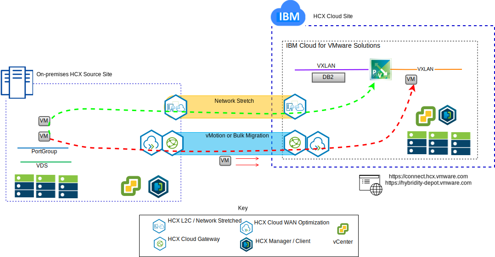
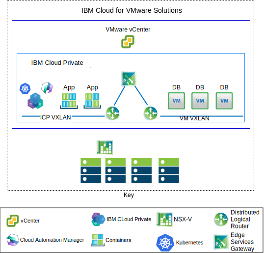

---

copyright:

  years:  2016, 2019

lastupdated: "2019-02-15"

---

# Use cases
{: #vcsnsxt-usecases}

## VMware workload migration to IBM Cloud
{: #vcsnsxt-usecases-wkld-mig}

Acme Skateboards wants to seamlessly extend their on-premises VMware SDDC instance into a VMware vCenter Server on {{site.data.keyword.cloud}} instance. They must keep their business up and running and minimize their downtime. Reconfiguring their applications to run in the cloud isn't an optimal solution.

The VMware vCenter Server on {{site.data.keyword.cloud_notm}} with Hybridity Bundle enables the creation of a seamless connection between vCenter Server instances and an on-premises VMware virtualized datacenter.

The VMware HCX components, which are deployed as virtual machines (VMs) in the vCenter Server target site enable the establishment of a connection with the VMware HCX components that are installed in the peer on-premises source site.

Figure 1. VMware Hybrid Cloud Extension service

The loosely coupled interconnectivity between on-premises and {{site.data.keyword.cloud_notm}} enables capabilities such as:
- **Simple interconnectivity** – logical network connections are established easily over any physical connection that includes public internet, private VPN, or direct link.
- **Layer 2 extension** – on-premises networks are extended into the cloud that includes on-premises subnets and IP addressing.
- **Encryption** – network traffic is securely encrypted between the two sides.
- **Optimized network** – selects the best connection and efficiently floods the connection so that network traffic is moved as fast as possible.
- **Data deduplication** – as much as 50% reduction in network traffic can be achieved.
- **Intelligent routing** – when a workload is moved, proximity routing can change the network path (that is, gateway) so that network traffic uses the target site gateway and doesn't “hairpin” back to the originating site.
- **Zero downtime migration** – a running system can be moved to (or back from) the cloud by using vMotion.
- **Scheduled migration** – any number of VMs can be replicated to the destination site and then activated on that site at a designated time that replaces the systems that runs on the originating site.
- **Migration of security policies** – if NSX is used on-premises any security policies, firewalls, and so on, are moved along with the workload.

## Hybrid architecture deployment
{: #vcsnsxt-usecases-hybrid-archi-deployment}

Acme Skateboards wants to deploy a hybrid architecture on the {{site.data.keyword.cloud_notm}} consisting of vCenter Server with Hybridity Bundle and {{site.data.keyword.icpfull_notm}} for their journey to application modernization. Their requirements are to run their databases on VMs, the apps and web interfaces in containers, and would like to use a common set of tools for network and security management.

{{site.data.keyword.vmwaresolutions_short}} provides automation to deploy VMware technology components in {{site.data.keyword.CloudDataCents_notm}} across the globe. The architecture consists of a single cloud region and supports the ability to extend into more cloud regions that are located in another geography or into another {{site.data.keyword.cloud_notm}} pod within the same data center.

The {{site.data.keyword.icpfull_notm}} and Cloud Automation Manager (CAM) products can be manually deployed into your on-premises virtualization platform enabling cloud management from the on-premises location. Alternatively, {{site.data.keyword.icpfull_notm}} and CAM are offered as a service extension to an existing or new vCenter Server deployment enabling cloud management from the {{site.data.keyword.cloud_notm}}.

The following diagram represents {{site.data.keyword.icpfull_notm}} running on a vCenter Server instance. NSX-V is configured with a dedicated switch/VXLAN, Distributed Logical Router (DLR), and an Edge Services Gateway (ESG) specifically for the {{site.data.keyword.icpfull_notm}} overlay network. Routing is set up through the ESG for access to the underlaying network.

Using {{site.data.keyword.cloud_notm}} automation, Acme Skateboards can provision a hybrid solution that encompasses vCenter Server to run their database VMs and {{site.data.keyword.icpfull_notm}} on vCenter Server to run their applications and front end web services in containers. NSX gives them a common set of management tools for networking and security in the overlay network.

For more information about NSX-V, see [NSX-V overview](/docs/services/vmwaresolutions/archiref/vcsnsxt?topic=vmware-solutions-vcsnsxt-overview-ic4vnsxv). For more information about the vCenter Server and {{site.data.keyword.icpfull_notm}} offering, see [vCenter Server and {{site.data.keyword.cloud_notm}} Private](/docs/services/vmwaresolutions/archiref/vcsicp?topic=vmware-solutions-vcsicp-intro).

Figure 2. vCenter Server with {{site.data.keyword.icpfull_notm}}

This creates a loosely coupled interconnectivity between on-premises and {{site.data.keyword.cloud_notm}} and enables capabilities such as:
-	**Simple interconnectivity** – logical network connections are established easily over any physical connection including public internet, private VPN, or direct link.
-	**Layer 2 extension** – on-premises networks are extended into the cloud including on-premises subnets and IP addressing.
-	**Encryption** – network traffic is securely encrypted between the two sides.
-	**Optimized network** – selects the best connection and efficiently floods the connection so that network traffic is moved as fast as possible.
-	**Data deduplication** – as much as 50% reduction in network traffic can be achieved.
-	**Intelligent routing** – when a workload is moved, proximity routing can change the network path (that is, gateway) so that network traffic uses the target site gateway and does not “hairpin” back to the originating site.
-	**Zero downtime migration** – a running system can be moved to (or back from) the cloud by using vMotion.
-	**Scheduled migration** – any number of VMs can be replicated to the destination site and then activated on that site at a designated time replacing the systems running on the originating site.
-	**Migration of security policies** – if NSX is used on-premises any security policies, firewalls, and so on, are moved along with the workload.

Using this solution Acme Skateboards was successfully able to migrate their on-premises VMware workloads to the {{site.data.keyword.cloud_notm}} meeting their requirements of little to no downtime and no application reconfiguration. For more information about vCenter Server with Hybridity Bundle, see [VMware HCX on {{site.data.keyword.cloud_notm}} Solution Architecture](https://www.ibm.com/cloud/garage/files/HCX_Architecture_Design.pdf).

## Related links
{: #vcsnsxt-usecases-related}

* [vCenter Server on {{site.data.keyword.cloud_notm}} with Hybridity Bundle overview](/docs/services/vmwaresolutions/archiref/vcs?topic=vmware-solutions-vcs-hybridity-intro)
