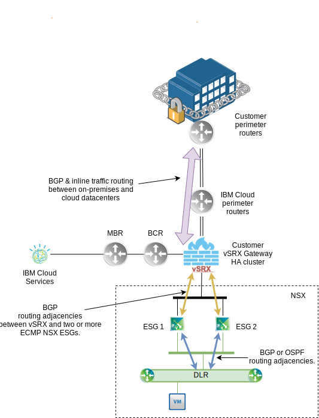
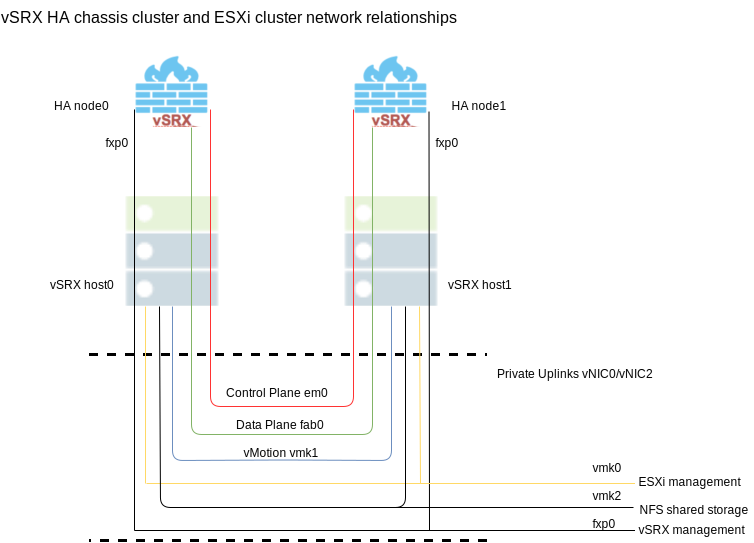
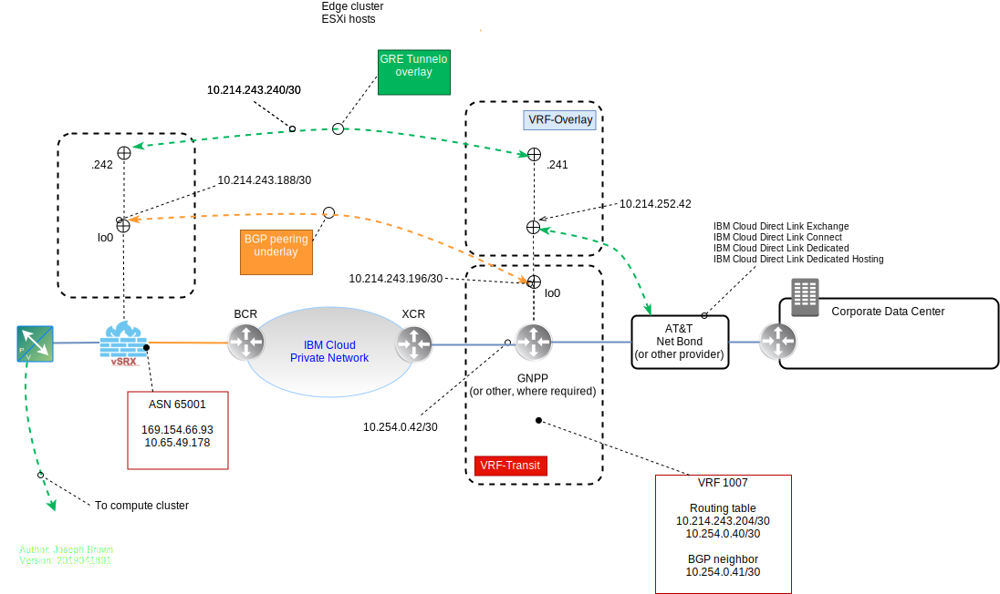

---

copyright:

  years:  2019, 2025

lastupdated: "2025-10-24"

subcollection: vmwaresolutions

---

{{site.data.keyword.attribute-definition-list}}

# vSRX single data center edge
{: #vcsvsrx-planning}

{{site.data.content.vms-deprecated-note}}

There are two options for deploying a vSRX high availability (HA) cluster:

* Deploy gateway on bare metal servers - deploys vSRX on a KVM-based host.
* Deploy gateway as part of the {{site.data.keyword.vmwaresolutions_full}} offering (gateway cluster) - deploys vSRX on a VMware vSphere ESXi™ hypervisor.

The two vSRX nodes are tied together in a highly available chassis cluster and deliver a reliable gateway solution that provides for continuous network traffic flows through the loss of a host that supports a node or a vSRX node.

The following features are common to both deployment types:

* Provides an HA pair within a single data center:
   * A pair of vSRX gateway appliance hosts
   * NFS storage that is shared between the hosts
* Full vSRX firewall and routing capability implemented.

The following features are unique to a deployment with the ESXi as the host OS:

* VXLAN connectivity into a {{site.data.keyword.vcf-auto}} instance
* Ability to host extra virtual machines (VMs) on the gateway cluster
* NSX edges and load balancers

The basic vSRX offering architecture places a vSRX in front of all the VLANs deployed into a customer account. The vSRX is a powerful Vyatta replacement for situations in which a customer-controlled gateway appliance is desirable.

The following figure represents the typical vSRX deployment.

{: caption="vSRX overview" caption-side="bottom"}

The deployment of the {{site.data.keyword.vcf-auto}} instance is required before the vSRX edge gateway appliance order is placed.
{: important}

## Understanding the default vSRX configuration for VMware Solutions
{: #vcsvsrx-planning-default-vsrx}

Understanding the default configuration helps both an understanding of the vSRX HA Chassis Cluster and {{site.data.keyword.cloud_notm}} underlay networking. The default configuration is the base upon which all further integration is done. For more information about extra configuration options that you might want to include and as an example, see the {{site.data.keyword.cloud_notm}} IaaS vSRX default configuration. This information does not illustrate your configuration. Your own configuration is different.

For more information, see [Understanding the vSRX Default Configuration](/docs/vsrx?topic=vsrx-understanding-the-vsrx-default-configuration#understanding-the-vsrx-default-configuration) and [{{site.data.keyword.cloud_notm}} IaaS vSRX default configuration](/docs/vmwaresolutions?topic=vmwaresolutions-vcsvsrx-iaas-def-config).

## vSRX and {{site.data.keyword.vcf-auto-short}} integrated design
{: #vcsvsrx-planning-vsrx-design}

{: caption="vSRX and {{site.data.keyword.vcf-auto-short}} integration" caption-side="bottom"}

The tight integration of the vSRX HA Chassis Cluster into a {{site.data.keyword.vcf-auto-short}} instance extends the basic {{site.data.keyword.vcf-auto-short}} architecture in a few key areas.

### {{site.data.keyword.vcf-auto-short}} cluster design
{: #vcsvsrx-planning-vcs-design}

When a {{site.data.keyword.vcf-auto-short}} instance is deployed to a customer account, it is typically a single hyper-converged cluster in which compute, management, and edge functions are delivered by a single three ESXi host (NFS shared storage) or four node (vSAN shared storage) cluster configuration.

The addition of the vSRX offering on ESXi impacts the basic {{site.data.keyword.vcf-auto-short}} design by moving the edge gateway out of the hyper-converged cluster onto a dedicated two ESXi host cluster. The gateway cluster is managed by the existing VMware vCenter® that is deployed with the initial {{site.data.keyword.vcf-auto-short}} instance.

#### Host sizing
{: #vcsvsrx-planning-host-sizing}

The current vSRX offering has limited hardware options for deployment. Since these options are not variable, it is recommended that you review the options available in the [{{site.data.keyword.slportal}}](https://control.softlayer.com/network/gatewayappliances).

### Network design
{: #vcsvsrx-planning-network-design}

The {{site.data.keyword.vcf-auto-short}} offering is designed to manage east-west network traffic at the SDN layer by using VMware NSX Tier-1 and virtual tunnel endpoints (VTEP) on each ESXi host and north-south traffic through NSX Tier-0. The vSRX is not a replacement for the NSX-T Tier0/1 edge clusters but can either assist or potentially replace the Tier-0 firewall services in managing the north-south traffic flows.

The required network design changes are modest and include all customer VM traffic no matter the destination, platform management traffic, direct-link traffic, where applicable, and internet bound traffic. Traffic that is explicitly excluded includes VTEP traffic, storage traffic, and vMotion traffic.

You can extend NSX from the compute cluster to the gateway cluster or you can use BGP over an IPsec VPN to enable connectivity between the edge and compute clusters. When the traffic that flows between the {{site.data.keyword.vcf-auto-short}} compute cluster and the gateway cluster is not in conflict with the subnets that are assigned by the {{site.data.keyword.cloud_notm}} infrastructure, you can use a local VLAN and subnet as a transit link.

BGP over IPsec VPN is the preferred method of connecting to a customer on-premises data center whether the connection traverses the internet or passes between the customer and {{site.data.keyword.cloud_notm}} through one of the {{site.data.keyword.cloud_notm}} infrastructure direct-link offerings.

It is recommended that you review the architecture patterns in the [Architecture pattern for using gateway cluster with NSX-T](/docs/vmwaresolutions?topic=vmwaresolutions-arch-pattern-edge-gateway-cluster).

#### Interface mapping for vSRX on VMware
{: #vcsvsrx-planning-interface-map}

The vSRX in the {{site.data.keyword.vcf-auto-short}} instance has specific connection requirements to enable and maintain the HA chassis cluster.

{: caption="vSRX HA chassis cluster on {{site.data.keyword.vcf-auto-short}} interconnections" caption-side="bottom"}

Each network adapter that is defined on the vSRX is mapped to a specific interface, depending on whether the vSRX instance is a stand-alone VM or one of a cluster pair for HA.

Note the following information for the stand-alone mode:

* The `fxp0` interface is the out-of-band management interface.
* The `ge-0/0/0` interface is the first traffic (revenue) interface.

Note the following information for the cluster mode:

* The `fxp0` interface is the out-of-band management interface.
* The `em0` interface is the cluster control link for both nodes.
* Any of the traffic interfaces can be specified as the fabric links, such as `ge-0/0/0` for `fab0` on `node 0` and `ge-7/0/0` for `fab1` on `node 1`.

The following table shows information for a stand-alone vSRX VM.

| Network adapter | Interface name in Junos OS |
|-----------------| -------------------------- |
| 1 | `fxp0` |
| 2 | `ge-0/0/0` |
| 3 | `ge-0/0/1` |
| 4 | `ge-0/0/2` |
| 5 | `ge-0/0/3` |
| 6 | `ge-0/0/4` |
| 7 | `ge-0/0/5` |
| 8 | `ge-0/0/6` |
{: caption="Interface names and mappings for a stand-alone vSRX VM" caption-side="bottom"}

The following table shows information for a pair of vSRX VMs in a cluster (node 0 and node 1).

| Network adapter | Interface name in Junos OS |
|-----------------| -------------------------- |
| 1 | `fxp0` (node 0 and 1) |
| 2 | `em0` (node 0 and 1) |
| 3 | `ge-0/0/0` (node 0) and `ge-7/0/0` (node 1) |
| 4 | `ge-0/0/1` (node 0) and `ge-7/0/1` (node 1) |
| 5 | `ge-0/0/2` (node 0) and `ge-7/0/2` (node 1) |
| 6 | `ge-0/0/3` (node 0) and `ge-7/0/3` (node 1) |
| 7 | `ge-0/0/4` (node 0) and `ge-7/0/4` (node 1) |
| 8 | `ge-0/0/5` (node 0) and `ge-7/0/5` (node 1) |
{: caption="Interface names and mappings for a pair of vSRX VMs in a cluster (node 0 and node 1)" caption-side="bottom"}

#### Default security zone configuration
{: #vcsvsrx-planning-default-sec-zone}

The following table shows the factory default settings for security policies.

| Source zone | Destination zone | Policy action |
| ----------- |------------------| ------------- |
| trust | untrust | permit |
| trust | trust | permit |
| untrust | trust | deny |
{: caption="Factory default settings for security policies" caption-side="bottom"}

As noted previously, the default configuration merely represents a point from which to build the required configuration to meet your requirements. The creation of extra security zones is often necessary to support the various traffic flow patterns present in the account.

## vSRX to client on-premises connections
{: #vcsvsrx-planning-client-config}

The preferred method of linking the {{site.data.keyword.vcf-auto-short}} instance to a client's existing on-premises data center is BGP.

If the client intends to connect over the Internet by using eBGP, they must obtain a public autonomous system number (ASN) or use BGP over an IPsec VPN to allow the use of private ASNs.

If the client is using Direct Link, BGP by using private ASNs is possible.

{: caption="vSRX BGP over IBM Direct Link" caption-side="bottom"}

The diagram illustrates one of many potential implementations of BGP from the on-premises data center to the {{site.data.keyword.cloud_notm}}.

The traffic that originates from the client facility flows through AT&T NetBond or other provider into the GNPP router. The GNPP router is peered through BGP to the vSRX gateway deployed into the client's {{site.data.keyword.cloud_notm}} account and all traffic is encapsulated in a GRE tunnel over BGP. The packets that exit the tunnel into the vSRX are then routed to the NSX overlay network through an edge gateway.

## Related links
{: #vcsvsrx-planning-related}

* [Getting Started with {{site.data.keyword.cloud_notm}} Juniper vSRX](/docs/vsrx?topic=vsrx-getting-started-vsrx)
* [Understand vSRX Virtual Firewall with VMware](https://www.juniper.net/documentation/us/en/software/vsrx/vsrx-consolidated-deployment-guide/vsrx-vmware/topics/concept/security-vsrx-vmware-overview.html){: external}
* [Requirements for vSRX Virtual Firewall on VMware](https://www.juniper.net/documentation/us/en/software/vsrx/vsrx-consolidated-deployment-guide/vsrx-vmware/topics/concept/security-vsrx-vmware-system-requirement.html){: external}
* [Install vSRX Virtual Firewall with VMware vSphere Web Client](https://www.juniper.net/documentation/us/en/software/vsrx/vsrx-consolidated-deployment-guide/vsrx-vmware/topics/task/security-vsrx-vsphere-client-installing.html){: external}
* [Configure a vSRX Virtual Firewall Chassis Cluster in Junos OS](https://www.juniper.net/documentation/us/en/software/vsrx/vsrx-consolidated-deployment-guide/vsrx-hyper-v/topics/task/security-vsrx-chassis-cluster-configuring.html){: external}
* [Configure ECMP on VMware NSX](https://letsv4real.com/2016/09/23/configure-ecmp-on-vmware-nsx/){: external}
