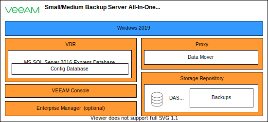

---

copyright:

  years:  2021

lastupdated: "2021-08-12"

subcollection: vmwaresolutions

---

{:external: target="_blank" .external}
{:tip: .tip}
{:note: .note}
{:important: .important}

# Veeam on bare metal server overview
{: #veeam-bms-archi-overview}

The following diagram describes an architecture overview for Veeam® on VMware Solutions Dedicated by using {{site.data.keyword.cloud}} bare metal servers. This solution is modular, where a single bare metal server can be used as an initial all-in-one deployment, which includes all required software components and local SATA DAS for backups. The solution can be scaled up with optional "add-on" servers.

{: caption="Figure 1. Architecture overview for Veeam on bare metal server deployments" caption-side="bottom"}

The following key components are part of the Veeam solution:
- Veeam Backup & Replication server (VBR) - The configuration and control center of the Veeam Backup & Replication installation.
- Veeam Enterprise Manager - The central management component that allows users to manage multiple Veeam Backup & Replication installations. In this architecture, Enterprise Manager is optional.
- Veeam proxies – The servers that run the Data Mover Services and basic backup proxy tasks, which include retrieval of VM data from the production storage, compressing, deduplicating, encrypting, and sending it to the backup repository.
- Veeam Backup & Replication configuration database - The database that stores data about the backup infrastructure, jobs, and sessions.
- Veeam Backup & Replication console – The console that provides a user interface to the backup application functions for the Backup Administrator.
- Backup repository – A local entity that provides storage capacity to be used for backups.
- Scale-out backup repository – A logical entity that groups a number of backup repositories (known as extents) to create a scalable pool of storage.
- FLR Appliance - For Linux® File Level Recovery (FLR), Veeam Backup & Replication uses a special FLR helper, which is a small virtual appliance based on a stripped-down Linux kernel.

More information about Veeam software components is provided in section [Veeam solution components](/docs/vmwaresolutions?topic=vmwaresolutions-veeam-bms-archi-components).

Veeam distributed software architecture allows these software packages to be installed on the same physical server or on their own servers. The initial all-in-one Veeam on bare metal server for VMware Solutions deployment provides all the roles that are installed on a single bare metal server per site. Optionally, the architecture can scale out for improved capacity and performance or to provide for VM DR replication functions by deploying more add-on proxies as needed.

The following image shows an overview of the all-in-one server. The all-in-one servers run all Veeam core components and they include local DAS storage for backups.

{: caption="Figure 2. Veeam on bare metal server deployment model for all-in-one server" caption-side="bottom"}

You can use other {{site.data.keyword.cloud_notm}} Storage options as a capacity tier storage for redundancy or long-term retention with Veeam scale-out backup repository functions, if your compliance requirements allow the usage of shared storage resources. For example, Object Storage can be used to provide a highly durable place for low-cost and long-term backup storage when these backups do not require high levels of restore performance.

The backup solution is self-managed and you can customize it post deployment. For more information, see [Post deployment customization options with self-managed vCenter Server](/docs/vmwaresolutions?topic=vmwaresolutions-veeam-bms-archi-post-deployment).

**Next topic:** [Veeam solution components](/docs/vmwaresolutions?topic=vmwaresolutions-veeam-bms-archi-components)

## Related links
{: #veeam-bms-archi-overview-related}

* [Veeam Backup & Replication](https://www.veeam.com/vm-backup-recovery-replication-software.html?ad=menu-products){: external}
* [Veeam Help Center technical documentation](https://www.veeam.com/documentation-guides-datasheets.html?ad=menu-resources){: external}
