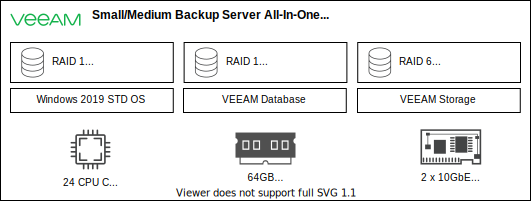

---

copyright:

  years:  2021, 2024

lastupdated: "2024-06-13"

subcollection: vmwaresolutions

---

{{site.data.keyword.attribute-definition-list}}

# Physical infrastructure for the Veeam server with {{site.data.keyword.cloud_notm}} bare metal servers
{: #veeam-bms-archi-physical}

## Veeam all-in-one servers
{: #veeam-bms-archi-physical-all-in-one}

This design uses {{site.data.keyword.cloud}} bare metal servers in an all-in-one model with SATA disks as Direct Attached Storage (DAS) by using both RAID 1 and RAID 6 disk arrays. RAID 1 is used for the operating system and configuration database, and RAID 6 for the backup repository. An overview of the physical setup is shown in the following diagram.

{: caption="Veeam on bare metal server all-in-one deployments" caption-side="bottom"}

The server CPU and RAM are sized to handle up backups for 500 VMs. You can select the backup storage repository size with RAID 6 with 8 physical disks of 2 TB, 6 TB, or 12 TB, which result in an effective capacity of 12 TB, 36 TB, or 72 TB.

RAID health is monitored through the {{site.data.keyword.cloud_notm}} standard RAID monitoring for bare metal servers. For more information, see [Name and location of the RAID monitoring daemon](/docs/bare-metal?topic=bare-metal-bm-raid-monitoring-daemon){: external}.

You can configure RAID alerts to bypass the monitoring process by changing the SMTP server and notification email destination in the configuration for a RAID card. However, if you change these configurations, {{site.data.keyword.IBM_notm}} cannot notify you of RAID issues or track the problem until resolution. You are advised not to alter the provided configuration.

## Network requirements
{: #veeam-bms-archi-physical-network}

Each Veeam® bare metal server is deployed with dual private only 10 GbE NICs with standard NIC teaming.

The Veeam bare metal servers are deployed to have connectivity to the following infrastructure VLANs:

| VLAN   | Designation | Traffic type                              |
|--------|-------------|-------------------------------------------|
| VLAN 1 | Private A   | ESXi management, management, Geneve (TEP) |
| VLAN 2 | Private B   | vSAN, NFS, vMotion, and Edge Geneve (TEP) |
{: caption="VLAN designations" caption-side="bottom"}

The Veeam bare metal servers are natively provisioned to VLAN 1, and they need the following IP address from the private primary subnet of VLAN 1: One IP address for the all-in-one server, which is deployed and configured during server provisioning of the nontagged VLAN 1.

Each Veeam bare metal server needs to be VLAN trunked to VLAN 2. They need the following IP address from the private portable subnet of the VLAN 2: One IP address for the all-in-one server from the NFS or vSAN subnet, which is configured through the automation on the tagged VLAN 2.

## Related links
{: #veeam-bms-archi-physical-related}

* [Veeam Backup and Replication](https://www.veeam.com/products/veeam-data-platform/backup-recovery.html?ad=menu-products){: external}
* [Veeam Help Center technical documentation](https://www.veeam.com/support/help-center-technical-documentation.html?ad=menu-resources){: external}
