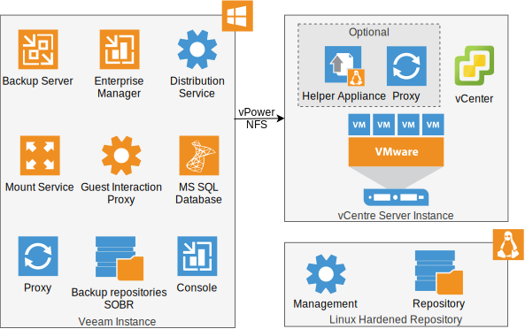

---

copyright:

  years:  2023, 2024

lastupdated: "2024-07-02"

subcollection: vmwaresolutions

---

{{site.data.keyword.attribute-definition-list}}

# Veeam components
{: #veeam-cr-sa-components}

This document describes the Veeam® components that are used in these solution architectures. It focuses on the Veeam service instance immediately after provisioning and before any changes occur.

Pertinent details are taken from the following information sources and also introduce the Veeam components:

* [Veeam Backup and Replication 12 user guide for VMware vSphere®](https://helpcenter.veeam.com/docs/backup/vsphere/overview.html?ver=120)
* [Veeam Backup and Replication best practices](https://bp.veeam.com/vbr/#veeam-backup--replication-best-practices){: external}

{: caption="Figure 1. Veeam components" caption-side="bottom"}

The Veeam service instance is based on an "all-in-one" [Simple deployment](https://helpcenter.veeam.com/docs/backup/vsphere/simple.html?ver=120){: external} scenario where the following Veeam components are deployed on a single server:

* Backup server.
* Configuration database.
* Backup proxy.
* Backup repository.
* Mount server.
* Guest interaction proxy.
* Enterprise Manager.
* vPower NFS service.
* Console.

The "all-in-one" server is installed automatically when the Veeam service instance is ordered. At order time, one of the following deployment options can be selected:

* VM - Veeam components that are installed on a Windows®-based virtual machine (VM) hosted on the {{site.data.keyword.vcf-auto}} instance.
* VSI - Veeam components installed on a Windows-based VSI.
* Bare metal - Veeam components installed on a Windows-based bare metal server.

The simple deployment scenario is suitable for small virtual environments.

For larger scale-virtual environments, the [Advanced deployment](https://helpcenter.veeam.com/docs/backup/vsphere/advanced.html?ver=120){: external} scenario is recommended. This deployment scenario moves the backup workload to dedicated backup infrastructure components. In this scenario, the backup server functions as a manager for backup jobs and for deploying and maintaining backup infrastructure components. The move from a simple to an advanced deployment scenario is a manual process.

The Veeam [distributed deployment](https://helpcenter.veeam.com/docs/backup/vsphere/distributed.html?ver=120){: external} scenario federates multiple Veeam instances and uses Veeam Backup Enterprise Manager for centralized management and reporting for multiple backup servers. This deployment scenario is not used in these solution architectures.

## Backup server
{: #veeam-cr-sa-components-backup}

The backup server is a Windows-based component and is the core component in the backup infrastructure. The backup server performs the administrative activities, such as coordination, scheduling, resource allocation, and management of backup infrastructure components. Each Veeam instance has only one backup server and high availability support is not provided. The VM option provides some high availability functions due to vSphere HA and DRS. Recovery of a backup server is achieved by restoring a configuration backup.

## Configuration database
{: #veeam-cr-sa-components-configdb}

The Veeam Backup and Replication configuration database stores data about the backup infrastructure, jobs, sessions, and other configuration data. In the deployment pattern, the database instance uses the default Microsoft® SQL Server Express Edition on the same virtual server that hosts the backup server.

If you are protecting more than 500 VMs, it is recommended to move to either a Standard or Enterprise Edition. It is still recommended to run the SQL Server locally on the backup server for lowest latency and highest performance. In large deployments, for high availability and fast recovery, you can use a Microsoft SQL cluster with AlwaysOn Availability Group. Fail over to a standby backup server can be simplified by connecting to the configuration database directly without the need to restore from a configuration backup.

## Backup and replication console
{: #veeam-cr-sa-components-console}

The Veeam Backup and Replication console provides access to the backup server to perform numerous tasks. The console can be installed only on a Microsoft Windows OS. To log in to the Veeam console, you must be in the Local Users group on the backup server or in a domain group that has access to the backup server. The user can perform the scope of operations that are permitted by their defined role in Veeam.

As part of the standard installation, the console is installed on the backup server. To harden the backup server, uninstall the console and install it on a jump server.

## Enterprise Manager
{: #veeam-cr-sa-components-em}

Veeam Backup Enterprise Manager is an optional component that is intended for distributed environments. Veeam Enterprise Manager is typically installed to enable one or more of the following features:

* Centrally manage multiple Veeam Backup and Replication servers in the distributed deployment scenario.
* The use of the Veeam RESTful API to automate data protection tasks.
* Password loss protection for backup or backup copy jobs by using encryption.
* Self-service capabilities, such as the delegation of permissions in a granular way.
* Veeam Cloud Connect Replication services and the need for a stand-alone web tool that allows a tenant to run a cloud failover plan remotely from a web browser.

## VMware backup proxy
{: #veeam-cr-sa-components-proxy}

A VMware backup proxy is an architecture component that sits between the backup server and other components of the backup infrastructure. While the backup server administers tasks, the proxy processes jobs and delivers backup traffic. Basic backup proxy tasks include retrieving VM data, compression, de-duplicating, encrypting, and forwarding to the backup repository.

The backup proxy is a key component to scale a Veeam service instance. Backup proxies can be Windows or Linux®-based. They can be hosted on VMs, VSI's or bare metal servers. For more information, see [Veeam backup proxy](/docs/vmwaresolutions?topic=vmwaresolutions-veeam-cr-sa-vp).

## Veeam vPower NFS service
{: #veeam-cr-sa-components-vpower}

The vPower NFS Service is a Microsoft Windows service that acts as an NFS server, which is then mounted by an ESXi host. The vPower NFS Service emulates the presence of VMDK file by using the Veeam backup files so that the ESXi host can work with them as with regular VMDK files. If your backup repository is a Microsoft Windows backup repository, enable the vPower NFS server on this backup repository server for best performance.

## Backup repository
{: #veeam-cr-sa-components-repo}

A backup repository is a storage location where Veeam keeps backup files, and it can be one of the following storage components:

* Direct attached storage - Microsoft Windows or Linux servers with volumes attached.
* Object storage - It can be manually configured as a capacity tier in a scale-out backup repository. However, the immutability option in {{site.data.keyword.cloud}} Object Storage cannot be used with Veeam.
* Network-attached storage - It can be manually configured to provide SMB/CIFS shares or NFS shares. It is not used in these solution architectures.

After provisioning, the Veeam service instance has two repositories that are automatically configured:

* IC4V Default VM Backup Repository - Used for backing up the configuration database.
* IC4V Default Config Backup Repository - Used as an extant of the IC4V Scale-Out Repository performance tier.

These solution architectures use a Linux-based bare metal server to create a Linux hardened repository. The hardened repository is a storage repository to protect backup files from loss. This loss can be caused by malware activity or unplanned actions. For more information, see [Veeam Linux hardened repository](/docs/vmwaresolutions?topic=vmwaresolutions-veeam-cr-sa-lhr).

## Scale-out backup repository
{: #veeam-cr-sa-components-sobr}

A scale-out backup repository consists of one or more backup repositories that are called the performance tier. It can be expanded with object storage repositories for long-term and archive storage that is known as capacity tier and archive tier. Policies are used to move backups between tiers. A scale-out backup repository enables horizontal scaling support for multitier storage of data. After the automated provisioning is done, a scale-out backup, called IC4V Scale-Out Repository, is available for a target for backup jobs.

The creation of a scale-out backup repository by using the Linux hardened repository is optional. For more information, see [Veeam Linux hardened repository](/docs/vmwaresolutions?topic=vmwaresolutions-veeam-cr-sa-lhr).

## Mount server
{: #veeam-cr-sa-components-mnt}

A mount server is a component on a Windows-based managed server, which is required for restores of guest OS files, application items, or secure restore. The Veeam backup file is mounted by the mount server so that the files can be copied to the restore destination. The mount server must be in the same location as the backup repository where backup files are stored to enable the best performance.

## Helper host or appliance
{: #veeam-cr-sa-components-helperhost}

To restore files from VM guest OS other than Microsoft Windows, the Veeam backup file is mounted by a helper host so that the files can be copied to the restore destination. The helper host must be in the same location as the backup repository where backup files are stored to enable the best performance. Alternatively, a helper appliance can be used. The helper appliance is a VM provisioned by the Veeam backup server and runs a stripped-down Linux kernel that has a minimal set of components. It takes around 10 seconds to start.

## Managed servers
{: #veeam-cr-sa-components-mngd}

Managed servers can be added to the backup infrastructure so that Veeam can use them as either source or target servers. After the automated provisioning, the following managed servers exist:

* The "all-in-one" backup server.
* The vCenter of the VMware vSphere Server instance.

More managed servers are added in the advanced deployment scenario, such as:

* VMware vSphere servers - VMware vCenter® appliances and the associated ESXi hosts to be used as a source or target for backup/restore of VMs.
* Microsoft Windows servers - For hosting Veeam components, such as backup proxy, backup repository, mount server, and vPower NFS server.
* Linux servers - For hosting Veeam components, such as helper host, backup proxy, and backup repository components.

## Related links
{: #veeam-cr-sa-components-related}

* [About Veeam Backup and Replication](https://helpcenter.veeam.com/docs/backup/vsphere/overview.html?ver=120){: external}
* [Veeam architects site](https://www.veeambp.com/){: external}
* [Veeam Size Estimator (VSE)](https://bp.veeam.com/vbr/2_Design_Structures/D_VSE_guide/){: external}
* [Using Veeam ports finder](https://bp.veeam.com/vbr/2_Design_Structures/D_Tools/Ports_finder.html){: external}
