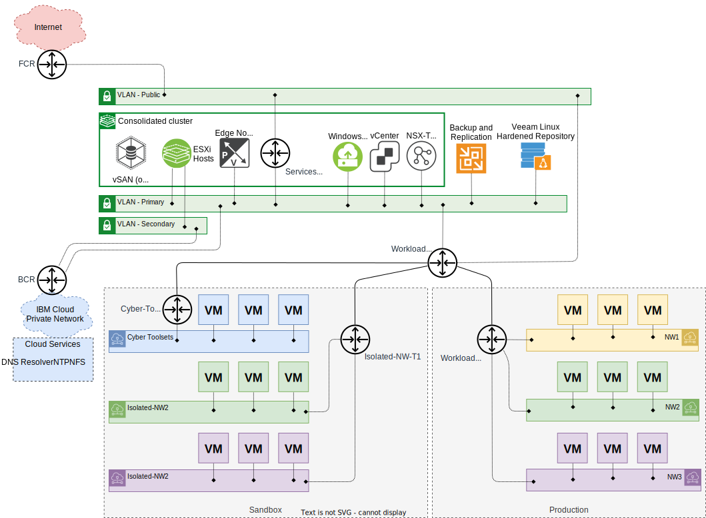
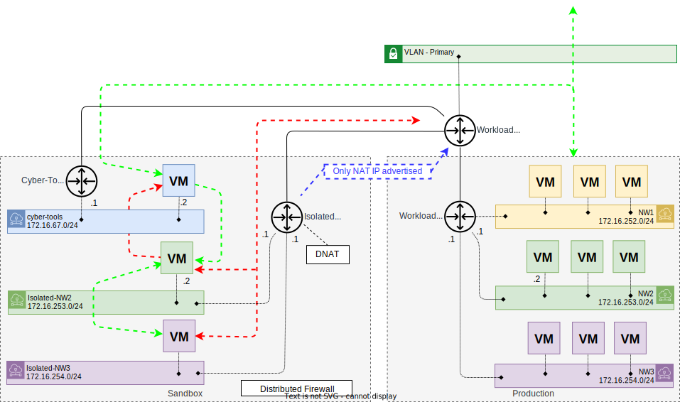

---

copyright:

  years:  2022, 2024

lastupdated: "2024-04-26"

subcollection: vmwaresolutions

---

{{site.data.keyword.attribute-definition-list}}

# Immutable backup network architecture
{: #veeam-cr-sa-ib-nw}

In the immutable backup solution architecture, the use of a sandbox is optional. In these solution architectures, a sandbox is defined as an isolated network environment where copies of backups can be accessed or used to start virtual machines (VMs). They are isolated from the production environment so that duplicate IP addresses caused by VMs with the same IP addresses do not clash or recovered VMs interact with production VMs.

While Veeam® DataLabs enables the sandbox concept, it is not yet enabled for VMware NSX-T™ environments as it does not enable the mapping of NSX-T segments to isolated segments. Therefore, these solution architectures enable a sandbox with the use of both Veeam and NSX-T technologies:

* Veeam vPower NFS service - Allows starting of VMs directly from the backup files.
* Veeam data integration API - Enables the mounting of the backup files in a files system.
* NSX-T overlay segments - Enables VMs to be connected to virtual networks abstracted from physical networks.
* NSX-T T1 - Provides routing and gateway firewall capabilities.
* NSX-T distributed firewall - Distributed firewall enables firewall capability on east-west traffic on VMs.

{: caption="Figure 1. Immutable backup environment network overview" caption-side="bottom"}

The previous diagram shows an example sandbox that is hosted on the consolidated cluster of the VMware vCenter Server® instance. The customer orders the following resources.

* A vCenter Server instance
* The Veeam service
* A bare metal server that runs Ubuntu 20.04 LTS

When the IaaS is provisioned, the customer:

* Deletes the sample segments that are created during the provisioning process.
* Keeps the workload T0 and T1.
* Does not change the services T0.
* Creates three segments, which are NW1, NW2, and NW3 and connects them to the workload T1.
* Provisions and configures their workload VMs on their three networks.

To enable backup with immutable storage, the customer completes the following tasks.

* Follows the prerequisite tasks on the bare metal server to prepare the server ready for its role as a Linux® hardened repository.
* Uses the Veeam backup server that is enabled by the Linux® hardened repository.
* Creates backup jobs for the VMs.

The customer completes cyber-related tasks on the backups that include the following examples.

* Scan backup files for malware.
* Recover VMs from backups on isolated networks.

The customer creates the following items.

* A new T1 named `Cyber-Tools-T1` and links it to the workload T0. `Cyber-T1` is configured to advertise connected segments. It enables the routing of traffic to and from the cybertoolset VMs.
* A segment for their cybertoolsets, which include the malware scanners.
* A new T1 named `Isolated-NW-T1` and links it to the workload T0. `Isolated-NW-T1` is configured to advertise only all NAT IP addresses. This action stops the advertisement of connected segments and advertises only the NAT IP addresses of the segments.
* The following distributed firewall groups.
   * Name `Cyber-Tools-Segments`, Category `Segments`, Members `Cybertools`
   * Name `Cyber-Isolated-Segments`, Criteria `Segment Tag Equals Isolated-Segments`, Scope `Cyber`
* A distributed firewall policy that is named `Cyber-Isolated`, which contains the following rules to satisfy their isolation requirements:

| Rule name | Sources | Destinations | Services | Action |
|:--------- |:------- |:------------ |:-------- |:------ |
| Allow access to Isolated | Cyber-Tools-Segments | Cyber-Isolated-Segments | All | Allow |
| Allow access between Isolated | Cyber-Isolated-Segments | Cyber-Isolated-Segments | All | Allow |
| Deny access to Isolated | Any | Cyber-Isolated-Segments | All | Deny |
| Deny access from Isolated | Any | Cyber-Isolated-Segments | All | Deny |
{: caption="Table 1. NSX-T distributed firewall rules" caption-side="bottom"}

When a sandbox is required, the customer uses their preferred scripting tool to automatically:

* Create logical segments connected to `Isolated-NW-T1` by using the IP address of the default gateway of that network on the T1. In the following diagram, you can see two `Isolated-NW2` and `Isolated-NW3` segments with subnets that match NW2 and NW3. These segments are created with Tags and Scopes, such as Scope `Cyber` and Tag `Isolated-Segments`. These tags and scope are used in the distributed firewall groups and rules that are listed in the previous table.
* Create destination NAT rules that map destination subnets to translated subnets for IP packets with a source address from the cybertools segment. For example, `Src=172.16.67.2->Dst=172.16.68.2 => Src=172.16.67.2->Dst=172.16.253.2`.

The required traffic flow is shown in the following diagram where:

* Green designates allowed traffic flow.
* Red designates denied traffic flow.

{: caption="Figure 2. Immutable backup environment sandbox example" caption-side="bottom"}

The Destination Network Address Translation (DNAT) rules have been configured as:

| Source | Destination | Translated |
|:------ |:----------- |:---------- |
| `172.16.67.0/24` | `172.16.68.0/24` | `172.16.253.0/24` |
| `172.16.67.0/24` | `172.16.69.0/24` | `172.16.254.0/24` |
{: caption="Table 2. NSX-T DNAT rules" caption-side="bottom"}

The distributed firewall groups configuration is defined as:

| Name | Category | Members | Criteria |
|:---- |:-------- |:------- |:-------- |
| `Cyber-Tools-Segments` | `Segments` | `cyber-tools` | None |
| `Cyber-Isolated-Segments` | None | None | `Segment Tag Equals Isolated-Segments Scope: Cyber` |
{: caption="Table 3. NSX-T distributed firewall groups" caption-side="bottom"}

The distributed firewall policy configuration in a policy named `Cyber-Isolated` is defined as:

| Rule name | Sources | Destinations | Services | Action |
|:--------- |:------- |:------------ |:-------- |:------ |
| Allow access to Isolated | Cyber-Tools-Segments | Cyber-Isolated-Segments | All | Allow |
| Allow access between isolated | Cyber-Isolated-Segments | Cyber-Isolated-Segments | All | Allow |
| Deny access to Isolated | Any | Cyber-Isolated-Segments | All | Deny |
| Deny access from Isolated | Any | Cyber-Isolated-Segments | All | Deny |
{: caption="Table 4. NSX-T distributed firewall policy" caption-side="bottom"}

## Related links
{: #veeam-cr-sa-ib-nw-related}

* [Tier-1 logical router](https://docs.vmware.com/en/VMware-NSX-T-Data-Center/3.1/administration/GUID-DAEF8457-8363-4F33-84DA-68AA36A2DE3C.html){: external}
* [Network Address Translation (NAT)](https://docs.vmware.com/en/VMware-NSX-T-Data-Center/3.1/administration/GUID-7AD2C384-4303-4D6C-A44A-DEF45AA18A92.html){: external}
* [Distributed firewall](https://docs.vmware.com/en/VMware-NSX-T-Data-Center/3.1/administration/GUID-6AB240DB-949C-4E95-A9A7-4AC6EF5E3036.html){: external}
* [Tags](https://docs.vmware.com/en/VMware-NSX-T-Data-Center/3.1/administration/GUID-358DF469-75C8-48C4-B0E2-279E55C7BB3E.html){: external}
* [Segments](https://docs.vmware.com/en/VMware-NSX-T-Data-Center/3.1/administration/GUID-316E5027-E588-455C-88AD-A7DA930A4F0B.html){: external}
