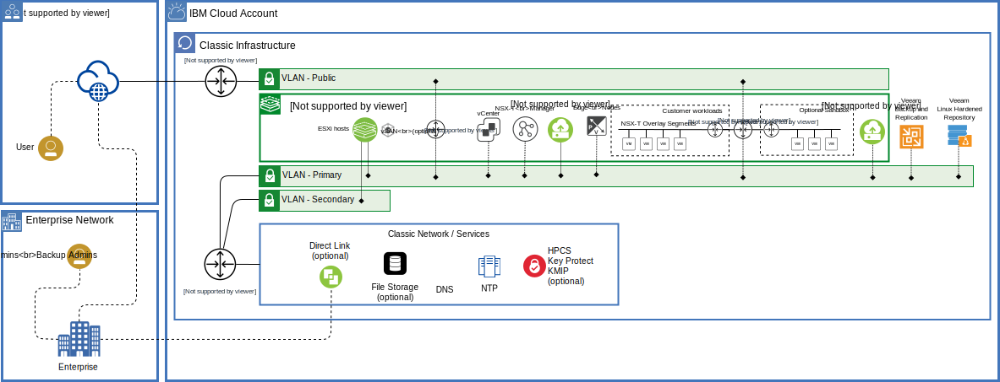

---

copyright:

  years:  2023, 2024

lastupdated: "2024-06-05"

subcollection: vmwaresolutions

---

{{site.data.keyword.attribute-definition-list}}

# Immutable backup solution architecture
{: #veeam-cr-sa-ib}

The immutable backup solution architecture is suitable for clients who want to extend their {{site.data.keyword.vcf-auto}} instance with the Veeam® service to use immutable storage and minimize costs. The immutable backup solution architecture does not preclude any of the {{site.data.keyword.vcf-auto-short}} options such as Caveonix, Entrust, and VMware Aria® Operations™.

The solution architecture is enabled by the following key technologies:

* The immutable storage is provided by a Veeam Linux® hardened repository that is hosted on an {{site.data.keyword.cloud}} bare metal server. For more information, see [Veeam Linux hardened repository](/docs/vmwaresolutions?topic=vmwaresolutions-veeam-cr-sa-lhr).
* Optionally, if a sandbox is required, the following technologies are used:
   * Veeam vPower NFS service enables a virtual machine (VM) to be started and run directly from the backup file that is hosted in the backup repository.
   * Veeam Instant Restore enables a VM to be started directly from the backup files. Veeam vPower NFS service is used to access the backup files.
   * The Veeam VM Recovery with the restore to new location option, enables a copy of the VM to be started and connected to an isolated network. The backup file is converted to VMDK files and placed in the designated data store.
   * Veeam Secure Restore is only available for Microsoft® Windows® VMs. It is an extra option in the VM Recovery workflow that enables the VM to be scanned by antivirus software before you restore the VM. The VMs disks are connected to a mount server and then the antivirus software on the mount server that is used to scan files from the mounted disks.
   * VMware NSX-T™ overlay segments allow the creation of isolated segments onto which copies of the VMs can be attached and isolated from the production VMs.
   * NSX-T distributed firewall provides the required isolation so that only required cybertoolsets can access the copies of the VMs.
   * Source Network Address Translation (SNAT) and Destination Network Address Translation (DNAT) are used to allow IP access between the cybertoolsets and the copies of the VMs.

   For more information, see [Veeam technologies used in the sandbox](/docs/vmwaresolutions?topic=vmwaresolutions-veeam-cr-sandboxveeam).

The following diagram shows the high-level view of the solution architecture.

{: caption="Figure 1. Immutable backup solution architecture" caption-side="bottom"}

The following components are prerequisites for the immutable backup solution architecture:

* {{site.data.keyword.vcf-auto-short}} instance - The management or consolidated cluster in the {{site.data.keyword.vcf-auto-short}} instance provides the compute and network resources to host the management appliances and your customer workloads. If the vSAN option in the {{site.data.keyword.vcf-auto-short}} instance order is used, then the {{site.data.keyword.vcf-auto-short}} instance also provides the storage resources. The {{site.data.keyword.vcf-auto-short}} instance consists of one or more clusters that host vSphere® ESXi hosts. The following VMs are hosted on the consolidated or management cluster:
   * Customer workloads are your VMs that are being backed up by the Veeam service and that you want some or all of them to use immutable backup.
   * The VMware vCenter® appliance manages the vSphere resources and provides a single management plane.
   * The NSX-T manager cluster consists of three manager appliances that provide the management and control plane for the virtualized networks, also known as the overlay networks.
   * Active Directory™ and domain name service (ADDNS) are the Microsoft® Windows® 2019 VMs configured for Active Directory and DNS.
* The Veeam service instance in the diagram shows the Veeam Backup and Replication (BUR) server that is deployed as a VM. However, the solution architecture can be based on the VM, VSI, or bare metal deployment options. The Veeam BUR server is a Microsoft Windows 2019 server that hosts the Veeam components.
* NTP service - Infrastructure resources are configured to use the {{site.data.keyword.cloud_notm}} NTP service for their time reference.
* DNS service - Infrastructure resources use the ADDNS servers for name resolution. The ADDNS servers use the {{site.data.keyword.cloud_notm}} DNS service for requests that they cannot resolve directly.
* Backup Admins are your existing team responsible for the production backup.
* IaaS Admins are your existing team responsible for the maintenance of the infrastructure.

Your existing {{site.data.keyword.vcf-auto-short}} instance might differ from the previous due to a number of reasons, including:

* You have a {{site.data.keyword.vcf-auto-short}} instance with vSAN. This solution architecture does not dictate the type of vSphere data store.
* You have extra optional services, such as Caveonix, VMware Aria Operations Manager, and VMware Aria Operations™ for Logs.
* You select a different option for the Veeam service as three options are available. This solution architecture does not dictate the VM option for the Veeam service. VSI or bare metal options are also available. For more information, see [Veeam Backup and Replication 12 overview](/docs/vmwaresolutions?topic=vmwaresolutions-veeamvm_overview).
* You expand your Veeam service from a simple deployment "all-in-one" to an advanced deployment by deploying extra Veeam components on different servers.
* You select a different ADDNS option. This solution architecture does not dictate the type of option, either two VMs or a single VSI options are available. For more information, see [Domain Name System Configuration](/docs/vmwaresolutions?topic=vmwaresolutions-vc_orderinginstance-network-interface-settings#vc_orderinginstance-dns-config).

If you have a {{site.data.keyword.vcf-auto-short}} instance that is deployed with the Veeam service added and Veeam is version 12, then this is a suitable base topology for the immutable backup solution architecture. The immutable backup solution architecture consists of:

* Linux hardened repository - The hardened repository is one or more {{site.data.keyword.cloud_notm}} bare metal servers that run a supported Linux OS. The hardened repository is configured as an immutable storage repository. The {{site.data.keyword.cloud_notm}} bare metal servers are ordered with internal disks and a RAID card to present this directly attached storage to the OS to be used as a backup repository.
* Optionally, the immutable backup solution architecture can include one or more sandboxes. For more information, see [Veeam technologies used in the sandbox](/docs/vmwaresolutions?topic=vmwaresolutions-veeam-cr-sandboxveeam).

The solution architecture does not show the components to adhere to the 3-2-1 backup rule. The 3-2-1 rule describes a backup architecture that:

* 3 - At least three copies of data: production, primary backup, and backup copy
* 2 - Use of two different types of media
* 1 - Keep one backup copy offsite

To adhere to this rule, consider:

* Use a Scale-Out-Repository capacity tier to copy data to Cloud Object Storage. Currently, {{site.data.keyword.cloud_notm}} Object Storage cannot be used by Veeam as an immutable capacity tier.
* Set up a Veeam backup copy job to transfer the backup to another backup repository hosted in another {{site.data.keyword.cloud_notm}} data center.

## Related links
{: #veeam-cr-sa-ib-related}

* [Overview of VMware Solutions](/docs/vmwaresolutions?topic=vmwaresolutions-solution_overview)
* [Veeam on bare metal server introduction](/docs/vmwaresolutions?topic=vmwaresolutions-veeam-bms-archi-intro)
* [Veeam Backup and Replication 12 overview](/docs/vmwaresolutions?topic=vmwaresolutions-veeamvm_overview)

