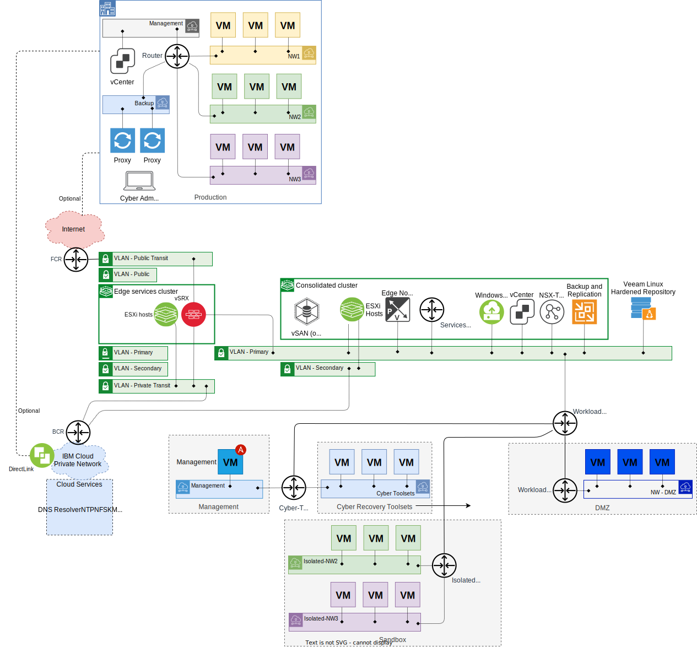
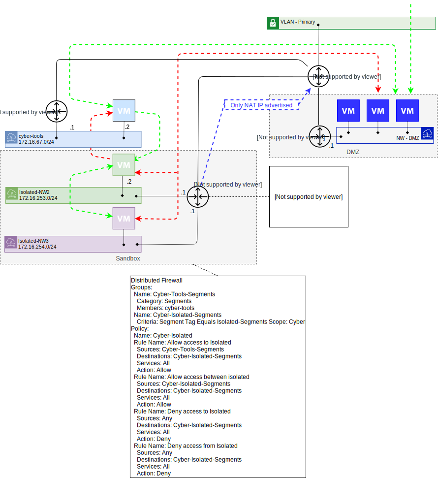

---

copyright:

  years:  2022, 2024

lastupdated: "2024-06-13"

subcollection: vmwaresolutions

---

{{site.data.keyword.attribute-definition-list}}

# Isolated recovery environment network architecture
{: #veeam-cr-sa-ire-nw}

In these solution architectures, a sandbox is defined as an isolated network environment where copies of backups can be accessed or used to start virtual machines (VMs). They are isolated from the production environment so that duplicate IP addresses caused by VMs with the same IP addresses do not clash or recovered VMs interact with production VMs.

While Veeam® DataLabs enables the sandbox concept, it is not yet enabled for VMware NSX-T™ environments as it does not enable the mapping of NSX-T segments to isolated segments. Therefore, these solution architectures enable a sandbox with the use of both Veeam and VMware NSX-T technologies:

* Veeam vPower NFS service - Allows starting of VMs directly from the backup files.
* Veeam data integration API - Enables the mounting of the backup files in a file system.
* NSX-T overlay segments - Enables VMs to be connected to virtual networks abstracted from physical networks.
* NSX-T T1 - Provides routing and gateway firewall capabilities.
* NSX-T distributed firewall - Distributed firewall enables firewall capability on east-west traffic on VMs.

The isolated recovery environment also uses vSRX appliances that are hosted on a gateway cluster along with a management VM to provide an air-gaped environment. In normal operation, the only inbound traffic is limited to accessing the VMs in the DMZ zone.

{: caption="Figure 1. Isolated recovery environment network overview" caption-side="bottom"}

The previous diagram shows the networks that are associated with a consolidated cluster of the {{site.data.keyword.vcf-auto}} instance that is used for an isolated recovery environment. The customer order is:

* A private network only {{site.data.keyword.vcf-auto-short}} instance with gateway cluster and Juniper® vSRX firewalls.
* The Veeam service on a bare metal server.
* A bare metal server that runs Ubuntu 20.04 LTS.

When the IaaS is provisioned, the customer:

* Deletes the sample segments that created during the provisioning process.
* Keeps the workload T0 and T1.
* Does not change to the services T0.
* Creates a DMZ segment and provisions several Microsoft® Windows® Jump hosts and Linux® bastion hosts. These actions provide the cyberteam with access to the environment while providing isolation.
* Configures the vSRX:
   * System services and local administrator access.
   * Management services, such as NTP, DNS, SNMP, and syslog.
   * Interfaces and zones.
   * Address books, services, and security policies.
   * NAT, routing, and VPN.
* Associates and routes-through the {{site.data.keyword.vcf-auto-short}} instance VLANs with the {{site.data.keyword.cloud}} gateway devices, which are the ESXi hosts in the gateway cluster.

The vSRX security policies enable the objectives that are listed in the following table:

| Rule name | Sources | Destinations | Services | Action |
|----------|---------|--------------|----------|-------|
| Allow access to DMZ | Cyber Admins IPs | DMZ subnets | SSH, RDP | Allow |
| Allow access to Instance Management | DMZ | Instance Management | SSH, HTTPS, TCP-9392, DNS | Allow |
| Allow Veeam access to production environment | Veeam backup server IP | Production vSphere management networks | HTTPS | Allow |
| Allow Veeam access to proxies | Veeam backup server IP | Production proxy network | SSH, TCP-6162, TCP-2500 - 3300 | Allow |
| Allow proxy access to Linux hardened repository | Production proxy network | Linux Hardened repository IP | TCP-2500 - 3300 | Allow |
| Allow ADDNS access to {{site.data.keyword.cloud_notm}} services | ADDNS IPs | DNS and NTP IPs | TCP/UDP-53, UDP-123 | Allow |
| Allow access between {{site.data.keyword.vcf-auto-short}} subnets | {{site.data.keyword.vcf-auto-short}} subnets | {{site.data.keyword.vcf-auto-short}} subnets | Any | Allow |
| Allow vCenter to KMIP | vCenter IP | {{site.data.keyword.cloud_notm}} endpoint service network | TCP 5696 | Allow |
{: caption="Table 1. vSRX security policies objectives" caption-side="bottom"}

* TCP-9392 - TCP port number used by Veeam remote console to access the Veeam server.
* In this solution architecture, the Veeam backup proxies are Linux. Therefore, the following steps are required:
   * Backup server to proxies, such as SSH, TCP-6162 (Veeam Data Mover port) and TCP-2500 to 3300 (Veeam data transmission channels).
   * Proxy to backup server, such as TCP-2500 to 3300 (Veeam data transmission channels).
* Veeam backup server access to isolated recovery vCenter and hosts is done through connected networks.
* Veeam backup server access to the Linux hardened repository is done through the connected network.
* The **Allow proxy access to Linux hardened repository** rule can be toggled between "Allow" and "Deny" to facilitate the air gap.
* If NFS is used, then this action bypasses the vSRX as the storage VLAN is not associated with the {{site.data.keyword.cloud_notm}} gateway devices that host the vSRX appliances.
* If the **Allow access between {{site.data.keyword.vcf-auto-short}} subnets** rule needs to be locked down further, for more information, see [Ports that are used by VMware Solutions](/docs/vmwaresolutions?topic=vmwaresolutions-vmwaresol_ports-vmwareuses).
* If encryption is used, then vCenter needs access to the KMIP service. This service is accessed through the {{site.data.keyword.cloud_notm}} endpoint service network 166.8.0.0/14.
* If automated Day 2 operations are required on the {{site.data.keyword.vcf-auto-short}} instance, for more information, see [Ports that are used for deployment and Day 2 operations](/docs/vmwaresolutions?topic=vmwaresolutions-vmwaresol_ports-deploy-day2ops).

To enable the air gap, the customer:

* Creates a T1 named `Cyber-Tools-T1` and links it to the workload T0. The `Cyber-T1` is configured to advertise connected segments. This action enables the routing of traffic to and from VMs on connected segments.
* Creates a segment for their management VM.
* Creates a management VM that runs Linux and Ansible. The management VM changes the security policy on the vSRX appliances at the required times.
* Uses a cron job on the automation server to schedule the running of an Ansible playbook that changes the inbound firewall rule from "Deny" to "Allow". After the backup window, the customer changes the inbound firewall rule from "Allow" to "Deny".

To enable cyberbackup of the production environment, the customer:

* Follows the prerequisite tasks on the bare metal server to prepare the server ready for its role as a Linux hardened repository.
* Uses the Veeam backup server enabled the Linux hardened repository.
* Removes the isolated recovery environment vCenter from the Veeam backup server configuration.
* Adds the production vCenter to the Veeam backup server configuration.
* Creates and deploys the Veeam VMware proxy servers to the production environment.
* Creates cyber-backup jobs for the required production VMs.

To enable cyber-related tasks on the cyberbackups, such as scanning backup files for malware and recovering VMs from backups on isolated networks, the customer:

* Creates a segment for their cybertoolsets, which include the malware scanners.
* Creates a T1 named `Isolated-NW-T1` and links it to the workload T0. The `I`solated-NW-T1` is configured to advertise all NAT IPs only. This action stops the advertisement of connected segments and advertises only the NAT IP addresses of the segments.
* Creates the following two distributed firewall groups:
   * Name: Cyber-Tools-Segments, Category: Segments, Members: cybertools
   * Name: Cyber-Isolated-Segments, Criteria: Segment Tag Equals Isolated-Segments, Scope: Cyber
* Creates a distributed firewall policy that is named Cyber-Isolated, which contains the following rules to satisfy their isolation requirements:

| Rule name | Sources | Destinations | Services | Action |
| ----------|---------|--------------|----------|------- |
| Allow access to Isolated | Cyber-Tools-Segments | Cyber-Isolated-Segments | All | Allow |
| Allow access between Isolated | Cyber-Isolated-Segments | Cyber-Isolated-Segments | All | Allow |
| Deny access to Isolated | Any | Cyber-Isolated-Segments | All | Deny |
| Deny access from Isolated | Any | Cyber-Isolated-Segments | All | Deny |
{: caption="Table 2. NSX-T distributed firewall rules" caption-side="bottom"}

When a sandbox is required, the customer uses their preferred scripting tool to automatically:

* Create logical segments connected to the Isolated-NW-T1 by using the IP address of the default gateway of that network on the T1. In the following diagram, you can see the two segments Isolated-NW2 and Isolated-NW3 with subnets that match NW2 and NW3. These segments are created with Tags and Scopes, such as Scope: Cyber and Tag: Isolated-Segments. These tags and scope are used in the distributed firewall groups and rules that are listed in the previous table.
* Create destination NAT rules that map destination subnets to translated subnets for IP packets with a source address from the cyber-tools segment. For example, `Src=172.16.67.2->Dst=172.16.68.2 => Src=172.16.67.2->Dst=172.16.253.2`.

The required traffic flow is shown in the following diagram where:

* Green designates allowed traffic flow.
* Red designates denied traffic flow.

{: caption="Figure 2. Immutable backup environment sandbox example" caption-side="bottom"}

## Related links
{: #veeam-cr-sa-ire-nw-related}

* [Tier-1 logical router](https://docs.vmware.com/en/VMware-NSX-T-Data-Center/3.1/administration/GUID-DAEF8457-8363-4F33-84DA-68AA36A2DE3C.html){: external}
* [Network Address Translation (NAT)](https://docs.vmware.com/en/VMware-NSX-T-Data-Center/3.1/administration/GUID-7AD2C384-4303-4D6C-A44A-DEF45AA18A92.html){: external}
* [Distributed firewall](https://docs.vmware.com/en/VMware-NSX-T-Data-Center/3.1/administration/GUID-6AB240DB-949C-4E95-A9A7-4AC6EF5E3036.html){: external}
* [Tags](https://docs.vmware.com/en/VMware-NSX-T-Data-Center/3.1/administration/GUID-358DF469-75C8-48C4-B0E2-279E55C7BB3E.html){: external}
* [Segments](https://docs.vmware.com/en/VMware-NSX-T-Data-Center/3.1/administration/GUID-316E5027-E588-455C-88AD-A7DA930A4F0B.html){: external}
