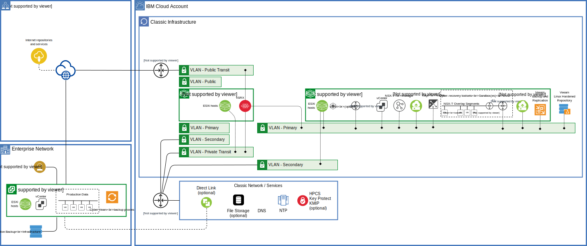

---

copyright:

  years:  2022

lastupdated: "2022-05-09"

subcollection: vmwaresolutions

---

{{site.data.keyword.attribute-definition-list}}

# Isolated recovery environment solution architecture
{: #veeam-cr-sa-ire}

The isolated recovery environment solution architecture uses a VMware vCenter Server® instance with the Veeam® service, edge services cluster, and Juniper® vSRX options. They create an air gapped cyber-recovery environment separate from the production environment. This isolated recovery environment is managed and accessed by using a segregated cyber-recovery team. The Veeam service is enhanced with a Veeam Linux® hardened repository for immutable storage.

The solution architecture is suitable for clients who want to move a copy of critical data away from the production environment, backup systems, and personnel to an environment that requires separate security credentials. The solution architecture does not preclude any of the vCenter Server options, such as Caveonix, Entrust, and vRealize Operations™.

{: caption="Figure 1. Isolated recovery environment solution architecture" caption-side="bottom"}

Key elements of the isolated recovery environment solution architecture include:

* Production data that must be recovered if a cyberattack is subject to a cyber-recovery backup to the cyber-recovery site and written to immutable storage in the Linux hardened repository.
* The cyber-recovery site is the {{site.data.keyword.cloud}} account, resource group, and data center location where the isolated recovery environment is located. If the production environment is in {{site.data.keyword.cloud_notm}}, then a different {{site.data.keyword.cloud_notm}} account is recommended for the cyber-recovery environment to enable segmentation.
* The solution architecture supports only production data that is hosted in a VMware vSphere® environment. It does not support physical servers or other hypervisors.
* The Veeam service in the isolated recovery environment provides a cyber-recovery backup of the specified production virtual machines (VMs). It writes the backup data to the Linux hardened backup repository in the isolated recovery environment.
* Cyber-recovery backup proxies, managed by the Veeam service in the isolated recovery environment, are required to be hosted in the production site. These proxies can be Windows® or Linux based and virtual or physical.
* The solution architecture is independent of existing production backup environment and does not integrate to any production systems except for the production vCenter and vSphere hosts.
* For cyber-recovery tasks, the Veeam service enables the mounting of the cyber-recovery backup files from the Linux hardened repository in read-only mode into a sandbox. The sandbox is hosted on the vSphere Server instance.
* There can be many sandboxes, for example:
   * One can be used daily to scan cyber-recovery backup files.
   * One or more can be used as required for cyber-recovery tasks.
* The sandboxes are for forensic scanning, analytics, or for other cyber-recovery tasks, such as investigations. The sandboxes are not meant to run production workloads. For recovery, the customer VMs must be moved back to either the production environment or to other customer-specified environment by using Veeam recovery methods.
* All devices are reconfigured to use the ADDNS servers for DNS and NTP requests.
* Sizing of the isolated recovery environment depends on the maximum size of the backup footprint. Also, on the number of sandboxes that are needed, and the number of recovered VMs to be instantiated at any time.

## Production environment
{: #veeam-cr-sa-ire-prod}

The production environment is the vSphere environment that hosts the production data. The production environment can be in {{site.data.keyword.cloud_notm}} or elsewhere. This site hosts:

* Production data refers specifically to the VM images (VMDKs) of the VMs running in the production environment.
* Production backup infrastructure is existing backup applications and infrastructure that are used to protect the production data. The isolated recovery environment solution architecture is independent of the production backup infrastructure and does not connect or interface to it.
* Backup admins are your existing team responsible for the production backup. To enable separation of duties, the team members must be different from the cyber-recovery admin team members.
* IaaS admins are your existing team responsible for the maintenance of the infrastructure. To enable separation of duties, the team members must be different from the cyber-recovery admin team members.
* Production vCenter manages the production vSphere hosts. The Veeam BUR server requires access to the production vCenter.
* Production ESXi hosts the production data and is managed by the production vCenter. The Veeam BUR server requires access to the production vSphere hosts.
* Cyber-recovery backup is the backup of production data to the isolated recovery environment. A cyber-recovery backup is different from a production backup.
* Control traffic is the access that is required by the Veeam backup server to the production vCenter and ESXi hosts to enable cyber-backup operations.
* Cyber-recovery backup proxy is a Veeam VMware backup proxy that is used to transport data from the production environment to the cyber-recovery site. It is an architecture component that sits between the cyber-backup server and other components of the cyber-backup infrastructure. While the cyber-backup server administers tasks, the cyber-recovery backup proxy processes jobs and delivers backup traffic. Basic backup proxy tasks include retrieving VM data, compression, de-duplicating, encrypting, and forwarding to the cyber-recovery backup repository. For more information, see [Veeam backup proxy](/docs/vmwaresolutions?topic=vmwaresolutions-veeam-cr-sa-vp).

## vCenter Server instance
{: #veeam-cr-sa-ire-vcs}

The vCenter Server instance provides the compute and network resources to host VMs and sandboxes. If the vSAN option in the vCenter Server instance ordering is used, then the vCenter Server instance also provides the storage resources.

The vCenter Server instance consists of a consolidated cluster with a minimum of three vSphere ESXi hosts. This cluster hosts the following VMs:

* vCenter server appliance - The VCSA manages the vSphere resources and provides a single management plane for vSphere.
* NSX-T™ manager cluster - The NSX-T manager cluster consists of three manager appliances that provide the management and control plane for the virtualized network, also known as the overlay network.
* Active Directory™ and domain name service - The ADDNS VMs are two Microsoft® Windows 2019 VMs configured for Active Directory and DNS. This option is selected in the order process by selecting the "Two highly available dedicated Windows Server VMs on the management cluster" option.
* Veeam service instance - For more information, see [Veeam components](/docs/vmwaresolutions?topic=vmwaresolutions-veeam-cr-sa-components).
* Edge services cluster - An Edge services cluster consists of two vSphere ESXi hosts provisioned on {{site.data.keyword.cloud_notm}} gateways. It provides the resources to run network edge services that include firewalls and the ability to become the default gateways for {{site.data.keyword.cloud_notm}} subnets that are associated with them. In this solution architecture, the cluster hosts the Juniper vSRX firewalls that run as virtual appliances. While Juniper vSRX appliances can be run directly on the consolidated cluster, it cannot act as the default gateways to the {{site.data.keyword.cloud_notm}} subnets, as this requires the {{site.data.keyword.cloud_notm}} gateway appliance

The solution architecture adds the following components to the vCenter Server instance:

* Management VM - This VM is a Linux VM that runs Ansible. Ansible playbooks are used for automation tasks that include the opening of the air gap to allow cyberbackups.
* Jump servers - Jump servers and bastion hosts allow access into the isolated recovery environment for the cyberadmins.
* Cybertoolsets - The cyber-recovery toolsets are your applications for use within the cyber-recovery site to scan, analyze, or clean cyber-recovery data.

The vCenter Server instance uses the following {{site.data.keyword.cloud_notm}} services:

* NFS service - If VMware vSAN is not specified for the vCenter Server instance, then {{site.data.keyword.cloud_notm}} file storage (NFS) is used or the VMware datastores. The {{site.data.keyword.cloud_notm}} file storage (NFS) is in the {{site.data.keyword.cloud_notm}} services network in the data center. Customers don't have direct access to the underlying storage infrastructure and consume file shares.
* NTP service - In this architecture, the isolated recovery environment uses the ADDNS servers as a time source. The ADDNS servers use the {{site.data.keyword.cloud_notm}} NTP service for their time reference.
* DNS service - In this architecture, the isolated recovery environment uses the ADDNS servers for name resolution. The ADDNS servers use the {{site.data.keyword.cloud_notm}} DNS service for requests that they cannot resolve directly.

The cyber-recovery admins are your team responsible for the operation of the cyber-recovery environment. To enable separation of duties, the team members must be different from your production teams. 

## Linux hardened repository
{: #veeam-cr-sa-ire-lhr}

The hardened repository is one or more {{site.data.keyword.cloud_notm}} bare metal servers that run a supported Linux OS. For more information, see [Veeam Linux hardened repository](/docs/vmwaresolutions?topic=vmwaresolutions--veeam-cr-sa-lhr).

## Optional services
{: #veeam-cr-sa-ire-opt}

The following services are optional but recommended to enable encrypted data stores, either Key Protect or Hyper Protect Crypto Services for key management with the KMIP service:

* Key Protect service - The Key Protect service is an encryption solution that allows data in the VMware datastores to be secured by using envelope encryption techniques that use FIPS 140-2 Level 3 certified cloud-based hardware security modules. For more information, see [About Key Protect](https://cloud.ibm.com/docs/key-protect?topic=key-protect-about).
* Hyper Protect Crypto Services - {{site.data.keyword.cloud_notm}} Hyper Protect Crypto Services is a dedicated key management service and hardware security module that enables the user to take the ownership of the hardware security module to fully manage your encryption keys and to perform cryptographic operations. Hyper Protect Crypto Services is built on FIPS 140-2 Level 4-certified hardware. For more information, see [Getting started with {{site.data.keyword.cloud_notm}} Hyper Protect Crypto Services](/docs/hs-crypto?topic=hs-crypto-get-started).
* KMIP service - The Key Management Interoperability Protocol (KMIP) for VMware service uses either the IBM Key Protect service or the Hyper Protect Crypto Services (HPCS) service to create, encrypt, and decrypt encryption keys. The KMIP service interfaces the Key Protect or HPCS service to VMware vSphere.

## Internet repositories and services
{: #veeam-cr-sa-ire-inet}

The internet repositories and services are resources that are used by the solution architecture or customer cyber-recovery toolsets, for example:

* Anti-virus virus definitions are used by malware scanning software to find malware and are downloaded from the vendor public repositories.
* Two factor authentication is a security process in which users provide two different authentication factors to verify themselves. The authentication server is provided by a service provider and is publicly connected.

## Related links
{: #veeam-cr-sa-ire-related}

* [What's in an account?](/docs/account?topic=account-overview)
* [Best practices for organizing resources and assigning access](/docs/account?topic=account-account_setup)
* [Overview of VMware Solutions](/docs/vmwaresolutions?topic=vmwaresolutions-solution_overview)
* [Veeam on bare metal server introduction](/docs/vmwaresolutions?topic=vmwaresolutions-veeam-bms-archi-intro)
* [Veeam v11 overview](/docs/vmwaresolutions?topic=vmwaresolutions-veeamvm_overview)
