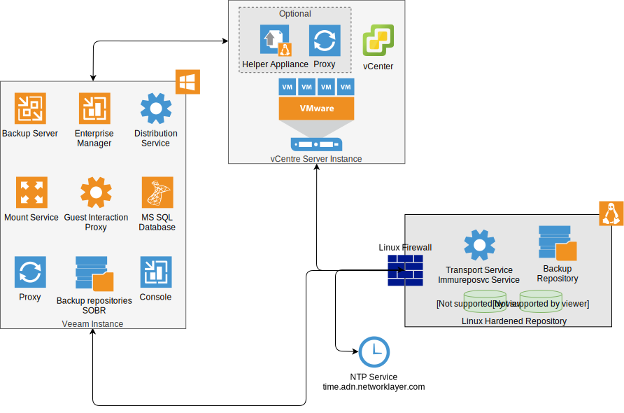
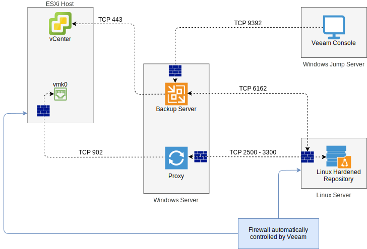

---

copyright:

  years:  2022, 2024

lastupdated: "2024-10-10"

subcollection: vmwaresolutions

---

{{site.data.keyword.attribute-definition-list}}

# Veeam Linux hardened repository
{: #veeam-cr-sa-lhr}

The key solution component in both the immutable backup and isolated recovery environment solution architectures is the Linux® hardened repository.

To prevent attacks on backups, Veeam® Backup and Replication offers the Linux hardened repository feature, which makes backups immutable for the required number of days. This action enables protection against threats, such as ransomware and hackers.

{: caption="Linux hardened repository" caption-side="bottom"}

The Veeam Linux hardened repository feature uses immutability features in the Linux OS. The immutability file attribute is set for each backup file, which assures the contents of the file. Its associated metadata is retained as nonrewriteable and nonerasable until expiration of an applied Immutable Until Date.

Only the following two Veeam services run on the Linux hardened repository server:

* The Veeam Transport Service receives the backup data and instructs the Veeam Immureposvc Service to set the Immutable Until Dates. This service runs as a normal user (nonroot).
* The Veeam Immureposvc Service sets the immutable flag for the backup files, monitors the Immutable Until Dates and removes the immutable flag when it is expired.

A single-use credential is used by the Veeam backup server to initially configure the Linux hardened repository. This credential is not stored by Veeam. During the initial configuration, certificate-based authentication is established between the Veeam backup server and the Veeam Transport Service.

After the initial configuration, Secure Shell (SSH) access is not required for Veeam operations. However, it is required for server updates and other maintenance tasks, unless all console access is done through the server IPMI port.

During initial configuration, when the **Make recent backup immutable for x days** is set, all compatible new backups to this repository become immutable for at least the number of _x days_. The immutable time can be longer. For example, earlier incremental backups in a backup chain are immutable for longer. This action ensures that the entire backup chain has the same immutable time as incremental backup files depend on each other in a backup chain.

When no backups or restores run, only the TCP 6162 inbound port is opened on the Linux hardened repository to allow the Veeam Transport Service to communicate with other Veeam components.

```text
ufw status
Status: active
To                         Action      From
--                         ------      ----
6162/tcp                   ALLOW       10.38.207.157              # Allow Veeam Mgmt from Veeam BUR server
6162/tcp                   ALLOW OUT   Anywhere                   # Veeam transport rule
```

The Veeam Transport Service opens extra ports, such as TCP 2500 - 3300, temporarily. This action allows data to be received from the proxy servers during backup and restore processes.

```text
ufw status
Status: active
To                         Action      From
--                         ------      ----
6162/tcp                   ALLOW       10.38.207.157              # Allow Veeam Mgmt from Veeam BUR server
2500/tcp                   ALLOW       Anywhere                   # Veeam rule 876f0752-7209-4e8b-8b34-fa0af7dbced4
2501/tcp                   ALLOW       Anywhere                   # Veeam rule 876f0752-7209-4e8b-8b34-fa0af7dbced4
6162/tcp                   ALLOW OUT   Anywhere                   # Veeam transport rule
2500/tcp                   ALLOW OUT   Anywhere                   # Veeam rule 876f0752-7209-4e8b-8b34-fa0af7dbced4
2501/tcp                   ALLOW OUT   Anywhere                   # Veeam rule 876f0752-7209-4e8b-8b34-fa0af7dbced4
```

{: caption="Veeam backup" caption-side="bottom"}

## Best practices for a Linux hardened repository
{: #veeam-cr-sa-lhr-bp}

The [Compliance assessment report (by Cohasset)](https://www.veeam.com/resources/wp-compliance-assessment-report-cohasset.html){: external} describes the settings that must be configured to become compliant with the following regulations:

* FINRA Rule 4511.
* SEC Rule 17a-4(f).
* CFTC Rule 1 .31 (c)-(d).

The previous assessment report considers the following details as best practice for a Linux hardened repository:

* The Linux hardened repository can be an independent or a scale-out backup repository. A repository that retains immutable backup files for compliance with SEC 17a-4(f) must be configured as a stand-alone backup repository as a Veeam Scale-Out backup Repository is not compliant with this rule.
* It is recommended that the name and description attributes for the repository include the word “immutable" when the Linux hardened repository feature is enabled.
* To protect against the possibility of premature deletion of backup files that can result from accelerating the system time clock, Linux OS must be configured to synchronize with a secure time source. For example, with a network time protocol (NTP) clock.
* Ensure separation of duties by assigning management of Linux hardened repositories to a team other than backup administrators.
* Veeam recommends XFS for performance and space efficiency reasons (block cloning support).
* Only backup job configurations with forward incremental with synthetic or active full are supported. Forward incremental with synthetic full is the default backup job setting.
* For backup copy jobs, GFS must be enabled.
* Encryption of backup files is available as follows:
   * When configured in a backup job, Veeam Backup and Replication can use 256-bit AES block cypher encryption.
   * For data in transit, a global network traffic rule can be configured to enable all traffic to be encrypted through 256-bit AES encryption. When enable and two backup infrastructure components need to communicate, a dynamic key is generated by the backup server and communicated to each node over a secure channel. The two components establish an encrypted connection between each other using this key. All communications between these two components for that session are encrypted by using this key. The key has a one-time use and it is discarded when the session is completed.

## Related links
{: #veeam-cr-sa-lhr-related}

* [Hardened repository](https://helpcenter.veeam.com/docs/backup/vsphere/hardened_repository.html?ver=120){: external}
