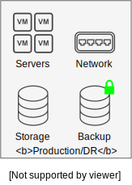
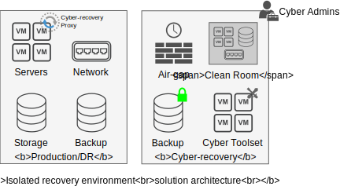

---

copyright:

  years:  2023, 2024

lastupdated: "2024-06-13"

subcollection: vmwaresolutions

---

{{site.data.keyword.attribute-definition-list}}

# Overview
{: #veeam-cr-sa-overview}

Cyber recovery is one of five functions that are described in the [NIST Cybersecurity framework](https://www.nist.gov/cyberframework){: external}. It is defined as the development and implementation of appropriate activities to maintain plans for resilience and to restore any capabilities or services that are impaired due to a cybersecurity incident. The other four functions are identify, protect, detect, and respond.

This documentation describes two solution architectures that can be used to assist with your cyber-recovery requirements. The solution architectures use {{site.data.keyword.vcf-auto}} and Veeam® Backup and Recovery for VMware vSphere®. The two solution architectures are named as Immutable backup and Isolated recovery environment.

{: caption="Figure 1. Immutable backup overview" caption-side="bottom"}

The immutable backup solution architecture uses the Veeam Linux® hardened repository design as an immutable storage repository within the production environment. Key elements of the solution architecture include:

* A {{site.data.keyword.vcf-auto-short}} instance that provides compute, storage, and network resources for the virtual machines.
* The Veeam service that provides backup for the virtual machines.
* The Veeam service is enhanced with a Veeam Linux hardened repository that is hosted on an {{site.data.keyword.cloud}} bare metal server.
* Optionally you can use Veeam technologies, such as vPower NFS Service and Mount servers to assist with cyber-recovery tasks.
* The solution architecture does not preclude any of the {{site.data.keyword.vcf-auto-short}} options, such as Caveonix, Entrust, and VMware Aria® Operations™.
* This solution is suitable for clients who want to extend their Veeam backup with immutability by minimizing costs and by using existing processes and resources.

{: caption="Figure 2. Isolated recovery environment overview" caption-side="bottom"}

The isolated recovery solution architecture uses a {{site.data.keyword.vcf-auto-short}} instance in an air-gapped recovery environment separate from the production environment. It is managed and accessed by using a separate team of cyber-recovery specialists. Key elements of the solution architecture include:

* A {{site.data.keyword.vcf-auto-short}} instance used for cyber-recovery tasks only, deployed in an {{site.data.keyword.cloud_notm}} account restricted to cyber-recovery activities.
* The {{site.data.keyword.vcf-auto-short}} instance does not host production or disaster recovery workloads.
* The {{site.data.keyword.vcf-auto-short}} instance includes an edge cluster to host Juniper® vSRX appliances to protect {{site.data.keyword.vcf-auto-short}} instance networks. It also provides a network air gap between the production environment and the isolated recovery environment.
* A Veeam instance under separate management used for cyber recovery only.
* An immutable repository based on the Veeam Linux hardened repository hosted on an {{site.data.keyword.cloud_notm}} bare metal server.
* The solution architecture does not preclude any of the {{site.data.keyword.vcf-auto-short}} options such as Caveonix, Entrust, and VMware Aria Operations.
* Sandboxes can be provisioned by using VMware NSX-T™ overlay segments to provide network-isolated zones to mount cyber-recovery backups for inspection by your cybertoolsets.
* Cyber toolsets are customer-supplied tools that run as virtual machines (VMs) in the isolated recovery environment.
* Cyber admins are customer personnel who are authorized to access the isolated recovery environment.
* The air gap enables network connectivity between the production environment and the isolated recovery environment only when required.
* The solution architecture:
   * Is independent of the location of the production environment. However, it is required network connectivity between the production environment and the cyber-recovery site.
   * Is independent of the production backup solution.
   * Requires that the production environment is vSphere based.
   * Requires that cyber-recovery backup proxies that are registered with the cyber-recovery environment are installed on the ESXi hosts in the production environment.
   * Requires that the cyber-recovery backup infrastructure has access with sufficient privileges to the production vCenter and ESXi hosts.
* This solution is suitable for clients who want to copy critical data away from the production environment. Also, that cyber-recovery backup systems and personnel are separate from production and disaster recovery processes.

[The definitive guide to ransomware: Readiness, response, and remediation](https://www.ibm.com/downloads/cas/EV6NAQR4){: external} provides an overview of ransomware history, its current prevalence, and resources to help fortify organizations and technical-level guidance on techniques to protect networks before an attack can happen. Also, a recovery guidance if an attacker makes it through defenses.

## Terms and definitions
{: #veeam-cr-sa-overview-terms}

This documentation uses the following terms and definitions:

| Term | Definition
|------|-----------
| {{site.data.keyword.vcf-auto-short}} instance | A VMware vSphere environment that is hosted on a minimum of three {{site.data.keyword.cloud_notm}} bare metal servers and includes VMware NSX to provide a virtual network overlay. An instance includes a vCenter appliance and Microsoft® Windows® AD/DNS. For more information, see [{{site.data.keyword.vcf-auto-short}} overview](/docs/vmwaresolutions?topic=vmwaresolutions-vc_vcenterserveroverview).
| Veeam service | A Veeam service is a deployment of Veeam Availability Suite that is associated with the {{site.data.keyword.vcf-auto-short}} instance. For more information, see [Veeam Backup and Replication 12 overview](/docs/vmwaresolutions?topic=vmwaresolutions-veeamvm_overview).
| Server instance | A server instance is an operating system that uses compute, storage, and network resources that host applications.
| Virtual machine (VM) | A VM is a server instance that runs on a vSphere hypervisor.
| Virtual Server Instance (VSI) | A VSI is a server instance that runs on the {{site.data.keyword.cloud_notm}} hypervisor.
| Bare metal server | A bare metal server is a server instance that runs directly on the {{site.data.keyword.cloud_notm}} x86 hardware.
| Veeam Backup and Replication (BUR) | The Veeam application that enables backups of server instances and the replication of VMs. While the Veeam product name includes "Replication", only the backup feature is used in these cyber-recovery architectures.
| Air-gap | An air gap is a term that is used to denote network isolation where the Linux backup repository is not accessible directly from the production networks. For backup transfer, the air gap is selectively unlocked and then locked when the transfer is complete.
| Production environment | The vSphere environment that hosts the production data. For the isolated recovery environment, the production environment can be in {{site.data.keyword.cloud_notm}} or elsewhere. 
| Cyber-recovery site | The location of the isolated recovery environment.
| Production data | Production data refers specifically to the VM images (VMDKs) of the VMs running in the production environment.
| Cyber-recovery data | Copies of the production VM images (VMDKs) in the isolated recovery environment.
| Cyber-recovery backup | The backup of production data to the isolated recovery environment. A cyber-recovery backup is different from a production backup.
| Cyber-recovery toolsets | Cyber-recovery toolsets are applications that are provided by the client for use within the cyber-recovery site to scan, analyze, or clean cyber-recovery data.
| Sandbox | A sandbox is an isolated zone on a network that enables the OS and applications to be started without impacting production systems. Specifically, in these solution architectures, it is one or more NSX-T segments that are protected with firewall rules where copies of backups can be accessed or used to start VMs.
{: caption="Table 1. Terms and definitions" caption-side="bottom"}

## Related links
{: #veeam-cr-sa-overview-related}

* [About Veeam Backup and Replication](https://helpcenter.veeam.com/docs/backup/vsphere/overview.html?ver=120){: external}
* [Veeam architects site](https://www.veeambp.com/){: external}
* [Overview of VMware Solutions](/docs/vmwaresolutions?topic=vmwaresolutions-solution_overview)
* [Veeam on bare metal server introduction](/docs/vmwaresolutions?topic=vmwaresolutions-veeam-bms-archi-intro)
