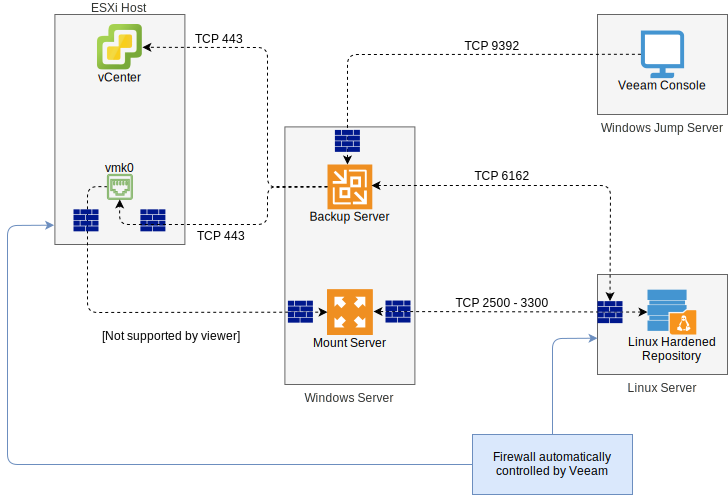
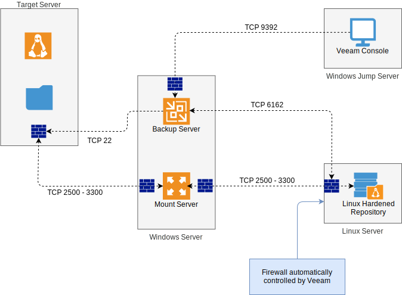

---

copyright:

  years:  2023, 2025

lastupdated: "2025-11-25"

subcollection: vmwaresolutions

---

{{site.data.keyword.attribute-definition-list}}

# Veeam technologies used in the sandbox
{: #veeam-cr-sandboxveeam}

{{site.data.content.vms-deprecated-note}}

The following Veeam® technologies are discussed as:

* Veeam vPower NFS service.
* Veeam data integration API.

## Veeam vPower NFS service
{: #veeam-cr-sandboxveeam-vpower}

The virtual machines (VMs) that start with Instant VM Recovery, the vPower NFS service is used as a conduit to the backup files. The ESXi host uses NFS to connect to the service. vPower NFS service runs as a Windows®-based service and runs on the Veeam backup server by default. However, it can be added to any Veeam managed Windows server. It cannot run on a Linux® server. For Linux-based repositories, it is recommended to configure vPower NFS on a managed Windows system as close as possible to the Linux repository.

The vPower NFS server is bound to a backup repository and the folder location is defined per server and can be changed through the mount server settings.

The ports that are used for this service are described in the following table:

| Source     | Destination | Protocol | Port | Description
|------------|-------------|----------|------|------------
| ESXi host | Microsoft Windows server that runs vPower NFS Service | TCP/UDP | 111 | Standard port used by the port mapper service.
| ESXi host | Microsoft Windows server that runs vPower NFS Service | TCP/UDP | 1058 | Mount acceptor port of Power NFS service.
| ESXi host | Microsoft Windows server that runs vPower NFS Service | TCP/UDP | 2049 | NFS acceptor port of Power NFS service.
{: caption="Used ports" caption-side="bottom"}

The following diagram shows the communication flow for the vPower NFS service.
{: caption="Veeam vPower NFS" caption-side="bottom"}

## Veeam Data Integration API
{: #veeam-cr-sandboxveeam-api}

The Veeam data integration API allows access to the backup files by mounting the backup files to a target server. Use cases include malware scans and data mining.

The Veeam Data Integration API is a set of Veeam PowerShell cmdlets that allows access to backup files as a mounted folder on a target server. This action enables an application to access backup files in a read-only manner.

The following diagram shows the communication flow for when backup files are published to a Linux target server.

{: caption="Publishing backup files" caption-side="bottom"}

By publishing the backup files, the backup files are displayed in the target server file system. The following example shows the backup of the VM named `centos01` that is mounted on `/temp`:

```text
lsblk
NAME    MAJ:MIN RM  SIZE RO TYPE MOUNTPOINT
loop0     7:0    0  600M  0 loop /tmp/Veeam®.Mount.FS.b2811b87-5bf4-4056-8134-21ce9555dca7/centos01-flat.vmdk_0
loop1     7:1    0 67.2M  1 loop /snap/lxd/21835
loop2     7:2    0 61.9M  1 loop /snap/core20/1242
loop3     7:3    0 55.5M  1 loop /snap/core18/2246
loop4     7:4    0 32.5M  1 loop /snap/snapd/13640
loop5     7:5    0 61.9M  1 loop /snap/core20/1169
loop6     7:6    0 42.2M  1 loop /snap/snapd/13831
loop7     7:7    0 67.2M  1 loop /snap/lxd/21803
loop8     7:8    0 55.5M  1 loop /snap/core18/2253
loop9     7:9    0    1G  0 loop /tmp/Veeam®.Mount.FS.b2811b87-5bf4-4056-8134-21ce9555dca7/centos01-flat.vmdk_1
loop10    7:10   0  1.6G  0 loop
loop11    7:11   0 12.8G  0 loop /tmp/Veeam®.Mount.FS.b2811b87-5bf4-4056-8134-21ce9555dca7/cl-root
```

For example, if the target server installs ClamAV, the following command scans the `centos01` VM file system in the mounted backup file for malware `clamscan -r -i /tmp/Veeam®.Mount.FS.b2811b87-5bf4-4056-8134-21ce9555dca7/cl-root`.

## Related links
{: #veeam-cr-sandboxveeam-related}

* [Veeam vPower NFS service](https://helpcenter.veeam.com/archive/backup/120/vsphere/vpower_nfs_service.html){: external}
* [Veeam data integration API](https://helpcenter.veeam.com/archive/backup/120/vsphere/data_integration_api.html){: external}
