---

copyright:

  years:  2022, 2024

lastupdated: "2024-06-04"

subcollection: vmwaresolutions

---

{{site.data.keyword.attribute-definition-list}}

# {{site.data.keyword.vcf-vpc}} architecture overview
{: #vpc-vcf-arch-overview}

The architecture of {{site.data.keyword.vcf-vpc}} is built upon {{site.data.keyword.vpc_short}} network concepts and uses bare metal servers for {{site.data.keyword.vpc_short}}. Through its native integration with {{site.data.keyword.vpc_short}} networking, you can easily use other {{site.data.keyword.cloud}} services with your VMware workloads or integrate networking with other {{site.data.keyword.vpc_short}}, Classic, or Power infrastructure offerings.

{: caption="Figure 1. Architecture overview of {{site.data.keyword.vcf-vpc}}" caption-side="bottom"}

VMware Cloud Foundation™ supports the two base architecture models - consolidated and standard. When you deploy your VMware Cloud Foundation instance in {{site.data.keyword.cloud}}, you can select the wanted model according to the requirements of your deployment and organization.

## VMware Cloud Foundation components
{: #vpc-vcf-arch-vcf-components}

The following items are the core components of VMware Cloud Foundation:

- VMware Cloud Builder
- SDDC Manager
- VMware vSphere® and VMware vCenter Server®
- VMware vSAN™
- VMware NSX™
- VMware Aria Suite Lifecycle (formerly vRealize Suite Lifecycle Manager)

**VMware Cloud Builder** appliance is the first virtual appliance that is deployed on the {{site.data.keyword.cloud_notm}} bare metal servers for {{site.data.keyword.vpc_short}}. It automates the deployment of the entire VMware software-defined stack. VMware Cloud Foundation assumes that the underlying network infrastructure, required bare metal servers, and DNS are deployed before you start deploying it. This part is handled by {{site.data.keyword.vcf-vpc}} automation. VMware Cloud Builder deploys and configures the first cluster of the management domain and then transfers the inventory and control to SDDC Manager. During the deployment process, the VMware Cloud Builder appliance validates network information that you provide in the deployment parameter workbook, such as DNS, network (VLANS, IP addresses, MTUs), and credentials. In the {{site.data.keyword.vcf-vpc}} automation deployments, credentials are randomly generated during the initial provisioning.

**SDDC Manager** automates the entire system lifecycle, that is, from configuration and provisioning to upgrades and patching, including host firmware, and simplifies day-to-day management and operations. In {{site.data.keyword.cloud}}, VMware Cloud Foundation capacity expansion is done through the {{site.data.keyword.vcf-vpc}} automation.

**VMware vSphere** running on bare metal servers for {{site.data.keyword.vpc_short}} uses virtualization to transform individual data centers into aggregated computing infrastructures that include CPU, storage, and networking resources. **vCenter Server** manages these infrastructures as a unified operating environment and provides you with the tools to administer the data centers that participate in that environment.

**vSAN** aggregates local or direct-attached data storage devices on {{site.data.keyword.vpc_short}} bare metal servers to create a single storage pool that is shared across all hosts in the vSAN cluster. By using vSAN, you don't need external shared storage and it also simplifies storage configuration and virtual machine provisioning. Built-in policies allow for flexibility in data availability.

**VMware NSX™** (referred as NSX throughout this documentation) is focused on providing networking, security, automation, and operational simplicity for emerging application frameworks and architectures that have heterogeneous endpoint environments and technology stacks. NSX supports cloud-native applications, bare metal workloads, multi-hypervisor environments, public clouds, and multiple clouds. NSX integrates with {{site.data.keyword.vpc_short}} capabilities through NSX edge cluster and Tier-0 gateways. Through this integration, your workloads are able to use other cloud services and interconnectivity services that are provided by {{site.data.keyword.cloud_notm}}.

**VMware Aria Suite Lifecycle** (formerly VMware vRealize Suite Lifecycle Manager) provides a comprehensive solution for deploying, configuring, managing, and upgrading Aria Suite products. These products include Aria Suite products such as: 

- Aria Operations (formerly vRealize Operations Manager)
- Aria Operations for Logs (formerly vRealize Log Insight)
- Aria Operations for Networks (formerly vRealize Network Insight)
- Aria Automation (formerly vRealize Automation)

Aria Suite Lifecycle provides product installation and content lifecycle management capabilities to automate the deployment of Aria Suite content. The access to use these products depends on the selected VMware Cloud edition. The {{site.data.keyword.vcf-vpc}} automation deploys Aria Suite Lifecycle (vRealize Suite Lifecycle Manager) and you can deploy Aria Suite products post deployment by using the Aria Suite Lifecycle.

## {{site.data.keyword.vcf-vpc}}
{: #vpc-vcf-arch-vcf-vpc-arch}

{{site.data.keyword.vcf-vpc}} is deployed on {{site.data.keyword.vpc_short}} and uses the bare metal servers for {{site.data.keyword.vpc_short}} for compute resources. These fast provisioning bare metal servers and {{site.data.keyword.vpc_short}} network form the core infrastructure for the deployment. Through the integration with the VPC platform, you can take full advantage of the network, storage, and security capabilities provided by the {{site.data.keyword.vpc_short}}.

The {{site.data.keyword.vcf-vpc}} automation is based on Terraform and Ansible. The underlying automation engine is {{site.data.keyword.cloud_notm}} Schematics, which uses {{site.data.keyword.cloud_notm}} Terraform provider to deploy the {{site.data.keyword.vpc_short}} and other required {{site.data.keyword.cloud_notm}} Services for your VMware Cloud Foundation instance. Ansible is used to deploy and configure Cloud Builder and SDDC manager, and to configure NSX by using relevant APIs. To provision a VMware Cloud Foundation instance, use {{site.data.keyword.vmwaresolutions_full}} Portal, which offers a more intuitive user experience to complete and complete the Terraform variable values.

The automation provisions a new {{site.data.keyword.vpc_short}}, prefixes, subnets, security groups, public gateways, and the required common services such as DNS. {{site.data.keyword.cloud_notm}} bare metal servers are provisioned on VPC subnets with two PCI interfaces and the required VLAN interfaces. PCI and VLAN interfaces are networking constructs for bare metal servers for {{site.data.keyword.vpc_short}} and how they integrate with {{site.data.keyword.vpc_short}} networking. The PCI interfaces are used for VMware vSphere Distributed Switch uplinks and VLAN interfaces are used for VMkernel adapters and the deployed VMware Cloud Foundation appliances, NSX edges, and Tier 0 Gateway uplinks. {{site.data.keyword.vpc_short}} routes are provisioned for allowing overlay access from your VPC, or from other interconnected VPCs.

An overview of the consolidated architecture and deployed assets is shown in the following diagram. Consolidated architecture deploys a singe set of VMware assets, a vCenter, NSX managers, and two NSX edges in addition to the SDDC manager. A Tier-0 gateway is deployed and integrated with VPC with external uplinks.

{: caption="Figure 2. Architecture overview - consolidated deployment" caption-side="bottom"}

An overview of the standard architecture and deployed assets is shown in the following diagram. As a main difference to consolidated architecture, this architecture model deploys more hosts for the VI workload domain, a new vCenter, new NSX appliances, and a new Tier-0 gateway. Also, new VPC subnets are provisioned for the VI workload domain hosts and NSX edges.

{: caption="Figure 3. Architecture overview - standard deployment" caption-side="bottom"}

For the connectivity needs and as the NSX deployment is integrated with VPC, you can use {{site.data.keyword.vpc_short}} connectivity services and {{site.data.keyword.cloud_notm}} interconnectivity solutions with your deployment. Public internet network access capabilities to the workloads are provided through floating IP addresses or Public Gateway configurations within your VPC. On-premises connectivity over public internet can be arranged by using {{site.data.keyword.vpc_short}} VPN services (site-to-site and client-to-site), or alternatively by using NSX built-in capabilities. For private networking, you can use {{site.data.keyword.cloud_notm}} interconnectivity services to connect your VMware workloads with {{site.data.keyword.cloud_notm}} classic infrastructure, other VPCs, and on-premises networks.

With VMware Cloud Foundation, you use VMware vSAN™ for storage and VMware NSX™ networking with your VMware workloads. You can easily and quickly add and remove ESXi hosts on to your deployment, or add new workload domains.

For post initial deployment integrations, for example with your own Active Directory™, you can use {{site.data.keyword.vpc_short}} compute resources to build your Active Directory in {{site.data.keyword.vpc_short}}, or interconnect with your existing Active Directory infrastructure.

## Related links
{: #vpc-vcf-arch-overview-links}

* [{{site.data.keyword.vpc_short}} getting started](/docs/vpc?topic=vpc-getting-started)
* [{{site.data.keyword.vpc_short}} bare metal servers](/docs/vpc?topic=vpc-planning-for-bare-metal-servers)
* [{{site.data.keyword.dl_full_notm}} overview](/docs/dl?topic=dl-get-started-with-ibm-cloud-dl)
* [{{site.data.keyword.tg_full_notm}} overview](/docs/transit-gateway?topic=transit-gateway-getting-started)
* [{{site.data.keyword.vpc_short}} VPN overview](/docs/vpc?topic=vpc-vpn-overview)
* [VPC IaaS endpoints](/docs/vpc?topic=vpc-service-endpoints-for-vpc#infrastructure-as-a-service-iaas-endpoints)
