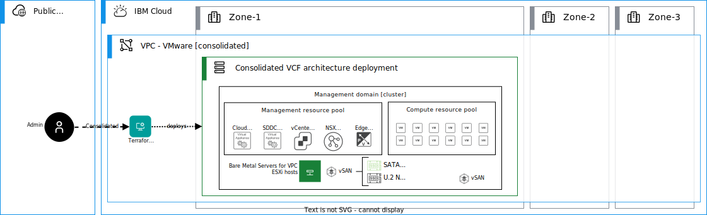
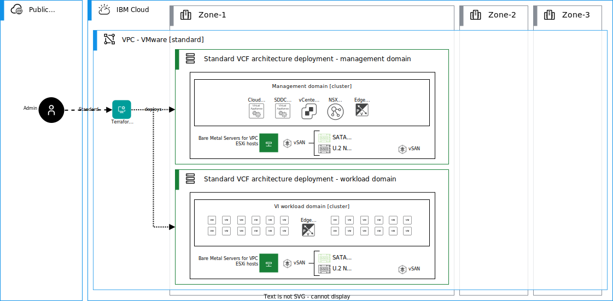

---

copyright:

  years:  2022, 2025

lastupdated: "2025-01-13"

subcollection: vmwaresolutions

---

{{site.data.keyword.attribute-definition-list}}

# Supported VMware Cloud Foundation architecture models
{: #vpc-vcf-architectures}

VMware Cloud Foundation™ supports two base architecture models - consolidated and standard. You can select a model according to the requirements of your deployment and organization. If you plan to deploy a small-scale environment and extend it according to your needs, or if you work on an SDDC proof-of-concept you can select a consolidated architecture. For a production environment, you can implement a standard architecture according to VMware's production best practices.

## Consolidated architecture model
{: #vpc-vcf-architectures-consolidated}

In this model, the management and customer workloads run on a shared management domain. The environment is managed from a single VMware vCenter Server®. VMware vSphere® resource pools provide isolation between management and customer workloads. Resource pools must be properly configured as the compute capacity is shared between the management and compute workloads.

{: caption="VMware Cloud Foundation consolidated architecture model on {{site.data.keyword.vpc_short}}" caption-side="bottom"}

Initial cluster in the management domain hosts includes VMware vCenter Server, NSX manager cluster, SDDC manager, and NSX edge nodes. VMware NSX edge™ deployment is a separate workflow, but in {{site.data.keyword.vpc_short}}, it is done through the Terraform and Ansible automation as part of the initial provisioning.

## Standard architecture model
{: #vpc-vcf-architectures-standard}

With the standard architecture model, the management workloads run on a dedicated management domain and the customer workloads are deployed in separate virtual infrastructure (VI) workload domains. Each VI workload domain is managed by a separate vCenter Server instance, which provides for scalability and allows for autonomous licensing and lifecycle management. In {{site.data.keyword.cloud_notm}}, the VI workload domains can run only on the same {{site.data.keyword.vpc_short}} availability zone in the same {{site.data.keyword.cloud_notm}} multizone region.

{: caption="VMware Cloud Foundation standard architecture model on {{site.data.keyword.vpc_short}}" caption-side="bottom"}

For the first VI workload domain, SDDC manager deploys a vCenter Server and an NSX manager cluster in the management domain (in the management cluster). For each subsequent VI workload domain, the SDDC manager deploys an extra vCenter Server. These VI workload domains can share the NSX manager cluster or you can deploy a new NSX manager cluster for each.

Standard architecture is the recommended architecture model because it aligns with the VMware best practice of separating management workloads from customer workloads. It also provides better long-term flexibility and expansion options. 

Deploying VI workload domains with multiple availability zones is not supported in {{site.data.keyword.cloud_notm}}. In VMware Cloud Foundation architecture, to be able to span workload domains across multiple availability zones, the network fabric must support stretched Layer 2 networks between the availability zones. Subnets in {{site.data.keyword.vpc_short}} are deployed for each zone and they do not span across zones. Therefore, this multizone scenario is not possible in {{site.data.keyword.vpc_short}}.

In the VI workload domains, VMware vSphere clusters host the VMware NSX edge clusters needed to service north-south traffic of your workloads. In the VMware Cloud Foundation architecture, the NSX edge appliances must rely on a single VLAN-backed network for management and uplink connectivity. In {{site.data.keyword.vpc_short}}, the subnets are deployed on each zone and they do not span across zones. Therefore, in VMware Cloud Foundation, the NSX edge clusters cannot be deployed on clusters that are spanning Layer 3 networks.
{: note}

If you need an expansion to another zone or region, you can deploy a new VMware Cloud Foundation instance and use NSX and VPC networking capabilities to connect these.

## Related links
{: #vpc-vcf-architectures-links}

* [VMware Cloud Foundation architecture](https://docs.vmware.com/en/VMware-Cloud-Foundation/5.1/vcf-getting-started/GUID-C6AF75AE-569C-49F8-A15E-E9A6EF9549DA.html){: external}
