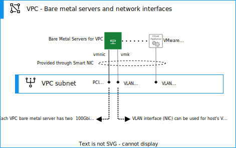
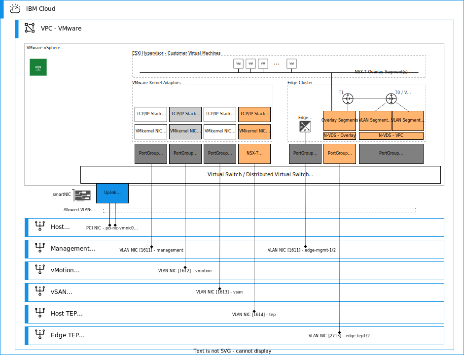

---

copyright:

  years:  2022, 2024

lastupdated: "2024-06-04"

subcollection: vmwaresolutions

---

{{site.data.keyword.attribute-definition-list}}

# Bare metal servers for {{site.data.keyword.vpc_short}}
{: #vpc-vcf-hosts}

The following information provides an overview of how {{site.data.keyword.cloud_notm}} bare metal servers are deployed in {{site.data.keyword.vcf-vpc}}.

## Physical host connections in VPC
{: #vpc-vcf-hosts-connections}

The {{site.data.keyword.cloud_notm}} bare metal server in {{site.data.keyword.vpc_short}} uses SmartNICs for VPC network capabilities. Each physical host has a redundant 100 Gb network connection for network access to {{site.data.keyword.vpc_short}}. The high availability for physical network connectivity is handled by {{site.data.keyword.cloud_notm}}, and you do not have to configure anything special. All network interfaces are backed by two redundant physical ports that are on the top-of-rack (TORs) switch. {{site.data.keyword.cloud_notm}} manages the aggregation, and you do not have to create multiple PCI interfaces for redundancy, for example. The 100 Gb bandwidth is shared by the network interfaces that are configured and currently active on the bare metal server.

A network interface in a {{site.data.keyword.cloud_notm}} bare metal server is an abstract representation of a network interface card, and a network interface connects a {{site.data.keyword.cloud_notm}} bare metal server to a VPC subnet.

{: caption="Figure 1. {{site.data.keyword.cloud_notm}} bare metal server network interfaces " caption-side="bottom"}

In {{site.data.keyword.vpc_short}}, you can create two types of network interfaces on a bare metal server.

* **PCI (Peripheral Component Interconnect) interface** represents a physical network interface. It is possible to include up to 8 PCI interfaces on a bare metal server.
* **VLAN (Virtual LAN) interface** represents an interface that is associated with a PCI interface through the VLAN ID. The VLAN interface automatically tags traffic that is routed through it with the VLAN ID. Inbound traffic that is tagged with a VLAN ID is directed to the appropriate VLAN interface.

PCI interface in a {{site.data.keyword.cloud_notm}} bare metal server is a physical PCI device that can be created or deleted only when the {{site.data.keyword.cloud_notm}} bare metal server is stopped or during initial bare metal server provisioning. PCI interface has an `allowed_VLANs` property, which controls the VLANs that use the PCI interface. VLAN interface is a virtual device, which is used through a PCI device that has the VLAN in its array of `allowed_VLANs`.

In VMware Cloud Foundation deployments, the bare metal servers in {{site.data.keyword.vpc_short}} use two PCI interfaces. It is important to note, that this does not increase the high availability with SmartNICs but this is a VMware Cloud Foundation prerequisite and the capability that is used by Cloud Builder and SDDC manager to handle deployment automation.
{: note}

The allowed VLANs list must be updated separately for all PCI interfaces and all hosts if you use new VLAN IDs in your solution.
{: note}

VLAN interfaces are created for every virtual machine (VM) or VMware Cloud Foundation appliance, which needs to be attached to a VPC subnet. For example, VLAN interface that is created for Cloud Builder or VMware vCenter Server® can use VLAN tag `1611` and this VLAN interface can be provisioned to a management subnet in VPC. When you deploy a vCenter virtual appliance VM, it is attached to vSphere vSwitch and uses a port group that is defined with VLAN tag `1611`. When the vCenter uses the IP of the vLAN interface as provided by VPC, it is logically attached to a management subnet in VPC just like any other VPC Virtual Server.

Every VLAN interface must use an IEEE 802.1q tag in the range 1-4094. It is important to understand that these VLAN tags have only local significance to the bare metal server, VPC subnet does not understand VLANs. You can see SmartNIC as a switch that handles this mapping between VLAN IDs and VPC subnets. VLAN tags are used internally inside the bare metal server to isolate and separate the traffic at layer 2 and it is used as the mechanism to isolate VPC subnet traffic inside the host. For example, in Distributed Virtual Switches different port groups are created to match used VLAN IDs. Each VLAN interface can attach to only one subnet, but you can create multiple VLAN interfaces attached to different subnets and use different VLAN IDs for each. In this design, the VLAN analogy is used and only a single VLAN ID is used for a single VPC subnet.

VLAN interfaces can be set to be `floatable`. This action is important with VMware workloads that require vMotion between the {{site.data.keyword.cloud_notm}} bare metal server. This capability is used with VMware management workloads, such as vCenter or NSX managers to allow them to be moved between hosts for High Availability (HA) or Distributed Resource Scheduler (DRS).

Both PCI and VLAN interfaces can be attached to one or more VPC security groups. A VLAN interface does not inherit the security groups of the PCI interface through which the VLAN interface traffic flows. Also, VPC ACLs can be used to control inbound and outbound traffic for a subnet to which these PCI and VLAN interfaces are attached.

This automation architecture uses primarily security groups to isolate different VMware System Traffic Types only to communicate between themselves if needed. By default, the ACLs allow all traffic. As the architecture uses multiple subnets for different traffic types, you can add your own ACL rules as an extra network security measure, if needed.

For more information about the networking concepts, see [Networking overview for {{site.data.keyword.cloud_notm}} bare metal server on VPC](/docs/vpc?topic=vpc-bare-metal-servers-network).

## Host management networks and VMkernel adapters
{: #vpc-vcf-hosts-mgmt-networks}

A dedicated VMkernel adapter (VMK) is created for every VMware System Traffic Type in VMware Cloud Foundation and System Traffic Types are isolated in different VPC subnets. The following diagram presents how PCI and VLAN interfaces, Distributed Virtual Switch, and Distributed Port Groups are used with NSX-based VMware Cloud Foundation deployment architecture.

{: caption="Figure 2. {{site.data.keyword.cloud_notm}} bare metal server network interfaces and Distributed PortGroups with NSX" caption-side="bottom"}

In VMware Cloud Foundation deployments in {{site.data.keyword.vpc_short}}, each {{site.data.keyword.cloud_notm}} bare metal server is connected to a VPC subnet by using two PCI interfaces. These interfaces are provisioned with an IP address, but this IP address is not used at all in VMware Cloud Foundation. A new management VMkernel adapter `vmk1` is created when the host starts, by using a script passed with user data. For the other System Traffic Types in VMware, a VLAN interface is used by Cloud Builder, SDDC manager, and NSX. These VLAN interfaces are created by the automation for the bare metal servers and attached to the specific subnet and security group.

The following table lists the VMKs that are required for each ESXi host in a VMware Cloud Foundation deployment.

| Interface name | Interface type | VLAN ID | Subnet | Allow float | VMkernel adapter | Distributed port group name |
| ---------------|----------------|---------|--------|-------------|------------------|---------------------------- |
| `pci-nic-vmnic0-uplink1` | `pci` | 0 | `vpc-host-subnet` | `false` | `none` | `dpg-hosts` |
| `pci-nic-vmnic0-uplink2` | `pci` | 0 | `vpc-host-subnet` | `false` | `none` | `dpg-hosts` |
| `vlan-nic-vcf-vmk1` | `vlan` | 1611 | `vpc-vmot-subnet` | `true` | `vmk1` | `pg-vmotion` |
{: caption="Table 1. Host management networks and VMkernel adapters" caption-side="bottom"}

As VMware Cloud Builder and SDDC manager use pool concepts for assigning IP addresses for VMkernel adapters, you must do this action in two steps in {{site.data.keyword.vpc_short}}. First, make sure that you have consecutive IP addresses that are available on the VPC subnet. You can use reserved IP address concept, and reserve the IP addresses from each System Traffic Type subnet. In the second step, you must create a VLAN interface for each pool as shown in the following table. How many IP addresses you need to reserve and how many VLAN interfaces to create depend on the size of your deployment.

| Interface name | Interface type | VLAN ID | Subnet | Allow float | VMkernel adapter | Distributed port group name |
| ---------------|----------------|---------|--------|-------------|------------------|---------------------------- |
| `vlan-nic-vmot-pool-<1>` | `vlan` | 1612 | `vpc-vmot-subnet` | `false` | `vmk0` | `pg-mgmt` |
| `vlan-nic-vsan-pool-<1>` | `vlan` | 1613 | `vpc-vsan-subnet` | `false` | `vmk2` | `pg-vsan` |
| `vlan-nic-tep-pool-<1>` | `vlan` | 1614 | `vpc-tep-subnet` | `false` | `vmk10` | `none` - set in NSX profile |
| `vlan-nic-tep-pool-<2>` | `vlan` | 1614 | `vpc-tep-subnet` | `false` | `vmk11` | `none` - set in NSX profile |
{: caption="Table 2. VMware Cloud Foundation pools for VMkernel adapters" caption-side="bottom"}

Before your VMkernel adapter can communicate in VPC, you must create a VLAN interface. Cloud Builder validates the connectivity for each one and you get an error or warning on validation if your VPC is not set up correctly.
{: important}

When you provision a host, make sure that you provision the required VLAN interfaces for each one, and that the PCI interfaces allow VLANs lists include the used VLAN IDs.
{: note}

As VMkernel adapters do not need to move between hosts, but to be able to facilitate the SDDC manager network pools, they are provisioned with `Allow Float` set to `true` as Cloud Builder and SDDC manager handle the IP address allocations to the hosts.
{: note}

## Related links
{: #vpc-vcf-hosts-links}

* [{{site.data.keyword.vpc_short}} getting started](/docs/vpc?topic=vpc-getting-started)
* [{{site.data.keyword.vpc_short}} bare metal servers](/docs/vpc?topic=vpc-planning-for-bare-metal-servers)
* [{{site.data.keyword.dl_full_notm}} overview](/docs/dl?topic=dl-get-started-with-ibm-cloud-dl)
* [{{site.data.keyword.tg_full_notm}} overview](/docs/transit-gateway?topic=transit-gateway-getting-started)
* [{{site.data.keyword.vpc_short}} VPN overview](/docs/vpc?topic=vpc-vpn-overview)
* [VPC IaaS endpoints](/docs/vpc?topic=vpc-service-endpoints-for-vpc#infrastructure-as-a-service-iaas-endpoints)
