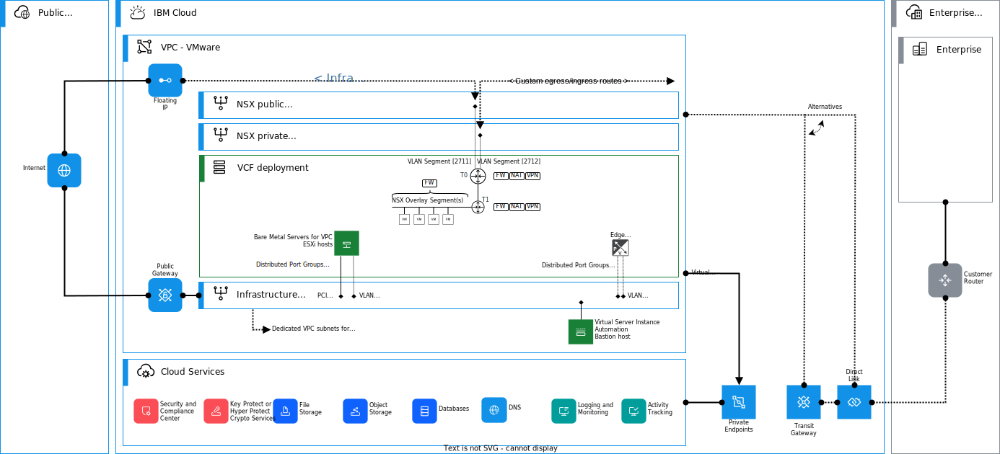

---

copyright:

  years:  2022, 2025

lastupdated: "2025-10-24"

subcollection: vmwaresolutions

---

{{site.data.keyword.attribute-definition-list}}

# NSX Tier-0 and Tier-1 gateways on {{site.data.keyword.vpc_short}}
{: #vpc-vcf-nsx-t-logical-routers}

{{site.data.content.vms-deprecated-note}}

A single VMware NSX® edge cluster with two virtual edge nodes is used in consolidated architecture. Automation creates Tier-0 (T0) gateways and Tier-1 (T1) routers with uplinks that are connected to VPC subnets. In this architecture, the edge clusters host both T0 and T1 gateways. The following information discusses how these gateways interact with {{site.data.keyword.vpc_short}}.

For more information about edge cluster deployment, see [CF NSX design on {{site.data.keyword.vpc_short}}](/docs/vmwaresolutions?topic=vmwaresolutions-vpc-vcf-nsx-t).

## Tier-0 gateway
{: #vpc-vcf-nsx-t-logical-routers-edge-tier-0}

An NSX Tier-0 gateway provides connectivity between the logical NSX overlay segments and VPC subnets, for example, for north-south traffic. In this architecture, a highly available T0 gateway is deployed in the NSX edge cluster. Because of a VMware NSX limitation, this edge cluster can host only a single T0 gateway, which runs in Active-Standby mode. Active-Standby mode is required, for example, to have high availability (HA) VIPs in the T0.

{: caption="T0 gateway in VPC edge cluster" caption-side="bottom"}

Currently, Active-Active mode with T0 is not supported in {{site.data.keyword.vpc_full}}.
{: note}

When T0 is run in Active-Standby mode, both participate Edge Transport Node has their own uplink. HA between these uplinks uses an HA VIP.
{: note}

The T0 is configured with **two uplink types**: two uplinks for **private** use and two uplinks for **public** use. HA VIPs are assigned to both public and private uplinks for HA. For public and private uplinks, two VPC subnets are needed. These subnets are provisioned from the Zone prefix, and they can both use RFC 1918 private addresses, including the public subnet. In the consolidated architecture, only one set of uplink subnets are provisioned.

| Subnet name | System traffic type | Subnet sizing guidance |
| ------------|---------------------|----------------------- |
| `vpc-t0-public-uplink-subnet` | T0 public uplink subnet | `/29` or larger |
| `vpc-t0-private-uplink-subnet` | T0 private uplink subnet | `/29` or larger |
{: caption="VPC subnets for NSX T0 uplinks" caption-side="bottom"}

If you do not need inbound traffic from the internet, you do not need a public uplink subnet.
{: note}

The following VLAN interfaces are required in VPC for each T0 uplink. You must separate the public and private uplinks as specified previously. VLAN interfaces with `Allow IP spoofing` and `Enable Infrastructure NAT` set to `false` allow public floating IP addresses to traverse non-NATted to the public uplinks of the T0 gateway. VLAN interfaces with `Allow IP spoofing` and `Enable Infrastructure NAT` set to `true` allow VMware workloads on NSX overlay with private IP addresses to be routed to {{site.data.keyword.vpc_short}}. These functions cannot be combined into one.

| Interface name | Interface type | VLAN ID | Subnet | Allow float | Allow IP spoofing | Enable infra NAT | NSX interface | Segment name |
| ---------------|----------------|---------|--------|-------------|-------------------|-------------------|--------------|------------ |
| `vlan-nic-t0-pub-uplink-1` | `vlan` | 2711 | `vpc-t0-public-uplink-subnet` | `true` | `false` | `false` | T0 Public Uplink * Edge 1 | `vpc-zone-t0-public-*vlanid*` |
| `vlan-nic-t0-pub-uplink-2` | `vlan` | 2711 | `vpc-t0-public-uplink-subnet` | `true` | `false` | `false` | T0 Public Uplink * Edge 2 | `vpc-zone-t0-public-*vlanid*` |
| `vlan-nic-t0-pub-uplink-vip` | `vlan` | 2711 | `vpc-t0-public-uplink-subnet` | `true` | `false` | `false` | T0 Public Uplink VIP | `vpc-zone-t0-public-*vlanid*` |
| `vlan-nic-t0-priv-uplink-1` | `vlan` | 2712 | `vpc-t0-private-uplink-subnet` | `true` | `true` | `true` | T0 Private Uplink * Edge 1 | `vpc-zone-t0-private-*vlanid*` |
| `vlan-nic-t0-priv-uplink-2` | `vlan` | 2712 | `vpc-t0-private-uplink-subnet` | `true` | `true` | `true` | T0 Private Uplink * Edge 2 | `vpc-zone-t0-private-*vlanid*` |
| `vlan-nic-t0-priv-uplink-vip` | `vlan` | 2712 | `vpc-t0-private-uplink-subnet` | `true` | `true` | `true` | T0 Private Uplink VIP | `vpc-zone-t0-private-*vlanid*` |
{: caption="VLAN interfaces for T0 uplinks for consolidated architecture" caption-side="bottom"}

If you do not need inbound traffic from internet, you might not need either public uplinks on T0 or the public VLAN interfaces for the bare metal server.
{: note}

By routing in T0, you need to take the previous note into consideration. If you have public uplinks, your default route `0.0.0.0/0` must be routed through the public uplinks, and any private routes must be routed through private uplinks. Configure your static routes to the gateway of your VPC subnet.
{: note}

You can provision only one pair of uplinks from the T0 gateway from the same edge cluster in the same VPC subnet. This limitation also includes T0 VRFs. Each T0 uplink pair needs its own VPC subnet.
{: note}

## Tier-1 gateway
{: #vpc-vcf-nsx-t-logical-routers-edge-tier-1}

An NSX T1 gateway has downlink connections to the attached NSX segments and uplink connections to a single T0 gateway. The NSX Edge Nodes provide the compute capacity for the T1 gateways. Each T1 gateway contains a service router (SR) and a distributed router (DR), the same as with T0s. A DR runs as a kernel module distributed in hypervisors and SR is instantiated as a VRF on an edge cluster when a service is enabled and cannot be distributed.

In this design, one or more T1 gateways can be created for the needs of your chosen topology.

You can deploy multiple T1s in the same edge cluster.
{: note}

## Network services that are provided by Tier-0 and Tier-1 gateways
{: #vpc-vcf-nsx-t-logical-routers-edge-gateway}

NSX Data Center supports network services, such as IPsec Virtual Private Network (IPsec VPN), Network Address Translation (NAT), and Firewalls as shown in the following diagram.

{: caption="Network Services provided by Tier-0 and Tier-1 gateways" caption-side="bottom"}

The topic gives a brief introduction to these capabilities and how they can be used in {{site.data.keyword.vpc_short}}.

### VPN services
{: #vpc-vcf-nsx-t-logical-routers-edge-services-vpn}

IPsec Virtual Private Network (IPsec VPN) and Layer 2 VPN (L2 VPN) run on an NSX Edge node. IPsec VPN offers site-to-site connectivity between an NSX Edge node and remote sites. With L2 VPN, you can extend your data center by enabling virtual machines (VMs) to keep their network connectivity across geographical boundaries while you use the same IP address.

When you configure NSX VPN service in {{site.data.keyword.vpc_short}}, you can use the public `/32` floating IP addresses as the VPN Endpoints both Tier-0 and Tier-1 gateways. You can have multiple VPN endpoints, if needed. When a VPN service is configured on a Tier-1 gateway, ensure that the floating IP is correctly advertised between Tier-0 and Tier-1 gateways.

For more information about the VPN service, see [VMware Documentation](https://techdocs.broadcom.com/us/en/vmware-cis/nsx/vmware-nsx/4-1/administration-guide/virtual-private-network-vpn.html){: external}.

### Network Address Translation
{: #vpc-vcf-nsx-t-logical-routers-edge-gateway-nat}

Network Address Translation (NAT) is supported on Tier-0 and Tier-1 gateways.

As example, the following types of NAT are supported.

* **Source NAT (SNAT)** translates a source IP address of outbound packets so that packets are shown as originating from a different network.
* **Destination NAT (DNAT)** translates the destination IP address of inbound packets so that packets are delivered to a target address into another network.

You can also disable SNAT or DNAT for an IP address or a range of addresses. If an address has multiple NAT rules, the rule with the highest priority is applied.

When you configure NSX NAT in {{site.data.keyword.vpc_short}}, you can use the public `/32` floating IP addresses as the public NAT IP addresses in both Tier-0 and Tier-1 gateways. You can have multiple NAT IP addresses, if needed. When NAT is configured on a Tier-1 gateway, ensure that the floating IP is correctly advertised between Tier-0 and Tier-1 gateways.

For more information about NAT in NSX, see [VMware Documentation](https://techdocs.broadcom.com/us/en/vmware-cis/nsx/vmware-nsx/4-1/administration-guide/manager-mode/advanced-nat/nat.html){: external}.

### Firewall
{: #vpc-vcf-nsx-t-logical-routers-edge-gateway-fw}

You can configure East-West and North-South firewall policies in your NSX platform.

A gateway firewall represents rules that are applied to the perimeter firewall for North-South traffic that is connected to {{site.data.keyword.vpc_short}}. A gateway firewall can be applied to both Tier-0 and Tier-1 gateways.

A distributed firewall monitors all the East-West traffic on your VMs. When you group objects, it simplifies the rule management. Groups include different objects that are added both statically and dynamically, and they can be used as the source and destination of a firewall rule. They can be configured to contain a combination of VMs, IP sets, MAC sets, segment ports, segments, AD user groups, and other groups. Dynamic inclusion of groups can be based on tag, machine name, OS name, or computer name.

For more information about firewalls in NSX, see the [VMware documentation](https://techdocs.broadcom.com/us/en/vmware-cis/nsx/vmware-nsx/4-1/administration-guide/security.html){: external}.

## Related links
{: #vpc-vcf-nsx-t-logical-routers-links}

* [{{site.data.keyword.vpc_short}} getting started](/docs/vpc?topic=vpc-getting-started)
* [{{site.data.keyword.vpc_short}} bare metal servers](/docs/vpc?topic=vpc-planning-for-bare-metal-servers)
* [{{site.data.keyword.dl_full_notm}} overview](/docs/dl?topic=dl-get-started-with-ibm-cloud-dl)
* [{{site.data.keyword.tg_full_notm}} overview](/docs/transit-gateway?topic=transit-gateway-getting-started)
* [{{site.data.keyword.vpc_short}} VPN overview](/docs/vpc?topic=vpc-vpn-overview)
* [VPC IaaS endpoints](/docs/vpc?topic=vpc-service-endpoints-for-vpc#infrastructure-as-a-service-iaas-endpoints)
