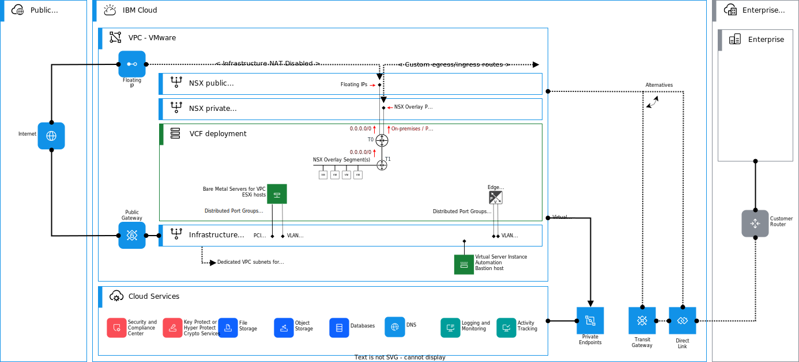

---

copyright:

  years:  2022, 2024

lastupdated: "2024-06-04"

subcollection: vmwaresolutions

---

{{site.data.keyword.attribute-definition-list}}

# NSX and IP routing on {{site.data.keyword.vpc_short}}
{: #vpc-vcf-nsx-t-vpc-routing}

When logical network topologies are deployed on {{site.data.keyword.vpc_full}} hosted VMware NSX™ environments, you must decide how to route the traffic between NSX overlays, {{site.data.keyword.vpc_short}}, and public internet. The following diagram presents an overview of the routing setup between NSX Tier-0 gateway and {{site.data.keyword.vpc_short}}.

{: caption="Figure 1. VPC routing with NSX gateways" caption-side="bottom"}

The {{site.data.keyword.vcf-vpc}} automation deploys these routes based on customer-given variables. This topic explains the core principles for these routing configurations done both in VPC and in NSX Tier-0 and Tier-1 gateways.

In the consolidated deployment, you have only one edge cluster and one Tier-0 gateway. In the standard deployment, you have two edge clusters and two Tier-0 gateways. The Tier-0 gateways follow the same principles presented.
{: note}

If your design does not need direct inbound public access, you can customize the architecture and remove the public uplinks.
{: note}

## Public traffic between Tier-0 and VPC
{: #vpc-vcf-nsx-t-vpc-routing-edge-tier-0-routing-public}

If your workloads need direct public traffic and have inbound public traffic without using any network translation, you must provision the public uplink subnet and public T0 uplink VLAN interfaces. Also, you must configure your T0 with public uplinks as described in the topic [Tier-0 gateway](/docs/vmwaresolutions?topic=vmwaresolutions-vpc-vcf-nsx-t-logical-routers#vpc-vcf-nsx-t-logical-routers-edge-tier-0) previously. As the NSX T0 uses Active-Standby, the HA VIP provides high availability for the routing of public traffic between VPC, T0, and your NSX workloads. When you need public IP addresses, you can order floating IP address to the HA VIP VLAN interface. Each floating IP address is a single `/32` IP address, and you can order as many as you need within [VPC Quotas](/docs/vpc?topic=vpc-quotas).

| Interface name | Interface type | VLAN ID | Subnet | Allow float | Allow IP spoofing | Enable infra NAT | NSX interface | Segment name |
| ---------------|----------------|---------|--------|-------------|-------------------|-------------------|--------------|------------ |
| `vlan-nic-t0-pub-uplink-vip` | `vlan` | 2711 | `vpc-t0-public-uplink-subnet` | `true` | `false` | `false` | T0 Public Uplink VIP | `vpc-zone-t0-public-vlanid` |
{: caption="Table 1. Public uplink HA VIP to be used for public floating IPs" caption-side="bottom"}

VLAN interfaces with `Allow IP spoofing` and `Enable Infrastructure NAT` set to `false` allow public floating IP address to traverse non-NATted to the public uplinks of the T0 gateway. For high availability with NSX T0 gateway, HA VIPs can be used. When you order floating IP address for public uplinks, always use the VIP VLAN interface instead of the uplinks that are reserved for the actual Edge Nodes.
{: note}

You can use the public IP addresses for the following purposes:

* To perform destination NAT done in either Tier-0 or Tier-1 gateways for inbound public traffic to NSX overlay.
* To perform source NAT done in either Tier-0 or Tier-1 gateways for outbound public traffic from NSX overlay.
* To establish VPNs in either Tier-0 or Tier-1.

For public IP addresses, you can currently use one or more `/32` IP address, but you cannot have subnets, such as `/29` or `/26`.
{: note}

In this case, your default route `0.0.0.0/0` in NSX T0 gateway must be pointed to the default gateway of the `vpc-t0-public-uplink-subnet`.

| Route description | Device | CIDR | Next-hop |
| ------------------|--------|------|--------- |
| Default route | T0 gateway | `0.0.0.0/0` | Default GW of `vpc-t0-public-uplink-subnet` |
{: caption="Table 2. Default route in T0 gateway with public uplinks" caption-side="bottom"}

If you do not need inbound traffic from internet, you do not need public uplinks on T0 nor the public VLAN interfaces. Alternatively, you can use Public gateway in {{site.data.keyword.vpc_short}}, which provides you with the outbound internet access from NSX overlay segments, and use the T0s private uplinks for this traffic. In this case, your default route `0.0.0.0/0` in NSX T0 gateway must be pointed to the default gateway of the `vpc-t0-private-uplink-subnet`.

| Route description | Device | CIDR | Next-hop |
| ------------------|--------|------|--------- |
| Default route | T0 gateway | `0.0.0.0/0` | Default GW of `vpc-t0-private-uplink-subnet` |
{: caption="Table 3. Default route in T0 gateway with private uplinks only" caption-side="bottom"}

## Private traffic between Tier-0 and VPC
{: #vpc-vcf-nsx-t-vpc-routing-edge-tier-0-routing-private}

If you have both Public and Private Uplinks, first you must create a route in NSX T0 pointing to the Private networks. You must connect it to the VMware workloads attached to NSX overlay segments. These networks must then be reachable through the VPC, or DL/TGW, which the VPC is attached to. The following table shows an example where the private prefix `172.16.0.0/16` is used on-premises and this prefix is known by the VMware Cloud Foundation VPC, either directly or through attached {{site.data.keyword.dl_short}} (DL) or {{site.data.keyword.tg_short}} (TGW).

| Route description | Device | CIDR | Next-hop |
| ------------------|--------|------|--------- |
| Private networks | T0 gateway | `172.16.0.0/16` | Default GW of `vpc-t0-private-uplink-subnet` |
{: caption="Table 4. Private routes in T0 gateway with public uplinks" caption-side="bottom"}

If you use only private route, then your default route `0.0.0.0/0` in NSX T0 gateway routes all traffic to the VPC.
{: note}

You must define inbound traffic from VPC. Then, you must create a VPC route in the Zone to the IP subnet or prefix that you are using in the NSX overlay. As the NSX T0 uses Active-Standby, the HA VIP provides high availability for the routing of private traffic between VPC and your NSX overlay. Therefore, the next-hop for the VPC route must be the HA VIP, as specified on the following table.

| Interface name | Interface type | VLAN ID | Subnet | Allow float | Allow IP spoofing | Enable Infra NAT | NSX interface | Segment name |
| ---------------|----------------|---------|--------|-------------|-------------------|-------------------|--------------|------------ |
| `vlan-nic-t0-priv-uplink-vip` | `vlan` | 2712 | `vpc-t0-private-uplink-subnet` | `true` | `true` | `true` | T0 Private Uplink VIP | `vpc-zone-t0-private-vlanid` |
{: caption="Table 5. VLAN interfaces for T0 uplinks" caption-side="bottom"}

VLAN interfaces with `Allow IP spoofing` and `Enable Infrastructure NAT` set to `true` allow VMware workloads on NSX overlay with private IP addresses to be routed to {{site.data.keyword.vpc_short}}. To enable this action, a VPC route is created with IP address of private uplink HA VIP/vlan-nic-t0-priv-uplink-vip as the next-hop configured in the {{site.data.keyword.vpc_short}} Zone.
{: note}

When you plan the routing, summarize the NSX overlay subnets or prefixes to keep the number of required routes to a minimum. When you create a route that points to the NSX overlay, the following table provides an example for the required parameters for an NSX overlay subnets `192.168.4.0/24`, `192.168.5.0/24`, `192.168.6.0/24`, and `192.168.7.0/24` attached to T1. Further summarized to a prefix `192.168.4.0/22` and by using NSX HA VIP `192.168.0.10` in Zone `us-south-2` as the next-hop. For more information about VPC routes, see [VPC routing tables and routes](/docs/vpc?topic=vpc-about-custom-routes).

| Route description | Zone | Traffic type | CIDR | Action | Type | Next-hop |
| ------------------|------|--------------|------|--------|------|--------- |
| NSX overlay networks | `us-south-1` | Egress | `192.168.4.0/22` | Deliver | IP | `192.168.0.10` |
| NSX overlay networks | `us-south-2` | Egress | `192.168.4.0/22` | Deliver | IP | `192.168.0.10` |
| NSX overlay networks | `us-south-3` | Egress | `192.168.4.0/22` | Deliver | IP | `192.168.0.10` |
{: caption="Table 6. VPC egress routes" caption-side="bottom"}

VPC routes are Zone specific.
{: note}

When you create a VPC route, it enables traffic within the Zone or VPC depending on how it is created. 

In the interconnectivity use case, an ingress routing table is created.

| Table description | Type    | Traffic sources |
| ------------------|---------|-----------------|
| Ingress route     | Ingress | Direct Link, Transit Gateway |
{: caption="Table 7. VPC ingress routing table" caption-side="bottom"}

Ingress routes are also created in the zone where VMware Cloud Foundation is deployed. For example, if the deployment would be on `us-south-1` and the overlay prefix would be `192.168.4.0/22`:

| Route description | Zone | Traffic type | CIDR | Action | Type | Next-hop |
| ------------------|------|--------------|------|--------|------|--------- |
| NSX overlay networks | `us-south-1` | Ingress | `192.168.4.0/22` | Deliver | IP | `192.168.0.10` |
{: caption="Table 8. VPC ingress routes" caption-side="bottom"}

If you use any of the interconnectivity options, such as {{site.data.keyword.dl_short}} or {{site.data.keyword.tg_short}}, and you need connectivity from another VPC attached to a TGW, in addition to the VPC route, you can create a VPC (ingress) routes with advertise flags. This action allows both DL and TGW to advertise your NSX overlay subnet or prefix to the attached TGW connections or DL.

For more information about VPC routes, see [VPC routing tables and routes](/docs/vpc?topic=vpc-about-custom-routes).

## Routing between Tier-0 and Tier-1 gateways
{: #vpc-vcf-nsx-t-vpc-routing-edge-tier-0-routing-t1}

T0 and T1 gateways provide native NSX routing between them, but you must configure that inside NSX. In this model, the workloads are typically connected to NSX overlay segments behind T1, and when T1 is connected to its parent T0, it has a default route that points to the T0. By default, T0 does not see prefixes of the segments that are attached to the T1 gateway, unless route advertisement is enabled in T1 to allow this.

If you want to route natively with {{site.data.keyword.vpc_short}} subnets and other connected service without using NAT in T1, enable route advertisement of **All Connected Segments & Service Ports** in the specific T1. You do not need to configure a routing protocol or static routes between T1 and T0 gateways. After you enable the route advertisement, NSX shows and creates these routes automatically. With this approach, you have all connected segments of your T1 routed to T0, and then you can decide how to proceed with the public and private traffic in T0.

For example, if you have a public floating IP configured and provisioned on your T0's HA VIP, you might decide whether you want to create a NAT rule in T1 or T1. Or create a VPN server endpoint on either of these.

For private traffic, you can configure a subnet that is carved out of the private VPC prefix, for example with prefix `192.168.4.0/22` and configure a subnets `192.168.4.0/26` and `192.168.4.64/26` on two segments that are attached to T1. Then, VPC will direct traffic that is destined toward `192.168.4.0/22` to T0's private uplink, and T0 will further forward that to the T1. The return path follows reverse path, T1 sends to T0, which then has the private traffic routes toward the default gateway of the VPC private uplink subnet.

## Interconnectivity
{: #vpc-vcf-nsx-t-vpc-interconnectivity}

Interconnectivity consists of multiple services and offerings that enable customers to connect from their remote network locations to {{site.data.keyword.cloud}} deployments and between workloads and services that run in {{site.data.keyword.cloud_notm}}.

It can be divided into the following categories:
- Interconnecting with on-premises networks
- Interconnecting VPCs and other {{site.data.keyword.cloud_notm}} infrastructure services

The following diagram shows an overview of the interconnectivity solutions.

{: caption="Figure 2. Interconnectivity options" caption-side="bottom"}

With {{site.data.keyword.tg_full}} (TGW), you can create a single or multiple transit gateways to connect VPCs together. You can also connect your {{site.data.keyword.cloud_notm}} classic infrastructure to a {{site.data.keyword.tg_short}} to provide seamless communication with Classic Infrastructure resources. Any new network that you connect to a {{site.data.keyword.tg_short}} is then automatically made available to every other network connected to it.

The {{site.data.keyword.dl_full_notm}} service is a routed OSI Layer-3 service. It offers a direct connection to the {{site.data.keyword.cloud_notm}} private network backbone. {{site.data.keyword.dl_full_notm}} can be connected directly to the VPC or you can attach it to your TGW.

For more information, see [About {{site.data.keyword.tg_full_notm}}](/docs/transit-gateway?topic=transit-gateway-about) and [About {{site.data.keyword.dl_full_notm}} (2.0)](/docs/dl?topic=dl-dl-about).

## Related links
{: #vpc-vcf-nsx-t-vpc-routing-links}

* [{{site.data.keyword.vpc_short}} getting started](/docs/vpc?topic=vpc-getting-started)
* [{{site.data.keyword.vpc_short}} bare metal servers](/docs/vpc?topic=vpc-planning-for-bare-metal-servers)
* [{{site.data.keyword.dl_full_notm}} overview](/docs/dl?topic=dl-get-started-with-ibm-cloud-dl)
* [{{site.data.keyword.tg_full_notm}} overview](/docs/transit-gateway?topic=transit-gateway-getting-started)
* [{{site.data.keyword.vpc_short}} VPN overview](/docs/vpc?topic=vpc-vpn-overview)
* [VPC IaaS endpoints](/docs/vpc?topic=vpc-service-endpoints-for-vpc#infrastructure-as-a-service-iaas-endpoints)
* [About {{site.data.keyword.tg_full_notm}}](/docs/transit-gateway?topic=transit-gateway-about)
* [About {{site.data.keyword.dl_full_notm}} (2.0)](/docs/dl?topic=dl-dl-about)
