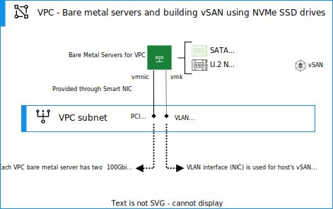

---

copyright:

  years:  2023

lastupdated: "2023-09-11"

subcollection: vmwaresolutions

---

{{site.data.keyword.attribute-definition-list}}

# VMware storage options
{: #vpc-vcf-storage-overview}

The architecture for {{site.data.keyword.cloud}} for VMware Cloud Foundation is built upon {{site.data.keyword.vpc_short}} network architecture and uses bare metal servers for {{site.data.keyword.vpc_short}}. VMware Cloud Foundation uses the locally attached NVMe drives on bare metal servers to create a software-defined storage for the VMware Cloud Foundation deployment. 

{: caption="Figure 1. vSAN deployment with NVMe SSD drives" caption-side="bottom"}

Currently, VMware vSAN is the only storage option. {{site.data.keyword.vpc_short}} File Shares are not supported in VMware Cloud Foundation deployments.
{: note}

VMware Cloud Foundation version 4.5.1 is supported for the VMware Cloud Foundation deployments, which come with VMware vSphere 7.0 Update 3l hosts and vSAN 7.0 Update 3l. Therefore, Original Storage Architecture (OSA) is the only supported vSAN architecture.
{: note}

As part of {{site.data.keyword.cloud}} for VMware Cloud Foundation automation, vSAN is deployed automatically for you and there is no need to apply any specific configurations for this. However, you can configure various storage policies for your virtual machines to meet various availability or performance goals post initial provisioning though vCenter server.

## VMware vSAN design
{: #vpc-vcf-storage-virtual-vsan-design}

The VMware vSAN is a distributed layer of software that runs natively as a part of the ESXi hypervisor. It aggregates local or direct-attached capacity devices of all hosts in the vSAN cluster and it creates a single storage pool that is shared across all hosts in the vSAN cluster. The VMware features that require shared storage, such as HA, vMotion, DRS, and vSAN eliminate the need for external shared storage. They also simplify storage configuration and virtual machine provisioning activities. However, if needed, you can combine these functions with {{site.data.keyword.vpc_short}} provided storage solutions.

Within vSAN design, the compute nodes contain local disk drives for the ESXi operating system (OS) and extra disk drives for the vSAN data store. In every bare metal server, two M.2 SSD mirrored drives are included in each node to house the ESXi installation, regardless of which type of cluster the host belongs to. The {{site.data.keyword.cloud_notm}} bare metal server profiles with letter `d` represent a number of additional attached NVMe U.2 SSDs, which can be used for vSAN.

vSAN can be employed as follows:

* One or two-disk group vSAN designs.
* Each disk group with two or more disks.
* One NVMe drive in the group serves as the cache tier and the remaining SSDs serve as the capacity tier.
* A single vSAN data store is created from all storage.

VMware Cloud Foundation deploys the vSAN automatically for you and you do not need to apply any specific configurations when deploying.

The available vSAN features depend on the license edition that you select when you order the instance. For more information, see [VMware vSAN edition comparison](/docs/vmwaresolutions?topic=vmwaresolutions-solution-appendix#solution-appendix-vsan-editions).

## Virtual network setup for vSAN
{: #vpc-vcf-storage-virtual-net-setup}

In this reference design, the vSAN traffic traverses between ESXi hosts on a dedicated VPC subnet. The PCI network adapter attached to the {{site.data.keyword.cloud_notm}} bare metal server is configured within vSphere as a vSphere Distributed Switch (vDS) with the network adapters as uplink. A dedicated vSAN kernel port group is configured for the vSAN VPC subnet and is located within the vDS. Jumbo frames (MTU 9000) are enabled for the private vDS.

vSAN does not load balance traffic across uplinks. High availability (HA) for the uplink is provided by the SmartNIC.
{: note}

For more information about physical NIC connections, see [Networking overview for {{site.data.keyword.cloud_notm}} Bare Metal Servers on VPC](/vpc?topic=vpc-bare-metal-servers-network&interface=ui).

## vSAN storage policy
{: #vpc-vcf-storage-virtual-storage-policy}

When vSAN is enabled and configured, storage policies are configured to define the VM storage characteristics. Storage policies specify different levels of service for different VMs. With {{site.data.keyword.cloud}} for VMware Cloud Foundation, default policies are created for you, but you are responsible for configuring the storage policies based on your needs for each VM.

The default storage policy in this design tolerates a single failure. It is configured with erasure coding, with the Failure tolerance method set to RAID-5/6 (Erasure Coding) - Capacity and Primary level of failures set to 1. The RAID 5 configuration requires a minimum of four hosts.

Alternatively, you can choose the RAID 6 configuration with Failure tolerance method set to RAID-5/6 (Erasure Coding) - Capacity and Primary level of failures set to 2. The RAID 6 configuration requires a minimum of six hosts. Deduplication and compression are normally enabled in the default storage policy but can be disabled if needed.

An vSAN uses the default policy unless otherwise specified from the vSphere console. When a custom policy is configured, vSAN guarantees it when possible. However, if the policy cannot be guaranteed, it is not possible to provision a VM that uses the policy unless it is enabled to force provisioning.

You can modify the vSAN configuration in vSphere without negatively affecting the VMware Cloud Foundation configuration.
{: note}

## vSAN storage settings
{: #vpc-vcf-storage-virtual-vsan-sett}

vSAN settings are configured based on best practices for deploying VMware Solutions within {{site.data.keyword.cloud_notm}}. The vSAN configuration includes storage IO Control (SIOC) settings, explicit failover settings port group, and disk cache settings. With the VMware Cloud Foundation deployment in VPC, you are responsible for configuring the storage policies based on your needs, but you can also accept the default configurations.

You can modify the vSAN configuration in vSphere without negatively affecting the VMware Cloud Foundation configuration.
{: note}

## Related links
{: #vpc-vcf-storage-links}

* [{{site.data.keyword.vpc_short}} getting started](/docs/vpc?topic=vpc-getting-started)
