---

copyright:

  years:  2022, 2025

lastupdated: "2025-01-13"

subcollection: vmwaresolutions

---

{{site.data.keyword.attribute-definition-list}}

# VPC network design
{: #vpc-vcf-vpc-deployment}

The following information provides an overview to the {{site.data.keyword.vpc_full}} deployment for a VMware® deployment. It's important to understand the separation and integration of VMware infrastructure networking with VPC, its requirements how to integrate and configure connectivity with other workload traffic.

## VPC subnets
{: #vpc-vcf-vpc-deployment-subnets}

In {{site.data.keyword.vpc_short}}, you can do logical segmentation or isolation in multiple ways. This architecture uses a traditional VLAN segmentation analogy by following VMware Cloud Foundation™ requirements, but {{site.data.keyword.vpc_short}} uses subnets instead of VLANs. Each System Traffic Type has its own VPC subnet, and the traffic between VMkernel adapter network interfaces can be controlled with both {{site.data.keyword.vpc_short}} security groups (SGs) and subnet access control lists (ACLs). The following diagram shows an overview of the consolidated VPC design.

{: caption="VPC network design for consolidated VMware Cloud Foundation deployment" caption-side="bottom"}

For this architecture, a new VPC is created for each VMware Cloud Foundation instance. This action is for simplicity and to avoid issues with scalability and architectural requirements and principles of VMware Cloud Foundation. To connect to other workloads and other VPCs, you can use {{site.data.keyword.cloud_notm}} interconnectivity solutions, such as Transit Gateway.

The following table lists the subnets that are created in VPC. Subnet design is based on the VMware Cloud Foundation requirement to separate System Traffic Types logically and a dedicated VPC subnet for each user used. Bare metal server PCI interfaces are hosted on their own subnet. Management interfaces and appliances, such as VMware vCenter®, VMware NSX™ managers, SDDC manager, and NSX Edge™ management interfaces are provisioned on their own management subnet.

| Subnet name | System traffic type | Subnet sizing guidance |
| ------------|---------------------|----------------------- |
| `vpc-host-subnet` | Host management traffic | Number of Hosts x 2 (each PCI NIC requires an IP address) |
| `vpc-mgmt-subnet` | Management appliance traffic | Number of VMware Cloud Foundation Management Appliances |
| `vpc-vmot-subnet` | vMotion traffic | Number of Hosts |
| `vpc-vsan-subnet` | vSAN traffic | Number of Hosts |
| `vpc-tep-subnet` | TEP traffic for hosts | Number of Hosts x 2 (each host requires 2 x TEPs) |
{: caption="VPC subnets for System traffic types" caption-side="bottom"}

NSX edge TEP traffic and NSX Tier-0 logical gateway interfaces are deployed on their own subnets in VMware Cloud Foundation deployments. The following VPC subnets are required for the edge cluster.

| Subnet name | System traffic type | Subnet sizing guidance |
| ------------|---------------------|----------------------- |
| `vpc-edge-tep-subnet` | TEP traffic for edge nodes   | Number of Edge Nodes x 2 (each edge node requires 2 x TEPs) |
| `vpc-t0-public-uplink-subnet` | T0 public uplink subnet | `/29` or larger |
| `vpc-t0-private-uplink-subnet` | T0 private uplink subnet | `/29` or larger |
{: caption="VPC subnets for NSX T0 uplinks" caption-side="bottom"}

To be able to create subnets in VPC, you must create a VPC prefix. VPC prefixes are defined per zone. To simplify routing, you must allocate the recommended subnets from a single prefix. Which means that to accommodate five subnets, you need one `/21` prefix to cater addresses for about 120 hosts per zone. If you want to use a prefix with `/22`, you can add about 60 hosts per zone. By selecting a large enough prefix, you will have growth for scalability and future needs, such as dedicated VMKs for NFS, replication, and NSX Tier-0 uplinks.

The standard deployment differs slightly from the consolidated deployment. Different subnets are used for VI workload domain as shown in the following diagram.

{: caption="VPC network design for standard VMware Cloud Foundation deployment" caption-side="bottom"}

The following subnets are deployed for hosts in the standard architecture model.

| Subnet name | System traffic type | Subnet sizing guidance |
| ------------|---------------------|----------------------- |
| `vpc-host-subnet` | Host management traffic | Number of Hosts x 2 (each PCI NIC requires an IP address) |
| `vpc-mgmt-subnet` | Management traffic | Number of VMware Cloud Foundation Management Appliances |
| `vpc-vmot-subnet` | vMotion traffic for management | Number of Hosts |
| `vpc-vsan-subnet` | vSAN traffic for management | Number of Hosts |
| `vpc-tep-subnet` | TEP traffic for management hosts | Number of Hosts x 2 (each host requires 2 x TEPs) |
| `vpc-wl-mgmt-subnet` | Management traffic for workload domain hosts and edges | Number of VMware Cloud Foundation Management Appliances |
| `vpc-wl-vmot-subnet` | vMotion traffic for workload domain | Number of Hosts |
| `vpc-wl-vsan-subnet` | vSAN traffic for workload domain | Number of Hosts |
| `vpc-wl-tep-subnet` | TEP traffic for workload domain hosts | Number of Hosts x 2 (each host requires 2 x TEPs) |
{: caption="VPC subnets for System traffic types" caption-side="bottom"}

For edges, the following subnets are deployed in the standard architecture model.

| Subnet name | System traffic type | Subnet sizing guidance |
| ------------|---------------------|----------------------- |
| `vpc-edge-tep-subnet` | TEP traffic for edge nodes   | Number of Edge Nodes x 2 (each edge node requires 2 x TEPs) |
| `vpc-t0-public-uplink-subnet` | T0 public uplink subnet | `/29` or larger |
| `vpc-t0-private-uplink-subnet` | T0 private uplink subnet | `/29` or larger |
| `vpc-wl-edge-tep-subnet` | TEP traffic for workload domain edge nodes   | Number of Edge Nodes x 2 (each edge node requires 2 x TEPs) |
| `vpc-wl-t0-public-uplink-subnet` | T0 public uplink subnet for workload domain | `/29` or larger |
| `vpc-wl-t0-private-uplink-subnet` | T0 private uplink subnet for workload domain | `/29` or larger |
{: caption="VPC subnets for NSX T0 uplinks" caption-side="bottom"}

## VPC access control lists and security groups
{: #vpc-vcf-vpc-deployment-net-security}

Bare metal server for VPC provides full support for VPC networking features. Network security capabilities, such as security groups and Access Control Lists can be used with bare metal server PCI and VLAN interfaces. In this design, both the VMware infrastructure subnets, which are used to carry VMware System Traffic Types, and VPC subnets for workloads VMs share the routing domain. This design allows the usage of these two built network VPC security tools.

### Access control list with VMware workloads
{: #vpc-vcf-vpc-deployment-net-security-acl}

An access control list can manage by allowing or denying inbound and outbound traffic for a subnet. An ACL is stateless, which means that inbound and outbound rules must be specified separately and explicitly. Each ACL consists of rules based on a source IP, source port, destination IP, destination port, and protocol. Every VPC has a default ACL that allows all inbound and outbound traffic. You can edit the default ACL rules, or create a custom ACL.

As ACLs are applied to a subnet, you can use them as virtual servers to control traffic to and from the VPC subnets. Also, you can create isolated subnets, for example, for vSAN™, vMotion and TEP traffic.

The default deployment uses a default ACL (`allow any`) for the whole VPC, but you can customize this post initial deployment.

For more information about ACLs, see [Security in VPC](/docs/vpc?topic=vpc-security-in-your-vpc). For more information about ACLs with {{site.data.keyword.cloud_notm}} bare metal server, see [Introduction to {{site.data.keyword.cloud_notm}} bare metal server networking](/docs/vpc?topic=vpc-bare-metal-servers-network).

### Security groups with VMware workloads
{: #vpc-vcf-vpc-deployment-net-security-sg}

A security group acts as a virtual firewall that controls the traffic for one or more virtual server network interfaces and {{site.data.keyword.cloud_notm}} bare metal server PCI or VLAN interfaces. A security group is a collection of rules that specify whether to allow or deny traffic for an associated interface. You can associate an interface with one or more security groups and edit the security group rules. You can also use security groups as a source or destination in the rules to create more dynamic rules without specifying IP addresses.

In this design, your security groups are used to create a logical grouping of management, vSAN, vMotion and TEP traffic types, and apply rules to allow required traffic flows. The following security groups are created:

| Security group name | Usage |
| --------------------|-------|
| `sg-mgmt`           | Management appliances and hosts |
| `sg-vmot`           | VMkernel adapters for vMotion |
| `sg-vsan`           | VMkernel adapters for vSAN |
| `sg-tep`            | VMkernel adapters for TEP |
| `sg-uplink-pub`     | VMkernel adapters for Tier-0 public uplinks |
| `sg-uplink-priv`    | VMkernel adapters for Tier-0 private uplinks |
| `sg-bastion`        | VMkernel adapters for bastion hosts (automation VSI) |
{: caption="VPC security groups" caption-side="bottom"}

The basic principle for the default rules is to allow practical minimum. For example, `sg-vmot` allows traffic between the security group members and inbound `icmp` from the security group `sg-mgmt`. The same principle is applied to all security groups used for VMkernel adapters. `sg-mgmt` allows connectivity from private RFC 1918 networks. These rules can be customized post initial provisioning and the following information provides simplified guidance and principles.

When security groups are used with VLAN interfaces in VMware virtual machines (VMs), to avoid misconfigurations and misunderstandings, it is important to understand how traffic flows to and from the standard and distributed vSwitches, and when traffic traverses inside the hosts inside these vSwitches.

In a VMware environment, traffic between VLAN network interfaces with the same VLAN ID on the same bare metal server is typically forwarded by the vSwitches within the ESXi host. If the virtual machines or VMkernel interfaces are on the same host and use the same port group and VLAN ID, the traffic does not reach the VPC network.

For example, on a VMware vSphere® cluster that consists of multiple bare metal server hosts, you configure a distributed vSwitch. In this case, you can create a port group with VLAN ID `1611` and add it to the specific vSwitch. The traffic between vNICs of two VMs that are attached to Port Group `1611` is controlled by the vSwitch.

In this example, this has the following consequences in VMware Cloud Foundation deployments:

- Security Group rules that control traffic between the network interfaces in Port Group VLAN ID `1611` are not applied if the traffic does not leave the vSwitch. 

In addition, when you work with security groups that are applied to NSX Tier 0 gateway uplinks and NSX overlay traffic, you must define rules based on IP addresses, for example:

- When you access a VM on an NSX overlay with an IP address of `192.168.45.10` from a VMware VM (or a VSI) on VPC subnet and you want to allow traffic to this IP address, your source security group rule must match outgoing traffic, and the security group that is assigned to the Tier 0 gateway uplinks must match it on the inbound. In this case, an IP address or CIDR must be used to match the overlay traffic.
- When a VM on an NSX overlay with an IP address of `192.168.45.10` needs to communicate to a vCenter or SDDC manager, Tier 0 gateway uplinks security group rule must match outgoing traffic, and the security group that is assigned to the vCenter or SDDC manager VLAN interface must match this on inbound. In this case, an IP address or CIDR must be used to match the overlay traffic.

For more information about security groups, see [Security in your VPC](/docs/vpc?topic=vpc-security-in-your-vpc). For more information about security groups with {{site.data.keyword.cloud_notm}} bare metal server, see [Introduction to {{site.data.keyword.cloud_notm}} bare metal server networking](/docs/vpc?topic=vpc-bare-metal-servers-network).

## Public connectivity with VMware VMs on VPC subnet
{: #vpc-vcf-vpc-deployment-public-connectivity}

Bare metal server for VPC provides full support for VPC public networking features. External connectivity can be achieved either by using a Public Gateway that is attached to a VPC subnet, or by using a floating IP address that is attached to a PCI or VLAN interface of a bare metal server. The public gateway uses source network address translation (SNAT) and a floating IP uses destination network address translation (DNAT). These functions are identical to VPC virtual servers.

VLAN interfaces that are attached to a VPC subnet with a Public Gateway can initiate connections to the internet, but they cannot receive connections from the internet. Public Gateway provides connectivity for an entire subnet, and public traffic that originates from the VMs on this subnet considers the Public Gateway IP address as the source. If the subnet is not attached to a Public Gateway, the traffic is fully private. In this design, vSAN, vMotion, or TEP subnets can be examples.

A VLAN interface with a floating IP can initiate or receive connections to or from the internet. Floating IP provides connectivity for a single instance. This action overrides the Public Gateway of that specific VLAN interface in the VPC subnet, if that is provisioned to a subnet with attached Public Gateway.

In VMware Cloud Foundation deployments, you must add a management subnet to a Public Gateway, which allows, for example, the SDDC manager to get updated directly from VMware public software repositories.

For more information about overlay and NSX public connectivity, see [VMware NSX logical routers on VPC deployments](/docs/vmwaresolutions?topic=vmwaresolutions-vpc-vcf-nsx-t-logical-routers) and [VMware NSX logical routing on VPC](/docs/vmwaresolutions?topic=vmwaresolutions-vpc-vcf-nsx-t-vpc-routing).

## Related links
{: #vpc-vcf-vpc-deployment-links}

* [{{site.data.keyword.vpc_short}} getting started](/docs/vpc?topic=vpc-getting-started)
* [{{site.data.keyword.vpc_short}} bare metal servers](/docs/vpc?topic=vpc-planning-for-bare-metal-servers)
* [{{site.data.keyword.dl_full_notm}} overview](/docs/dl?topic=dl-get-started-with-ibm-cloud-dl)
* [{{site.data.keyword.tg_full_notm}} overview](/docs/transit-gateway?topic=transit-gateway-getting-started)
* [{{site.data.keyword.vpc_short}} VPN overview](/docs/vpc?topic=vpc-vpn-overview)
* [VPC IaaS endpoints](/docs/vpc?topic=vpc-service-endpoints-for-vpc#infrastructure-as-a-service-iaas-endpoints)
