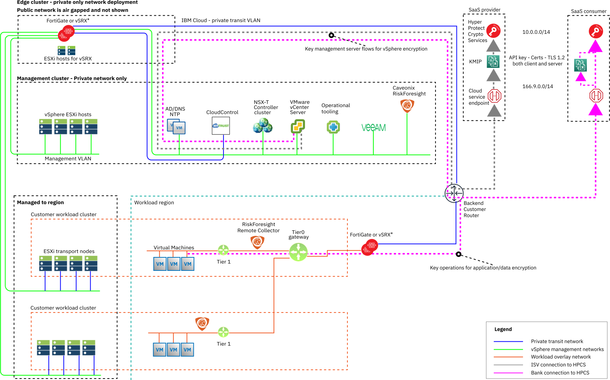

---

copyright:

  years:  2020, 2023

lastupdated: "2023-03-24"

subcollection: vmwaresolutions

---

{{site.data.keyword.attribute-definition-list}}

# Architecture overview
{: #vrw-archi-overview}

The {{site.data.keyword.cloud}} for VMware® Regulated Workloads architecture is an extension of the VMware vCenter Server® offering.

The design extends and enhances the basic VMware vCenter Server® architecture to deliver a secure, high-performance platform. Clients are able to run both classic virtualized workloads and containerized applications with the addition of {{site.data.keyword.redhat_openshift_full}}.

{{site.data.keyword.vmwaresolutions_full}} automation is used to deploy all layers of the platform thus consistently delivering a secure and compliant-ready build for every {{site.data.keyword.cloud_notm}} for VMware Regulated Workloads instance ordered.

{: caption="Figure 1. IBM Cloud for VMware Regulated Workloads infrastructure overview" caption-side="bottom"}

The perimeter gateway cluster that is shown in the workload region is the same gateway that runs on the dedicated gateway cluster.

The minimum viable product consists of the following components:
* At least one workload cluster that includes four or more ESXi™ hosts
* vSAN™ and NSX-T™
* A management cluster of four ESXi hosts
* A gateway cluster of two ESXi hosts or a physical FortiGate® appliance

## Management cluster
{: #vrw-archi-overview-management}

The management cluster is sized to support only the requirements of the management software stack. Do not run nonmanagement function workloads in the management cluster. Keeping the management functions fully isolated from the workload cluster makes it impossible for a runaway workload VM to use resources that are dedicated to platform management. This way, administrators ensure that they can maintain full control of the environment.

vSAN is used to provide enhanced resiliency to the management stack. The use of shared storage provides rapid restoration of management components if an ESXi host is lost.

The management software stack includes the following components:
* vCenter Server, which manages all hosts in the entire {{site.data.keyword.cloud_notm}} for VMware Regulated Workloads instance.
* Microsoft® AD/DNS servers, which provide DNS and authentication services.
* NSX-T management components to fully isolate the SDN control plane from the workload cluster.
* Entrust CloudControl™ is used to unify security policies for access to the management stack. In addition, Entrust CloudControl is used for unified visibility into security configuration and context and continuous compliance by using templates to enforce separation of duties. Entrust CloudControl also provides a robust audit trail that includes a full record of all actions that are taken by security, network, and compute platform administrators. Entrust CloudControl also simplifies compliance with administrative controls requirements in HIPAA, PCI, FedRAMP, CJIS, and other regulations.

{: caption="Figure 2. IBM Cloud for VMware Regulated Workloads Entrust overview" caption-side="bottom"}

* Security is further enhanced by IBM Hyper Protect Crypto Services (HPCS). HPCS uses a FIPS 140-2 Level 4 hardware security module (HSM) that gives access to the highest level of security for regulated data and digital assets. HPCS helps meet regulatory compliance requirements by providing complete control of data encryption keys, including the HSM primary key.
* Caveonix RiskForesight provides a common Risk Management Control Plane (RMCP) for continuous and proactive protection of management and edge workloads. It provides a comprehensive cloud workload protection platform for {{site.data.keyword.cloud_notm}} for VMware Regulated Workloads. The {{site.data.keyword.cloud_notm}} for VMware Regulated Workloads architecture is designed to enable compliance with NIST and other necessary certifications, as required for the SaaS provider and SaaS consumer.
* VMware vRealize Operations Manager (vROps), vRealize Log Insight (vRLI), and the optional vRealize Network Insight (vRNI). These components collectively provide a native console for vSphere operations, the ability to automate management of the cloud platform, centralized log collection, and network visibility, analysis, and optimization.  
* Veeam provides continuous backup of the management stack for protection against disasters and rapid restoration to known good states if corruption of any management stack component were to occur. Veeam can also provide backup services for the workload cluster. The single site deployment can use the Veeam bare metal option to provide a suitable backup repository.

## Gateway cluster
{: #vrw-archi-overview-edge}

The FortiGate physical 10 Gb HA appliance is the only point of entry into the {{site.data.keyword.cloud_notm}} for VMware Regulated Workloads. The gateway cluster with the vSRX HA appliance or a suitable bring your own gateway appliance is an alternative to the physical FortiGate appliance. The gateway cluster uses local storage only (no vSAN, no NFS) and each host is running a virtual appliance node. The gateway cluster requires only two ESXi hosts. The nodes are configured as a highly available cluster. The cluster is sized to support 10 Gb networking.

## Workload cluster
{: #vrw-archi-overview-workloads}

The sizing of four ESXi servers for the workload cluster is based on the required compute resources, memory, and storage needs of the customer applications. The minimum host count of four is a vSAN requirement. Each workload cluster added is provisioned on new VLANs in the same datacenter location to separate traffic of different workload clusters with the firewall, either physical or an appliance that is running on the gateway cluster.

vSAN is the storage provider and is fully contained within the workload environment. Therefore, all regulated data is isolated from external access and threats.

NSX-T provides a highly secure and flexible software-defined network to support the application requirements. NSX-T management is external to the workload cluster thus ensuring that network and security changes are not possible by anyone other than the designated administrators. All north-south network access in the workload cluster is done through private and secure connections by using IPsec or IBM Direct Link.

Add more workload clusters to deliver dedicated resources for more applications or to satisfy business or compliance requirements.

## Option for consolidated workload and management cluster
{: #vrw-archi-overview-workloads-opt}

Smaller deployments, such as those for Development, Test, or a minimal footprint DR site, might not require the deployment of both dedicated management and workload clusters. You can order the VMware Regulated Workloads environment with a consolidated management and workload cluster. When you use a consolidated cluster, additional operation and security risks exist. No option is offered to deploy without a Perimeter Gateway.

Resource exhaustion is an operational risk that might require reserving sufficient compute, storage, and network resources for management functions to ensure that the necessary resources are available to manage the environment. Another option to prevent resource exhaustion is through the assignment of quotas to workloads.

Before you deploy a consolidated cluster, consider the following possible security risks:
* An attacker who gets access to a workload VM might be able to use future microarchitectural vulnerabilities to steal secrets from or manipulate memory on an ESXi host.
* An attacker who gets access to a workload VM might be able to use future hypervisor vulnerabilities to escape from the VM and manipulate the management VMs on the same ESXi host.

## Optional management by IBM
{: #vrw-archi-overview-ibm-services}

The VMware Regulated Workloads offering is available as a self-managed or SaaS provider-managed solution. However, a SaaS provider might choose to deploy the {{site.data.keyword.cloud_notm}} for VMware Regulated Workloads as an IBM-managed offering by bundling in IBM GTS services.

## How to order VMware Regulated Workloads instances
{: #vrw-archi-overview-order-inst}

For more information, see:
* [VMware Regulated Workloads overview](/docs/vmwaresolutions?topic=vmwaresolutions-vrw-overview)
* [Ordering VMware Regulated Workloads](/docs/vmwaresolutions?topic=vmwaresolutions-vrw-orderinginstance-req)

## Related links
{: #vrw-archi-overview-related}

* [IBM Cloud compliance programs](https://www.ibm.com/cloud/compliance){: external}
* [Caveonix RiskForesight](/docs/vmwaresolutions?topic=vmwaresolutions-caveonix_considerations)
* [Entrust CloudControl](/docs/vmwaresolutions?topic=vmwaresolutions-entrust-cc_considerations)
* [vRealize Operations and Log Insight](/docs/vmwaresolutions?topic=vmwaresolutions-vrops_overview)
