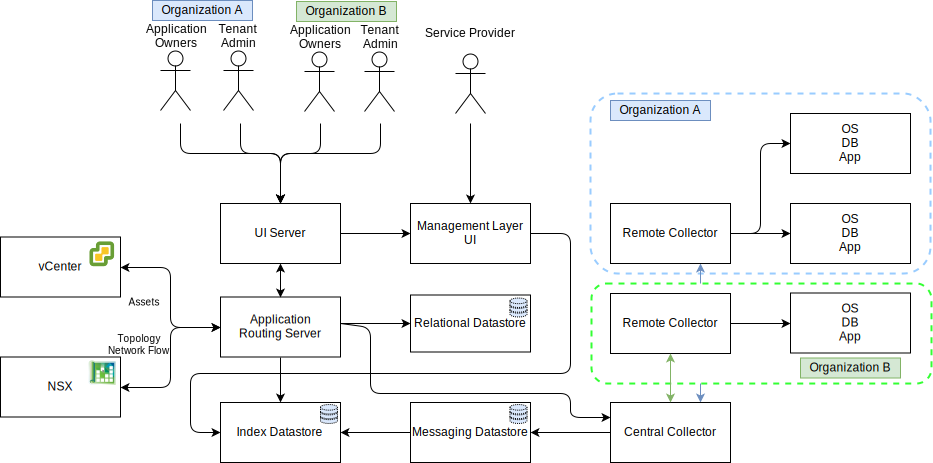

---

copyright:

  years:  2020, 2025

lastupdated: "2025-12-09"

subcollection: vmwaresolutions

---

{{site.data.keyword.attribute-definition-list}}

# Caveonix integration
{: #vrw-caveonix}

{{site.data.content.vms-deprecated-note}}

{{site.data.content.vrw-deprecated-note}}

{{site.data.keyword.cloud}} for VMware® Regulated Workloads requires Caveonix RiskForesight™ for continuous compliance monitoring. The {{site.data.keyword.rw}} architecture is designed to allow compliance with NIST and other compliance certifications as required of the SaaS provider or the SaaS consumer that uses the {{site.data.keyword.rw}} offering.

{: caption="Caveonix data flows" caption-side="bottom"}

## Management cluster
{: #vrw-caveonix-management}

[Caveonix RiskForesight](https://cavhq.ai/){: external} provides a comprehensive cloud workload protection platform for {{site.data.keyword.rw}}. This platform delivers a common Risk Management Control Plane (RMCP) for continuous and proactive protection of management and edge workloads.

The RMCP enables the SaaS provider to maintain continuous and real-time visibility into workload deployments at scale, incorporating the most recent cyberthreats and regulatory compliance needs. RiskForesight also evaluates workload-specific cyberrisks and compliance risks and provides proactive defense by using agentless enforcement at network, security, and compute control planes of deployment.

RiskForesight’s unique Risk Management Control Plane (RMCP) interface slashes or eliminates needless security blind spots and compliance gaps, restoring risk visibility and confidence in compliant deployments.

{: caption="Caveonix components" caption-side="bottom"}

## Gateway cluster
{: #vrw-caveonix-edge}

Caveonix RiskForesight is used to continuously monitor compliance of the gateway cluster.

## Workload cluster
{: #vrw-caveonix-workload}

Caveonix RiskForesight is used to continuously monitor compliance of all workload cluster hosts.

Caveonix RiskForesight can optionally monitor compliance of SaaS consumer workloads. Enabling the use of RiskForesight for workload compliance monitoring requires appropriate rules and policies on the perimeter security appliance that isolates the workload regions.

## Related links
{: #vrw-caveonix-related}

* [{{site.data.keyword.cloud_notm}} compliance programs](https://www.ibm.com/products/cloud/compliance){: external}
* [Caveonix RiskForesight](/docs/vmwaresolutions?topic=vmwaresolutions-caveonix_considerations)
