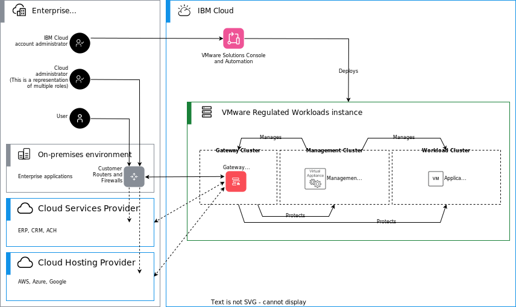

---

copyright:

  years:  2020, 2023

lastupdated: "2023-07-10"

subcollection: vmwaresolutions

---

{{site.data.keyword.attribute-definition-list}}

# System context
{: #vrw-context}

Although {{site.data.keyword.cloud}} for VMware® Regulated Workloads is a self-contained design, some external dependencies exist. {{site.data.keyword.cloud_notm}} for VMware Regulated Workloads is designed without the use of {{site.data.keyword.cloud_notm}} shared offerings such as VSIs and shared storage offerings.

{: caption="Figure 1. IBM Cloud for VMware Regulated Workloads context" caption-side="bottom"}

Connections between the on-premises environment, CSP (Cloud Service Provider), CHP (Cloud Hosting Provider), and {{site.data.keyword.cloud_notm}} traverse the internet and are required to use {{site.data.keyword.cloud_notm}} Direct Link, IPsec, or other secure protocol.

* {{site.data.keyword.cloud_notm}} Account administrator - manages the SaaS provider's {{site.data.keyword.cloud_notm}} account through the {{site.data.keyword.cloud_notm}} portal. The {{site.data.keyword.cloud_notm}} administrator is the only administrator who can add or remove hosts or services from the cloud account.
* {{site.data.keyword.cloud_notm}} for VMware Regulated Workloads administrator - manages the virtualized environment for the {{site.data.keyword.cloud_notm}} for VMware Regulated Workloads instances. The {{site.data.keyword.cloud_notm}} for VMware Regulated Workloads administrator manages all compute, storage, and network resources that are used by the client applications. For simplicity, the administrator who is illustrated is a collection of multiple administration roles. Separation of duties might require dedicated virtualization, network, and security administrator roles.
* User (SaaS consumer) - uses the resources available in the {{site.data.keyword.cloud_notm}} for VMware Regulated Workloads instances to run their applications. The SaaS consumer has no access to the management plane.
* {{site.data.keyword.cloud_notm}} data centers - supply the needed racks, cooling, and power to support the vSphere hosts used to build out the regions of the {{site.data.keyword.cloud_notm}} for VMware Regulated Workloads.
* {{site.data.keyword.cloud_notm}} network services - enable the connection of the {{site.data.keyword.cloud_notm}} for VMware Regulated Workloads to the internet (disabled by default). The connection is done through the frontside network and through private connection to the SaaS provider and SaaS consumer over the backside network through {{site.data.keyword.cloud_notm}} network offerings such as Direct Link.
* Gateway cluster - provides compute, storage, and network services to support the gateway appliance. The gateway cluster is only present when a virtual appliance is deployed as the perimeter gateway.
* Edge gateway appliance - physical or virtual device that protects the management plane and supports secure network communication between the {{site.data.keyword.cloud_notm}} for VMware Regulated Workloads Management region and the SaaS provider and SaaS consumer.
* Management cluster - provides compute, storage, and network services to support management functions.
* Management services - enable administrators to monitor, operate, and maintain the infrastructure to ensure it is compliant, secure, and available to support hosted applications.
* Workload clusters - provides compute, storage, and network services to support hosted applications and operations.
* Applications - applications are VMs that deliver services to the SaaS consumer that support business operations.
* On-premises facilities - the existing facilities of the SaaS provider, SaaS consumer, or both.
* CSP (Cloud Service Provider) - deliver ancillary services. Examples might include credit card transaction processing or ACH services.
* CHP (Cloud Hosting Provider) - can provide hosting services to support disaster recovery or specialized application hosting.

## Related links
{: #vrw-context-related}

* [IBM Cloud compliance programs](https://www.ibm.com/cloud/compliance){: external}
