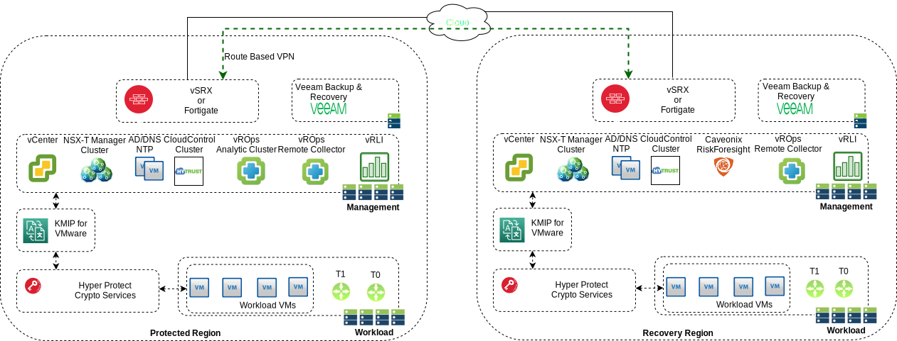

---

copyright:

  years:  2021

lastupdated: "2021-02-23"

subcollection: vmwaresolutions

---

{:shortdesc: .shortdesc}
{:tip: .tip}
{:note: .note}
{:important: .important}
{:external: target="_blank" .external}

# Dual region Disaster Recovery overview
{: #vrw-dualregion-overview}

The {{site.data.keyword.cloud_notm}} for VMware® Regulated Workloads instance is a single regional deployment, which includes a number of High Availability (HA) and business continuity features. However, this single regional design does not address Disaster Recovery (DR).

DR is defined as a plan to recover critical business systems and normal operations if a catastrophic disaster occurs. For example, a major weather event, a cyberattack, or another cause of significant downtime. Key concepts that differentiate DR from HA include: policy-based management, non-disruptive testing, and automated orchestration.

{{site.data.keyword.cloud_notm}} provides three tiers of regions: multizone regions (MZR), single-zone regions (SZR), and data centers.

* Multizone regions - Three or more zones that are independent from each other to ensure that single failure events affect only a single zone. Regions in the Americas include `us-south` hosted in Dallas and `us-east` hosted in Washington DC. For more information about all regions in Americas, Europe, and Asia Pacific, see [Multizone regions](/docs/overview?topic=overview-locations#mzr-table).
* Single-zone regions - Single-zone regions are `kr-seo` hosted in Seoul and `in-che-1 that is hosted in Chennai and consist of a single availability zone. For more information, see [Single-zone regions](/docs/overview?topic=overview-locations#szr-table).
* Data centers - More than 50 data centers exist around the world, including MON01 in Montreal, AMS02 in Amsterdam, and MEL01 Melbourne. For more information about all data centers, see [Data centers](/docs/overview?topic=overview-locations#data-centers). For more information about the data centers in which VMware Solutions can be deployed, see [IBM Cloud data center availability](https://cloud.ibm.com/docs/vmwaresolutions?topic=vmwaresolutions-vc_planning#vc_planning-dc-availability).

The focus of the {{site.data.keyword.cloud_notm}} for VMware® Regulated Workloads DR design has the following specifications:
* A design to deliver against the two key requirements:
  * Establish an alternative site in a different multizone region for failover of workloads if a failure occurs in the primary site.
  * Failover of the workloads that meets customer’s Recovery Time Objectives (RTO) and Recovery Point Objectives (RPO) application requirements.
* A design that defines the recovery of the infrastructure and management components in the alternative site.
* A design that allows flexibility in the recovery of the workloads, but does not define how the workloads are recovered. This approach allows maximum flexibility to meet customer’s RTO/RPO application requirements.

**Notes**
* While this design focuses on the use of two multizone regions, a customer is able to select single-zone regions or data centers in the {{site.data.keyword.cloud_notm}} for VMware® Regulated Workloads instance order form.
* If you select single-zone regions or data centers, be aware that the placement of the KMIP for VMware and Hyper Protect Crypto Services is not local to the {{site.data.keyword.cloud_notm}} for VMware® Regulated Workloads instance. Latency between the services and the instance is not an issue in practice due to when the keys are requested that is, on initial encryption, rekey requests, and ESXi server restarts.
* Ensure that you know the location of all service components and ensure that their required regulatory compliance can be achieved.

## Concept
{: #vrw-dualregion-overview-concept}

The {{site.data.keyword.cloud_notm}} for VMware® Regulated Workloads dual region design concept is based on the automated deployment of two {{site.data.keyword.cloud_notm}} for VMware® Regulated Workloads instances, each deployed into a different {{site.data.keyword.cloud_notm}} multizone region. The use of different multizone regions enables DR due to:
* Colocation of services - KMIP for VMware and Hyper Protect Crypto Services are hosted in multizone regions.
* Geographical distance - the risk that the same physical event impacts both multizone regions is low.
* Resiliency - logical services in each region are independent, such that a failure in one service does not impact the service in the other region.

Hyper Protect Crypto Services is not available in the London multizone region.
{: note}

This paring of {{site.data.keyword.cloud_notm}} for VMware® Regulated Workloads instances enables management and workload virtual machines (VM) to fail over between regions. As each region is a separate {{site.data.keyword.cloud_notm}} for VMware® Regulated Workloads instance, the regions have a similar physical layer and virtual infrastructure designs. The {{site.data.keyword.cloud_notm}} for VMware® Regulated Workloads disaster recovery design requires two {{site.data.keyword.cloud_notm}} locations:
* Protected region - This region contains the protected VMs that require DR.
* Recovery region - This region provides an environment to host VMs from the protected region if a disaster occurs

**Notes**
* The recovery region management cluster requires sufficient free capacity to host the protected management applications from the protected region.
* The recovery region workload cluster requires sufficient free capacity to host the protected workloads from the protected region.
* In normal operations, workload VMs can run in the recovery region if required. However, there needs to be enough initial capacity in the recovery region to run the recovered workload VMs upon DR invocation. These workloads might be test and development workloads that are considered to be sacrificial upon DR.

Recovery Point Objective (RPO) and Recovery Time Objective (RTO) depend on many variables. Therefore, the regulated workloads dual region design provides no standard Service Level Agreement (SLA) for RPO or RTO. However, review the following information about RPO and RTO:
* The VMware vSphere clusters in the recovery region are provisioned and are available to run workloads as soon as these workload VMs are started after DR invocation.
* The core management components in the recovery region (vCenter Server and the NSX-T Manager cluster) are running, so there is no infrastructure deployment wait time.
* The recovery infrastructure is being monitored and compliant through the management toolset, that is, vRealize Operations and Caveonix RiskForesight, so that the recovery infrastructure resources are healthy, compliant, and ready to be used.
* The design describes the availability and recovery of the management components, and the technology that is used to accomplish this design can also be used for the workloads, if required. Alternatively, other products can be used for the workloads as required to meet the client's RTO/RPO application requirements.
* The design does not limit options for DR approaches for the workloads. For example, the client's requirements can define the use of the same or different IP addressing in DR or the use of replication or backup and restore for the recovery of these workloads. Most technologies include the ability to restore to multiple restore points so that the client can roll back to "known good" configuration when malware attacks occur.

## Design overview
{: #vrw-dualregion-overview-design}

The regulated workloads dual region design incorporates a number of design decisions that are justified by design simplicity, maximizing the regulated workloads instance deployment automation, and minimizing the restrictions upon DR of the workloads. The recovery of management workloads and customer workloads is considered to be independent and this design focuses on the recovery of these management components. Customer workloads can be recovered by similar methods or by using different tooling.

{: caption="Figure 1. IBM Cloud for VMware® Regulated Workloads dual region overview diagram" caption-side="bottom"}

The regulated workloads dual region design uses the following specifications:
* An {{site.data.keyword.cloud_notm}} for VMware® Regulated Workloads instance in each region, two regions are required. Available regions are; Dallas, Washington DC, Sydney, London, Frankfurt, and Tokyo.
  * In the protected region, deploy a single or multizone {{site.data.keyword.cloud_notm}} for VMware® Regulated Workloads instance as required to support the normal operations of the workload.
  * In the recovery region, deploy a single {{site.data.keyword.cloud_notm}} for VMware® Regulated Workloads instance as required to support the restoration of the workload when DR is invoked or tested.
* vCenter - One appliance per region.
* NSX Manager - One cluster per region.
* RiskForesight - An "all-in-on" VM hosted in the recovery region that has Asset Repositories and scheduled jobs configured for both the protected and recovery regions.
* HyTrust CloudControl - One cluster per region.
* vRealize Log Insights (vRLI) - One cluster per region and the use log forwarding/filtering between regions
* vRealize Operations Manager (vROps) - An analytic cluster on a cross-region network in the protected region and remote collectors in both regions. Recovery of the analytics cluster is done through replicas.
* vRealize Network Insights (vRNI) – An optional manual installation in each region.
* AD/DNS/NTP - HA VMs in both regions. Each region is a separate forest.
* Veeam - A single Veeam Backup & Replication instance with a bare metal server in each region. The management components are located in the recovery region. Backup and file copies are used to provide off-site copies. Veeam replication is used to provide replicas of the vROps analytic cluster
* Key Management Interoperability Protocol for VMware Service (KMIP) - An HA KMIP instance in each region.
* Hyper Protect Crypto Services (HPCS) - A HA HPCS instance in each region.

**Next topic**: [Dual region Disaster Recovery design](/docs/vmwaresolutions?topic=vmwaresolutions-vrw-dualregion-design)

## Related links
{: #vrw-dualregion-overview-related}

* [Veeam v10a overview](/docs/vmwaresolutions?topic=vmwaresolutions-veeamvm_overview)
