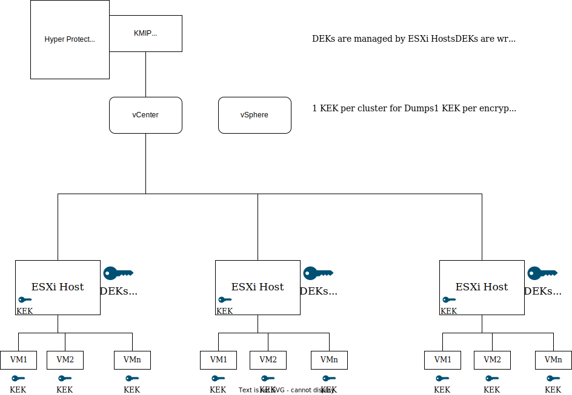

---

copyright:

  years:  2020, 2022

lastupdated: "2022-08-26"

subcollection: vmwaresolutions

---

{{site.data.keyword.attribute-definition-list}}

# Encryption
{: #vrw-encryption}

{{site.data.keyword.cloud}} for VMware® Regulated Workloads relies upon VMware vSphere® encryption to secure management and production VMs while at-rest or in-transit. VMware vSphere encryption applies to all types of VMware storage, including vSAN storage. With vSphere encryption solution, VMware vCenter Server® and your ESXi™ hosts connect to a key management server to get the required encryption keys. These keys are used to protect individual virtual machine (VM) disks, according to your VM storage policies.

As vSphere encryption operates at the VM disk level, it can prevent regulated data exposure if loss of physical disk drives or loss of VM disks occurs. Many backup and replication technologies cannot back up or replicate effectively if the VM is encrypted. It is also notable, that vSphere encryption is not compatible with cross-vCenter vMotion, VMware HCX™, or Zerto. However, when properly configured, Veeam Backup and Replication is compatible with vSphere encryption.

## Hyper Protect Crypto Services
{: #vrw-encryption-hpcs}

{{site.data.keyword.cloud_notm}} Hyper Protect Crypto Services (HPCS) is a key management service (KMS) that supports Keep Your Own Key (KYOK). HPCS is accessible through [Enterprise PKCS#11 (EP11)](/docs/hs-crypto?topic=hs-crypto-use-cases#vmware-encryption-kyok), but VMware vSphere encryption supports only a key management system (KMS) that uses the KMIP standard. Therefore, the KMIP adapter is required to act as an adapter between the vCenter Server appliance and HPCS.

{{site.data.keyword.cloud_notm}} HPCS is backed by a FIPS 140-2 level 4 certified hardware security module (HSM). At a high level, the IBM HPCS consists of the following components.
* Crypto unit - a singular unit that represents a piece of hardware, the HSM, and the corresponding software stack, both are dedicated to a single tenant.
* Service instance - a cluster of crypto units, which operates as a single logical entity to provide redundancy and scalability. It is recommended to have at least two crypto units per instance of HPCS to provide high availability.

HPCS is a highly available solution owing to the multizone Region (MZR) architecture. Cross-regional high availability is available in some geographies with an expanding footprint.

The KMIP for VMware instance is authorized to Hyper Protect Crypto Services instance by using an {{site.data.keyword.cloud_notm}} Identity and Access Management (IAM) service ID that has access to the instance. The service ID must have a minimum of platform Viewer access and service Manager access to the key manager instance. KMIP for VMware uses the customer root key (CRK) in the key manager instance, and stores all KEKs generated on behalf of VMware, in wrapped form, in the key manager instance.

To access KMIP for VMware over the private network, cloud service endpoints are used. During the setup, VMware vCenter and ESXi establish a trust with the deployed KMIP instance. VMware vCenter and ESXi authenticate with the KMIP adapter instance by using certificates in VMware vCenter when the connection to the key management server (KMS) is created. The public certificate is installed into KMIP to identify the vCenter client or clients that are allowed to connect. Each client is authorized to all keys stored in that KMIP for VMware instance.

## Hyper Protect Crypto Services for vSphere encryption - no third parties
{: #vrw-encryption-no3rd}

The following figure shows a typical vSphere encryption setup with HPCS/KMIP integration:

{: caption="Figure 1. vSphere encryption with Hyper Protect Crypto Services - no third parties" caption-side="bottom"}

## Hyper Protect Crypto Services for vSphere encryption - SaaS provider use case
{: #vrw-encryption-saas}

With HPCS, SaaS providers and SaaS consumers can move their most mission critical workloads to {{site.data.keyword.cloud_notm}} with the highest level of security to prevent unauthorized access to their regulated data. SaaS providers and SaaS consumers both maintain complete control over their respective keys and regulated data in the cloud and no one, including IBM, has access to the regulated data. Additionally, no single person has access to the full key and if required multiple crypto unit administrators can be deployed.

{: caption="Figure 2. vSphere encryption with Hyper Protect Crypto Services for SaaS providers" caption-side="bottom"}

The SaaS provider is responsible for deploying and managing both Hyper Protect Crypto Services and the KMIP for VMware instance for their {{site.data.keyword.cloud_notm}} for VMware Regulated Workloads instance. The virtualization administrator creates the KMS cluster configuration in the vCenter. To protect the regulated data of the SaaS consumer and the SaaS provider, it is recommended that they use independent HPCS instances and root keys. The two-key approach balances both the stake holders rights and responsibilities.

{: caption="Figure 3. Dual HPCS overview" caption-side="bottom"}

### HPCS - independent software vendor (ISV) view
{: #vrw-encryption-keys-isv}

The SaaS provider initializes their root key material into the HPCS provisioned as part of the {{site.data.keyword.cloud_notm}} for VMware Regulated Workloads deployment. This key integrates with the management platform and is used with vSphere encryption or vSAN encryption or any other tool that is used to encrypt any of the platform components.

### HPCS - financial institution view
{: #vrw-encryption-keys-bank}

The SaaS consumer manages their own independent HPCS instance and introduces their own root key material. This key is critical to the security of the regulated data of the SaaS consumer and they would generate "descendant" keys for each individual SaaS provider they engage with.

The keys that are provided by the SaaS consumer are used to protect any regulated data from the SaaS consumer.

## HPCS flows
{: #vrw-encryption-flows}

Review the following information for the step-by-step process to order and initialize KMIP:
* [VMware Solutions KMIP considerations](/docs/vmwaresolutions?topic=vmwaresolutions-kmip_standalone_considerations)
* [Documentation to provision HPCS](/docs/hs-crypto?topic=hs-crypto-initialize-hsm#initialize-hsm)

## Related links
{: #vrw-encryption-related}

* [IBM Cloud compliance programs](https://www.ibm.com/cloud/compliance)
