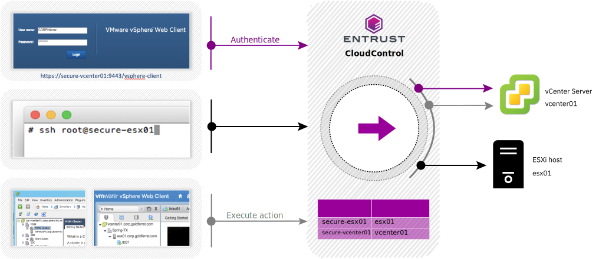

---

copyright:

  years:  2020, 2022

lastupdated: "2022-08-26"

subcollection: vmwaresolutions

---

{{site.data.keyword.attribute-definition-list}}

# Entrust integration
{: #vrw-hytrust}

{{site.data.keyword.cloud}} for VMware® Regulated Workloads requires Entrust CloudControl™ for identity and access management. Entrust CloudControl enables fine grained role-based access control with capability of forensic auditing for all actions that are taken by any privileged user.

## Management cluster
{: #vrw-hytrust-management}

Identity and access management for administrators of the {{site.data.keyword.cloud_notm}} for VMware Regulated Workloads infrastructure is handled by Entrust CloudControl and Microsoft® Active Directory servers. CloudControl uses the AD to authenticate the administrator but handles the authorization of privileged users internally.

### Entrust CloudControl
{: #vrw-hytrust-management-cloudcontrol}

Entrust CloudControl enables unified security policies for access to the management stack, unified visibility to security configuration and context, and continuous compliance by using templates to enforce separation of duties. It also provides a robust audit trail that includes a full record of all actions that are attempted by security, network, and compute platform administrators. Entrust CloudControl also simplifies compliance with administrative controls requirements in HIPAA, PCI, FedRAMP, CJIS, and other regulations.

{: caption="Figure 1. Entrust CloudControl transparent proxy" caption-side="bottom"}

### Entrust CloudControl architecture
{: #vrw-hytrust-management-cloudcontrol-architecture}

Entrust CloudControl is composed of many internal functional components:
* Transparent proxy – provides the proxy functions for requests to vCenter and ESXi. This same mechanism is used for vSphere Client, vSphere Web Client, and even SSH to ESXi hosts.
* Policy engine – enforces security policies that are created by the security administrators.
* Authentication engine – uniform authentication policy, which integrates with Active Directory or LDAP, and it applies multifactor authentication policy.
* Inventory engine – keeps a synchronized inventory of vCenter objects and determines the trust level for ESXi hosts.
* Compliance engine – performs configuration assessments and remediation.
* Logging – logs every action, regardless of whether it was performed or denied by policy, and, if configured, forwards to syslog server or SIEM tool. Forwarding of logging to vRealize Log Insight is required.

{: caption="Figure 2. IBM Cloud for VMware Regulated Workloads Entrust integration" caption-side="bottom"}

All access is through Entrust CloudControl and no direct access to the ESXi hosts is enabled. The network is designed to allow only the necessary connections from the vCenter Server. Lockdown mode is enabled. Allow listing of IP addresses permitted network access to the ESXi hosts is required in the integrated host firewall. The rules on the perimeter gateway further enforce the limited traffic flows from the vCenter Server to the subnets upon which the ESXi hosts are deployed. The cloud account administrator (through {{site.data.keyword.cloud_notm}} IAM) should not authorize VPN connections to the subnets upon which the ESXi hosts are deployed except for the connections that are essential to support DR recovery operations.

## Edge services cluster
{: #vrw-hytrust-edge}

Access to the ESXi hosts is strictly limited. No direct access to an ESXi host is permissible. The gateway appliance is deployed with only local accounts and it is necessary to configure the appliance to use centrally managed user accounts (Radius or Tacplus server for the vSRX). The gateway is configured to forward all logs to vRealize Log Insight. These logs contain authentication failure and success events for full visibility into the activities taken that potentially impact security or compliance status. Entrust does not play a role in authentication or authorization for access to the gateway appliance. Allow listing of IP addresses permitted network access to the ESXi hosts is required in the integrated host firewall.

## Workload cluster
{: #vrw-hytrust-workload}

The ESXi host access is strictly limited. No direct access to an ESXi host is permissible. Entrust CloudControl provides the same level of access control and auditing for administrators who are assigned to manage the dedicated workload infrastructure, such as the SDN (NSX-T™). The fine-grained RBAC capability of Entrust CloudControl limits their scope of action to the workload region. Allow listing of IP addresses permitted network access to the ESXi hosts is required in the integrated host firewall.

## Related links
{: #vrw-hytrust-related}

* [IBM Cloud compliance programs](https://www.ibm.com/cloud/compliance)
* [Entrust CloudControl](/docs/vmwaresolutions?topic=vmwaresolutions-entrust-cc_considerations)
* [Entrust DataControl](/docs/vmwaresolutions?topic=vmwaresolutions-entrust-dc_considerations)
* [IBM Cloud Hyper Protect Crypto Services API](/apidocs/hs-crypto)
