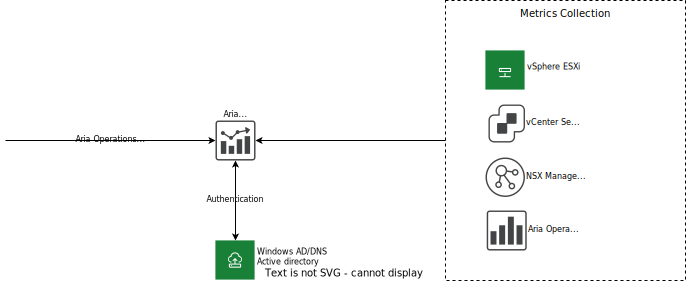
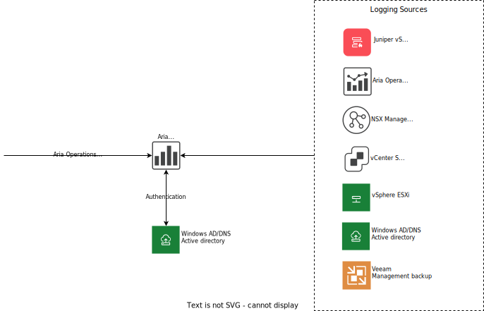

---

copyright:

  years:  2020, 2025

lastupdated: "2025-10-21"

subcollection: vmwaresolutions

---

{{site.data.keyword.attribute-definition-list}}

# Operational tooling identity and access management
{: #vrw-iam-vrealize}

{{site.data.content.vrw-deprecated-note}}

## Overview
{: #vrw-iam-vrealize-overview}

The operational tooling consists of the following components:

* VMware Aria® Operations™ (formerly known as VMware vRealize® Operations Manager™) - Using data collected from objects in the VMware® platform, VMware Aria Operations uses detailed dashboards to show system health, capacity, and performance.
* VMware Aria Operations™ for Logs (formerly known as VMware vRealize® Log Insight™) - Objects in the VMware platform have been configured to send their logging events to VMware Aria Operations for Logs to enable a centralized log management function.

The following main principles or requirements for identity and access management to the operational tooling apply:
* The principle of least privilege to be used so that a user account is assigned only the privileges that are essential to perform the intended function.
* SaaS provider operations have full access to the operational tooling.
* `Auditor` has read-only access to the operational tooling.
* IC4V Active Directory (AD) is used to host accounts and define roles.

## Accounts
{: #vrw-iam-vrealize-accounts}

The following terminology is used to define the account types:

* User IDs - These IDs are assigned to people who require access to the system.
* Service IDs - These IDs are used by the IC4V automation or used by software components.
* Local IDs - These IDs are local to the application.
* SSH IDs - These IDs are used to access the Linux® VMs that host the applications.

## VMware Solutions infrastructure AD domain
{: #vrw-iam-vrealize-ad}

The VMware Solutions infrastructure AD domain holds the resource objects and user accounts for the administration of the VMware platform only.

## VMware Aria Operations
{: #vrw-iam-vrealize-vrops}

By default, the following local users are configured during service instantiation:

| ID  | Type |
|:--- |:---- |
| `automationAdmin` | LocalID |
| `cloudadmin` | LocalID |
| `admin` | LocalID |
| `maintenanceAdmin` | LocalID |
| `migrationAdmin` | LocalID |
{: caption="VMware Aria Operations user IDs" caption-side="bottom"}

The following groups are configured during service instantiation:

* Cloud Admin - The `cloudadmin` user ID is a member of this group.
* Everyone - All users are a member of this group.

{: caption="VMware Aria Operations logical" caption-side="bottom"}

### Roles
{: #vrw-iam-vrealize-vrops-roles}

The following roles are defined in VMware Aria Operations:
* `Administrator` - System administrator
* `AgentManager` - Deploy and configure EP Ops management agents
* `ContentAdmin` - Manage all the contents in the product
* `GeneralUser-1` - Configurable out of the box role
* `GeneralUser-2` - Configurable out of the box role
* `GeneralUser-3` - Configurable out of the box role
* `GeneralUser-4` - Configurable out of the box role
* `PowerUser` - All the privileges except the ones that are related to user management and cluster management. Typically, vCenter administrators map to it.
* `PowerUserMinusRemediation` - All the Privileges except the ones that are related to User Management. Cluster Management and Remediation Actions.
* `Readonly` - Read-only access for the product.

VMware Aria Operations authentication sources are configured to use active directory to connect to the infrastructure AD. Within the infrastructure AD, the following groups are assigned roles:

| Group | Role |
|---|---|
| `icv4-vCenter` | Administrator |
| `ic4v-infra`  | To be determined |
| `ic4v-auditor` | Read only |
{: caption="VMware Aria Operations groups" caption-side="bottom"}

## VMware Aria Operations for Logs
{: #vrw-iam-vrealize-vrli}

By default, the following local users are configured during service instantiation:

| ID | Type | Role |
|---|---|---|
| `admin` | Local ID | Super Admin |
{: caption="VMware Aria Operations default user IDs" caption-side="bottom"}

This account is not used on a day-to-day basis or for configuration tasks.

{: caption="VMware Aria Operations for Logs logical" caption-side="bottom"}

### VMware Aria Operations for Logs roles
{: #vrw-iam-vrealize-vrli-roles}

The following roles are defined in VMware Aria Operations for Logs:
* Super Admin - Full Admin and User capabilities, including editing shared content
* View Only Admin - Can view Admin information and has full User access, including editing shared content
* User - Can use interactive analytics and dashboards
* Dashboard User - Can use only dashboards

VMware Aria Operations for Logs authentication configuration is configured to use Active Directory to connect to the infrastructure AD. Within the infrastructure AD, the following groups are assigned roles:

| Group | Role |
|---|---|
| `icv4-vCenter` | Super admin |
| `ic4v-infra`  | View only admin |
| `ic4v-auditor` | User |
{: caption="VMware Aria Operations for Logs user IDs" caption-side="bottom"}

## Related links
{: #vrw-iam-vrealize-related}

* [{{site.data.keyword.cloud_notm}} compliance programs](https://www.ibm.com/products/cloud/compliance){: external}
* [{{site.data.keyword.cloud_notm}} Hyper Protect Crypto Services API](/apidocs/hs-crypto)
