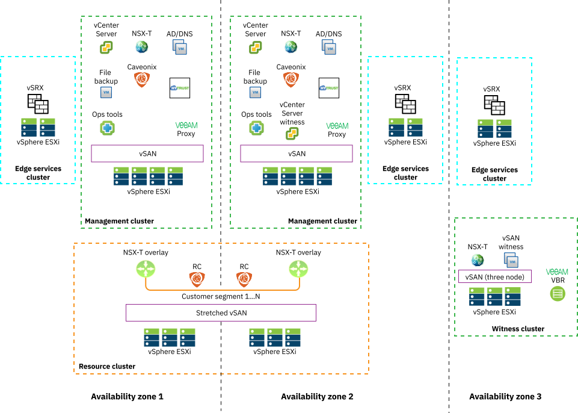

---

copyright:

  years:  2020, 2021

lastupdated: "2021-01-18"

subcollection: vmwaresolutions

---

{:shortdesc: .shortdesc}
{:tip: .tip}
{:note: .note}
{:important: .important}

# Multizone region
{: #vrw-mzr}

Expanding the single zone region topology into a multizone region (MZR) topology, introduces complexity around high availability of components. It also introduces some new capabilities, including stretched networking between the data centers and stretched VSAN.

## Multi data center view
{: #vrw-mzr-view}

{: caption="Figure 1. MZR topology" caption-side="bottom"}

The MZR topology consists of two management clusters and a witness cluster in a third site. The management clusters must use vSAN based storage and VLAN backed subnets only. The management clusters are a 4-node configuration to support VSAN.

The resource cluster can be two independent clusters and use local vSAN storage or use a vSAN stretched cluster, as shown in the diagram. vSAN stretched cluster supports two active sites, each with an even number of hosts and storage devices, and a witness host at the third site.

According to the NSX-T design, the NSX-T Controllers run an instance in each data center to provide the network failover capabilities. Only the resource cluster is converted to NSX-T transport nodes.

## Product considerations
{: #vrw-mzr-considerations}

### Active Directory and DNS
{: #vrw-mzr-considerations-addns}

Dual Domain controllers in each data center with default domain replication to ensure that all services can access Active Directory. All services that require directory services should point to an AD server in both the primary and secondary sites.

### Veeam management backup
{: #vrw-mzr-considerations-veeam}

Veeam backup and replication servers (VBR) are placed in both the primary and secondary sites. The built-in proxy is used for backup jobs. A copy job that goes to Cloud Object Storage is created when allowed for each backup repository, this design allows either site to restore the other. The VBR servers at each site store a VBR configuration backup on the server in the other site. If a total loss of the VBR server occurs in one site, it can be restored to the other.

### vCenter
{: #vrw-mzr-considerations-vcenter}

Use vCenter High Availability (HA). Automated failover is managed and done by vCenter Server. The reassignment of the vCenter Server IP address in DNS is required if a failover occurs.

### NSX-T controllers
{: #vrw-mzr-considerations-nsx}

The NSX controllers are provisioned in each of the three AZs to ensure that NSX management continues if a DR event occurs.

Each controller is assigned an IP address from the AZ management plane it is deployed to. Therefore, the NSX-T UI VIP for the controller-embedded load balancing function can't operate when it is deployed in an MZR. Proper operation of NSX-T in the MZR deployment requires an IBM Cloud Load Balancer (private-to-private) so the NSX-T UI is available at a single URL.

### NSX-T topologies
{: #vrw-mzr-considerations-nsxtopo}

For more information, see [Supported topologies](/docs/vmwaresolutions?topic=vmwaresolutions-vrw-nsxt-topologies).

### vRealize Operations Manager
{: #vrw-mzr-considerations-vrops}

vRealize Operations is deployed by using the continuous availability mode.

### vRealize Log Insight
{: #vrw-mzr-considerations-vrli}

Each site has a stand-alone instance of vRealize Operations, which is deployed in the management clusters.

### HyTrust CloudControl
{: #vrw-mzr-considerations-htcc}

A HyTrust CloudControl cluster is deployed with an instance in the primary and secondary site. The HyTrust CloudControl cluster is configured with the Multi-Site-HA option. This option creates a VIP address (which is a different IP from the one assigned to the node) for each node. Since the nodes have different subnets, a PIP is configured to point at these VIPs.

The IBM Cloud Load Balancer is configured to point to the previous VIP addresses. The IBM Cloud Load Balancer creates an instance in two of the three data centers and must be resolvable through DNS. In the IBM Cloud for VMware® Regulated Workloads environment, a new CNAME is defined that resolves to the friendly name of the Cloud Load Balancer FQDN.

Between the HyTrust CloudControl cluster and the IBM Cloud Load Balancer, the capability to fail over between data centers is established.

{: caption="Figure 2. HyTrust with IBM Cloud Load Balancer" caption-side="bottom"}

### Backup server
{: #vrw-mzr-considerations-buserver}

The primary configuration backup server instance is backed up using rsync across to the secondary configuration backup server in the secondary AZ. If a failover of the backup server occurs, the following systems require a manual update to the new backup server IP.

| System | Backup option | Frequency | Location|
|--- |--- |--- | --- |
|**vCenter Server** | Backup Server File | Daily | Update needed in DR to point at new backup IP address |
|**NSX-T Controllers** |Backup Server File | Daily | Update needed in DR to point at new backup IP address |
|**HyTrust CloudControl** | Backup Server File | Update needed in DR to point at new backup IP address |
|**Juniper vSRX** | Backup Server File through SCP from vSRX | Commit Change | Site specific |
{: caption="Table 1. Backup source and frequency" caption-side="top"}

**Next topic**: [Supported topologies](/docs/vmwaresolutions?topic=vmwaresolutions-vrw-nsxt-topologies)

## Related links
{: #vrw-mzr-related}

* [IBM Cloud compliance programs](https://www.ibm.com/cloud/compliance)
