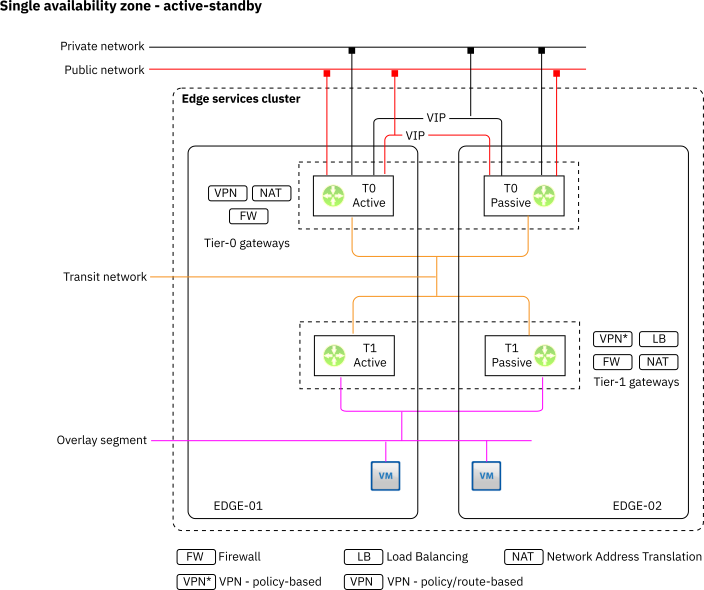
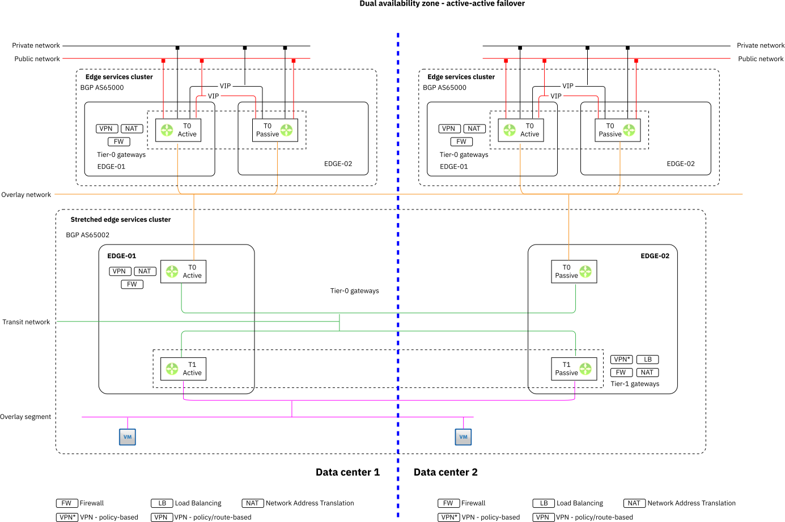

---

copyright:

  years:  2020, 2021

lastupdated: "2021-10-21"

subcollection: vmwaresolutions

---

{{site.data.keyword.attribute-definition-list}}

# Supported topologies
{: #vrw-nsxt-topologies}

## Single data center base topology
{: #vrw-nsxt-topologies-single}

This topology creates a single edge services cluster, with active-passive Tier-0 and Tier-1.

Active-passive on the Tier0 provides IPsec capability for access through the HA VIP address. Alternatively, Tier-0 can use Border Gateway Protocol (BGP) and peer with a vSRX firewall.

{: caption="Figure 1. Single data center" caption-side="bottom"}

## Multizone region data center active-active topology
{: #fss-nsx-topologiest-mzraa}

This topology is one of the more complex topologies and requires a large CPU/Memory footprint for all the moving parts.

Two levels of Tier-0 exist in combination with a vSAN stretched cluster.

The first level of Tier-0s is located and isolated to a data center, providing the northbound communication to the physical network and IPsec capabilities to the on-premises location.

The second level Tier-0 (active-passive) instances and Tier-1 (active-passive) are connected to the first-level Tier-0s. The differences at this level are that the active-passive nodes are stretched to run an instance in each data center and that they are connected to the first level Tier-0 in each data center. BGP is configured between the Tier-0 instances to provide dynamic routing and failover routing in a dynamic fashion.

From the Tier-1 instances, the overlay network segments are connected, which are available in both data centers as a stretched network. The previous Tier-0 failover and redundancy provide the same SLA availability as NSX-V, with a seamless active-active topology and failover.

{: caption="Figure 2. Active-active MZR topology" caption-side="bottom"}

**Next topic**: [vSphere components](/docs/vmwaresolutions?topic=vmwaresolutions-vrw-vsphere-platform)

## Related links
{: #vrw-nsxt-topologies-related}

* [IBM Cloud compliance programs](https://www.ibm.com/cloud/compliance)
