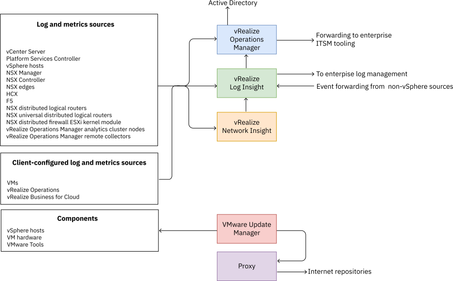
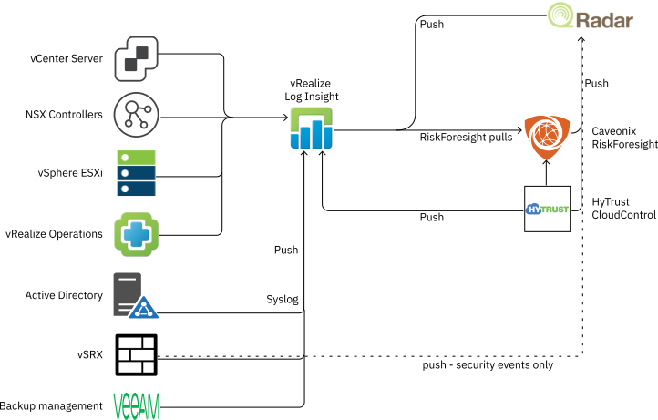

---

copyright:

  years:  2020, 2022

lastupdated: "2022-04-27"

subcollection: vmwaresolutions

---

{{site.data.keyword.attribute-definition-list}}

# Operations management
{: #vrw-operations}

{{site.data.keyword.cloud_notm}} for VMware® Regulated Workloads is delivered as a clean environment. Extensive work was done to identify and remediate common errors and warnings that are often found in a typical vSphere deployment. IBM and VMware® best practices, which are combined with standard and customized templates for vRealize Operations, ensure that all {{site.data.keyword.cloud_notm}} for VMware Regulated Workloads configurations are deployed as clean as possible, ready for onboarding. Caveonix RiskForesight is used to scan the environment for compliance with industry and government standards such as NIST, PCI, and more. RiskForesight is continually monitoring the{{site.data.keyword.cloud_notm}} for VMware Regulated Workloads for adherence to compliance standards. RiskForesight provides on-demand compliance posture reporting and at-a-glance compliance status.
The operational tools support the customer in compliance with current standards and assist them in rapidly responding to a changing compliance landscape.

{: caption="Figure 1. IBM Cloud for VMware Regulated Workloads operational tools overview" caption-side="bottom"}

## Management cluster
{: #vrw-operations-management}

All operational tools are deployed into the management cluster. The {{site.data.keyword.cloud_notm}} for VMware Regulated Workloads depends upon multiple layers of tools to deliver comprehensive insight into the operation, security, and compliance of all layers of the platform. Customers that use {{site.data.keyword.cloud_notm}} for VMware Regulated Workloads can extend the use of the operational tools to monitor the VMs supporting their applications.

### Caveonix RiskForesight
{: #vrw-operations-management-riskforesight}

[Caveonix RiskForesight](/docs/vmwaresolutions?topic=vmwaresolutions-vrw-caveonix) provides a comprehensive cloud workload protection platform for {{site.data.keyword.cloud_notm}} for VMware Regulated Workloads. This platform delivers a common Risk Management Control Plane (RMCP) for continuous and proactive protection of management and edge workloads.

### vRealize Operations
{: #vrw-operations-management-vrops}

[VMware vRealize Operations](https://www.vmware.com/products/vrealize-operations.html){: external} delivers self-driving IT operations management from apps to infrastructure to optimize, plan, and scale hybrid cloud and HCI deployments while unifying multicloud monitoring. Powered by AI/ML, vRealize Operations helps IT run production operations hands-off and hassle-free with a unified operations platform. This platform delivers continuous performance optimization, efficient capacity management, proactive planning, intelligent remediation, and integrated compliance.

### vRealize Log Insight
{: #vrw-operations-management-vrli}

[vRealize Log Insight](https://www.vmware.com/products/vrealize-log-insight.html){: external} delivers heterogeneous and highly scalable log management with intuitive, actionable dashboards, sophisticated analytics, and broad third-party extensibility. It provides deep operational visibility and faster troubleshooting across physical, virtual, and cloud environments.

All systems that generate logs are configured to send their logs to vRealize Log Insight (vRLI). Centralized collection of all logging enables a comprehensive view of all aspects of the {{site.data.keyword.cloud_notm}} for VMware Regulated Workloads operation. Log Insight is also capable of forwarding logs to security scanning services such as IBM QRadar.

{: caption="Figure 2. vRealize Log Insight integration" caption-side="bottom"}

### vRealize Network Insight
{: #vrw-operations-management-vrni}

[VMware vRealize Network Insight](https://www.vmware.com/products/vrealize-network-insight.html){: external} helps you build an optimized, highly available, and secure network infrastructure across hybrid and multicloud environments. It provides network visibility and analytics to accelerate micro-segmentation security, minimize risk during application migration, optimize network performance and confidently manage and scale NSX deployments.

vRealize Network Insight monitors network components and management traffic throughout the entire {{site.data.keyword.cloud_notm}} for VMware Regulated Workloads instance. The monitoring scope includes insight into the operation of the NSX-T™ overlay network. Network Insight is also used to help optimizing performance by eliminating network bottlenecks. vRealize Network Insight is an optional component that requires manual installation.

## Edge services cluster
{: #vrw-operations-edge}

No operational tools are deployed to the edge services cluster. The edge services cluster is monitored and managed by using the tools that are deployed on the management cluster. All components of the edge services cluster are configured to deliver their log files to vRLI, inclusive of the virtual gateway syslog facilities. If the physical FortiGate is deployed instead of the edge services cluster, its syslog facility must send logs to vRLI.

## Workload cluster
{: #vrw-operations-workload}

No operational tools are deployed to the workload cluster. The workload cluster is monitored and managed by using the tools that are deployed on the management cluster. All platform components that are deployed in the workload cluster are configured to deliver their log files to vRLI.

## Related links
{: #vrw-operations-related}

* [IBM Cloud compliance programs](https://www.ibm.com/cloud/compliance)
* [vRealize Operations and Log Insight](/docs/vmwaresolutions?topic=vmwaresolutions-vrops_overview)
* [Caveonix RiskForesight](/docs/vmwaresolutions?topic=vmwaresolutions-caveonix_considerations)
