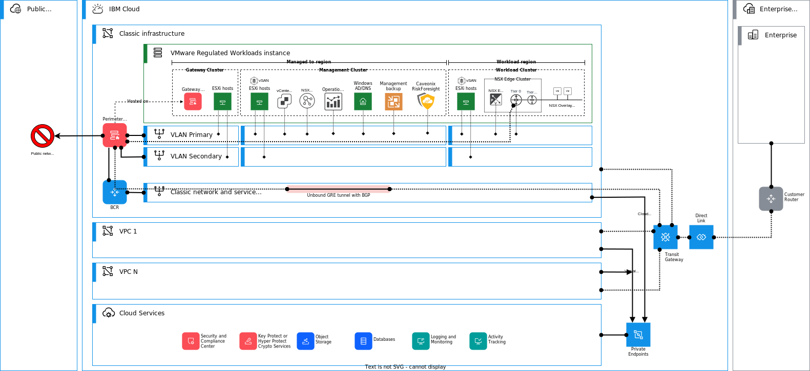

---

copyright:

  years:  2020, 2023

lastupdated: "2023-09-11"

subcollection: vmwaresolutions

---

{{site.data.keyword.attribute-definition-list}}

# Overlay networking
{: #vrw-overlay-network}

{{site.data.keyword.cloud}} for VMware® Regulated Workloads uses NSX-T™ as the software-defined network overlay provider.

{: caption="Figure 1. Cluster overlay network" caption-side="bottom"}

## Management cluster
{: #vrw-overlay-network-management}

The management cluster uses VLANs only to support the requirements of the management services. No overlay networking is enabled on the management cluster.

## Gateway cluster
{: #vrw-overlay-network-edge}

The optional gateway cluster does not employ any overlay networking and a physical FortiGate appliance is available to serve as the perimeter gateway in its place.

The vSRX running on the gateway cluster connects the management network to the private and public transit networks. The vSRX is configured to allow only traffic in or out of the management region that is necessary for proper operation and monitoring of the environment. The vSRX also isolates all traffic between the ESXi hosts in the clusters and vCenter Server. ESXi hosts within a cluster can communicate with each other and vCenter Server. ESXi hosts in one cluster (workload or management for example) are unable to communicate with the hosts of any other clusters. The limitation of cross-cluster traffic is enforced by vSRX and the configuration of the firewalls of the ESXi hosts.

The gateway cluster is the peering point for traffic between the on-premises SaaS provider and {{site.data.keyword.cloud_notm}} for VMware® Regulated Workloads. It also serves as the demarcation for traffic from the SaaS consumer. The SaaS provider uses vSRX as the secure tunnel endpoint for its VPN.

Traffic from the SaaS consumer passes through the vSRX in an encrypted tunnel, which lands on the overlay network virtual edge device.

## Workload cluster
{: #vrw-overlay-network-workload}

The workload cluster network design requires both the overlay network that is delivered with NSX-T and two or more VLANs to support the infrastructure layer functions.

Traffic from the SaaS consumer is peered with the overlay network virtual edge. It is the virtual edge that the SaaS consumer uses as the secure tunnel end point to establish an encrypted VPN.

## Interconnectivity
{: #vrw-overlay-network-interconnectivity}

With {{site.data.keyword.tg_full}} (TGW), you can create one or more transit gateways to connect your VMware® Regulated Workloads with VPCs, other {{site.data.keyword.cloud}} infrastructure platforms, or on-premises networks through {{site.data.keyword.dl_full}}.

{{site.data.keyword.tg_short}} supports GRE tunnels with BGP routing. These GRE tunnels can be used to connect your NSX-T overlay to the {{site.data.keyword.tg_short}}, which can further provide routed connectivity to the other connections of the {{site.data.keyword.tg_short}}.

## Related links
{: #vrw-overlay-network-related}

* [{{site.data.keyword.cloud_notm}} compliance programs](https://www.ibm.com/cloud/compliance)
