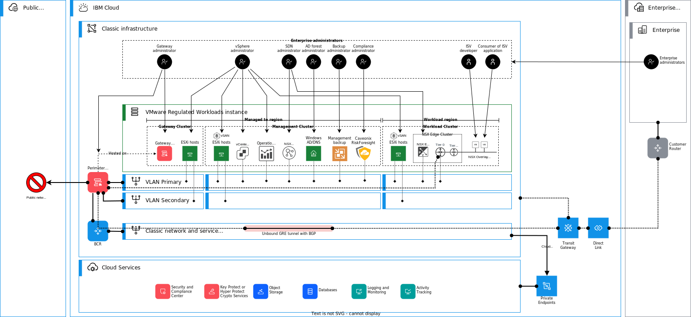

---

copyright:

  years:  2020, 2024

lastupdated: "2024-06-14"

subcollection: vmwaresolutions

---

{{site.data.keyword.attribute-definition-list}}

# Zero trust model
{: #vrw-separation-of-duties}

{{site.data.keyword.cloud_notm}} for VMware® Regulated Workloads is designed following the concept of a zero trust model. Wherever practical, the scope of action of any one individual administrator is strictly limited to those actions necessary and appropriate to perform their assigned roles. Overlap of duties is minimized or eliminated to prevent the need for privilege escalation. The escalation can result in undesired flows of information in or out of any layer of the {{site.data.keyword.rw}}.

{: caption="{{site.data.keyword.rw}} roles" caption-side="bottom"}

## Network and security administrator roles
{: #vrw-separation-of-duties-network}

The vCenter Server model employs a single network administrator role responsible for management across all network components (such as the underlay network, vSRX, and NSX™).

The {{site.data.keyword.rw}} network administrator role must break out to multiple discrete administrator roles to prevent such a situation. 

The following roles are suggested network and security admin roles:
* IaaS security administrator - The IaaS security administrator role is focused on protection of all platform infrastructure components from threats that can originate on the network. The scope of responsibility includes the security objects necessary to secure and control access to the management and edge layers of the {{site.data.keyword.cloud_notm}} for VMware Regulated Workloads. These objects include the ESXi hosts that deliver compute and storage resources to the user workloads. The IaaS security administrator is also afforded necessary access to the {{site.data.keyword.cloud_notm}} console to deploy and manage network gateway devices. The IaaS security administrator might play a role in managing NSX security objects if those objects impact the security of the management and edge layers of the {{site.data.keyword.cloud_notm}} for VMware Regulated Workloads. It is recommended that consideration is given to whether enabling the IaaS security administrator access to the NSX platform introduces unacceptable risk.
* IaaS network administrator - The IaaS network administrator scope is limited to the underlay networking necessary for operation of the management plane, edge services layer, and the hardware that delivers compute and storage resources to the workloads. The IaaS network administrator is provided necessary access to the {{site.data.keyword.cloud_notm}} console to fulfill the assigned duties of the role. The IaaS network administrator has no access to the NSX portal.
* NSX administrators - The NSX administrators' access is limited to the NSX portal. The scope of duties of the NSX administrator is broad enough to create any necessary global network and security objects that are required to allow the necessary traffic flows. These flows must fully support the requirements of the workloads that use the network resources. The NSX administrator has no role in the networking or security of the management or edge layers of the {{site.data.keyword.cloud_notm}} for VMware Regulated Workloads platform. The NSX network administrator might define more limited scopes for application or business group network administrators that can create network objects necessary for particular requirements.

The NSX administrator role can be separated into the following roles:
* NSX network super admin - responsible for deployment and operation of necessary shared network objects, such as T0 routers or edge gateways for the workloads.
* NSX network security admin - a dedicated security admin that has responsibility that is limited to the firewall and security aspects of NSX.
* Tenant NSX admin - where wanted, scope that is limited to a function/application/business unit as applicable to manage resources with such limited scope. For example, it includes deployment of T1 routers.

## Management cluster
{: #vrw-separation-of-duties-management}

The vSphere administrator is responsible for the proper configuration, operation, and maintenance of the entire virtualized compute and storage infrastructure. The platform security administrator and network administrator share responsibility for the protection and operation of the network and security aspects of the management infrastructure. The network administrator role scope includes the configuration, operation, and maintenance of the software-defined network (NSX) which delivers network and security services to the SaaS consumer workloads.

The use of NSX as the software-defined networking provider eliminates reliance on the vCenter appliance for control of the SDN. Therefore, it enables a clear separation of duties and responsibilities for the networking and compute resources, and the storage between the platform network administrator and the vSphere administrator.

Both the vSphere administrator and network administrator create roles with the necessary and appropriate privilege levels to enable the SaaS application administrators to fulfill their required duties. The use of a zero trust model improves the security of the entire {{site.data.keyword.rw}} implementation.

## Gateway cluster
{: #vrw-separation-of-duties-edge}

While the vSphere administrator holds responsibility for proper operation of the underlying ESXi hosts that form the gateway cluster, the VMware administrator has no access rights to the vSRX appliance nodes that run on them. There is no software-defined network applicable to the gateway cluster, so the NSX administrator has no access to the vSRX appliance nodes.

The security administrator is solely responsible for the configuration, operation, and maintenance of the vSRX gateway cluster. Only the security administrator has the right to implement configuration changes that impact the security stance of the {{site.data.keyword.rw}} management layer.

Where a physical appliance such as the FortiGate appliance is used in place of the gateway cluster, the security administrator retains responsibility for its operation though no role for the virtual platform administrator exists.

## Workload cluster
{: #vrw-separation-of-duties-workload}

The vSphere administrator is responsible only for the proper operation of the workload hosts that deliver virtualized compute, storage, and networking services for consumption by the client applications.

The security administrator responsible for the management layer does not retain any responsibility for the security of the SaaS applications beyond the requirement that appropriate policies are in place. These policies protect the infrastructure upon which the SaaS consumer deploys their applications and protect the network perimeter to which NSX passes north-south traffic.

The SaaS provider might designate one or more NSX tenant network administrators to provision and manage network services that are delivered through NSX to support the requirements of the applications deployed into the workload clusters. Limited access and scope are assigned to the tenant network administrator by the platform network administrator. The scope that is assigned might include the ability to deploy and modify security policies that impact the workload scope but that do not extend beyond the workload context.

## Related links
{: #vrw-separation-of-duties-related}

* [{{site.data.keyword.cloud_notm}} compliance programs](https://www.ibm.com/cloud/compliance)
