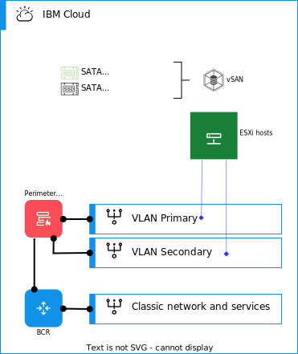

---

copyright:

  years:  2020, 2025

lastupdated: "2025-07-07"

subcollection: vmwaresolutions

---

{{site.data.keyword.attribute-definition-list}}

# Storage
{: #vrw-storage}

{{site.data.keyword.cloud}} for VMware® Regulated Workloads employs multiple storage types.

## Management cluster
{: #vrw-storage-management}

The management cluster storage is vSAN™. Security requirements mandate that multitenant shared storage is not permissible and in such cases the use of vSAN is necessary. vSAN requires deploying a minimum of four VMware ESXi™ hosts to the management cluster.

## Gateway cluster
{: #vrw-storage-edge}

The gateway cluster uses only local data stores. Local data stores are suited to support the vSRX nodes since they do not require any vSphere DRS functions. The resiliency of the vSRX high availability cluster is a function of the clustering mechanism that is used by the vSRX and is not reliant on the underlying hosts.

## Workload cluster
{: #vrw-storage-workload}

The workload clusters require the use of vSAN. vSAN is the only storage option on {{site.data.keyword.cloud_notm}} that keeps all workload data within the account and delivers resiliency to the applications deployed to the workload clusters. All workload clusters are formed by using a minimum of four ESXi hosts to meet vSAN requirements.

## Bare metal storage design
{: #vrw-storage-bare-metal}

Physical storage design consists of the configuration of the physical disks that are installed in the physical hosts and the configuration of the shared network-attached storage if applicable. It includes the operating system (vSphere ESXi) and the disks that are used for storage of the virtual machines (VMs). Storage for VMs consists of local disks that are virtualized by VMware® vSAN.

{: caption="Storage options" caption-side="bottom"}

### Operating system disks
{: #vrw-storage-os-disks}

The vSphere ESXi hypervisor is installed in a persistent location. The physical hosts' boot drive consists of a single M.2 solid-state drive.

### vSAN disks
{: #vrw-storage-vsan-disks}

VMware vSAN is the required storage platform. vSAN uses an all–flash configuration. This design allows for several configuration options, including 2U and 4U chassis, various numbers of disks, and various disk sizes.

All configurations use two vSAN disk groups of solid-state disks (SSD):
* Two disks for cache tier (one per disk group)
* Two or more SSDs for capacity tier (one or more per disk group, drive counts must match in each disk group)

All drives that are allocated for vSAN consumption are configured in single-disk RAID 0.

## Related links
{: #vrw-storage-related}

* [{{site.data.keyword.cloud_notm}} compliance programs](https://www.ibm.com/cloud/compliance)
