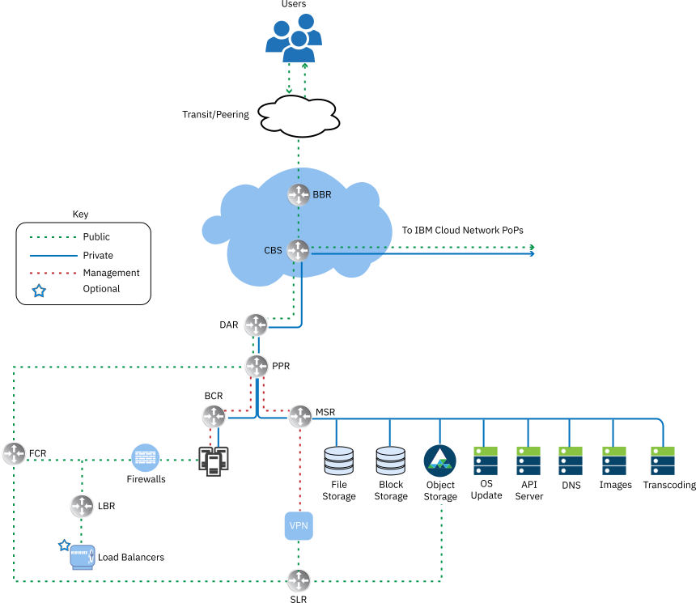
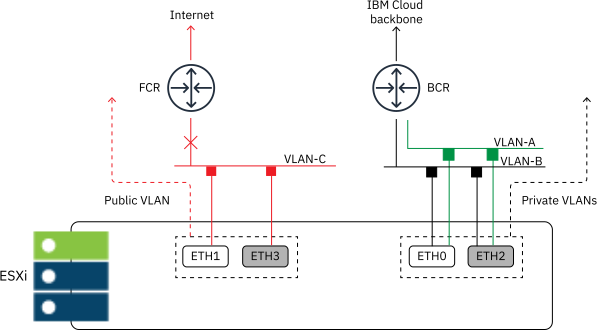
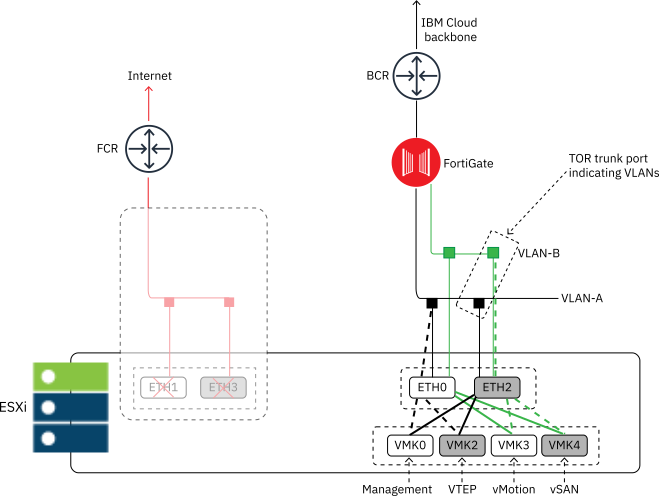

---

copyright:

  years:  2020, 2023

lastupdated: "2023-03-21"

subcollection: vmwaresolutions

---

{{site.data.keyword.attribute-definition-list}}

# Underlay networking
{: #vrw-underlay-network}

{{site.data.keyword.cloud}} for VMware® Regulated Workloads requires isolated networking between the workload clusters and the management and gateway clusters.

## Management cluster
{: #vrw-underlay-network-management}

The management cluster requires two VLANs to support the management functions.

One VLAN includes subnets for ESXi management (vmk0) and management services such as the vCenter Server. The gateway appliance establishes security zones and policies to control the flow of traffic within the VLAN between the subnets. Unsolicited traffic from the ESXi or bare metal hosts is prevented from reaching the management systems. The perimeter gateway controls the traffic flow from these two subnets to any other area outside of the management region.

The second VLAN includes subnets that are dedicated to vMotion and vSAN. No routing between these subnets is allowed and the VLAN is isolated by the perimeter gateway from all other security zones and networks in a single-zone deployment.

## Gateway cluster
{: #vrw-underlay-network-edge}

The optional gateway cluster adds two transit network VLANs to the solution. These VLANs connect the vSRX to both the back-end customer router (BCR) for private traffic and front-end customer router (FCR) for public (internet) traffic flows. When a private-only deployment is wanted, the public transit VLAN is not ordered. The management VLAN is trunked to the gateway cluster.

The network design is done in this manner to enable the vSRX to control traffic flows within the management zone and between the management zone and the {{site.data.keyword.cloud}} private and public networks. The FortiGate appliance transit and VLAN network design are the same as the ones used with the gateway cluster.

The vSRX running on the gateway cluster connects the management network to the private and public transit networks. The vSRX is configured to allow only traffic in or out of the management region that is necessary for proper operation and monitoring of the environment. The vSRX also isolates all traffic between the ESXi hosts in the clusters and vCenter Server. ESXi hosts within a cluster can communicate with each other and vCenter Server. ESXi hosts in one cluster (workload or management for example) are unable to communicate with the hosts of any other clusters. The limitation of cross-cluster traffic is enforced by vSRX and the configuration of the firewalls of the ESXi hosts.

The gateway cluster is the peering point for traffic between the SaaS provider on-premises and the {{site.data.keyword.cloud_notm}} for VMware Regulated Workloads. It also serves as the demarcation for traffic from the SaaS consumer. The SaaS provider uses the vSRX as the secure tunnel endpoint for its VPN.

Traffic from the SaaS consumer passes through the vSRX in an encrypted tunnel, which lands on the overlay network virtual edge device.

## Workload cluster
{: #vrw-underlay-network-workload}

The workload cluster network design is closely aligned to that of a traditional vCenter Server deployment. VLANs and subnets are provisioned to support vMotion, vSAN, VTEPS for the Software-Defined Networking (SDN) network, and workload cluster host management functions.

Within the workload clusters, NSX-T™ provides a highly secure and flexible software defined network to support the application requirements. NSX-T management is external to the workload cluster thus ensuring that network and security changes are not possible by anyone other than the designated administrators. All north-south network access in the workload cluster is done through private and secure connections by using IPsec or IBM Direct Link. The workload clusters are protected by the same gateway cluster with the vSRX or the physical FortiGate that protects the management plane.

## IBM Cloud networking
{: #vrw-underlay-network-cloud}

The physical network of {{site.data.keyword.cloud_notm}} is separated into two distinct networks: public and private. The private network also contains the management Intelligent Platform Management Interface (IPMI) traffic to the physical servers.

{: caption="Figure 1. IBM Cloud high–level network" caption-side="bottom"}

### Public network
{: #vrw-underlay-network-cloud-public}

{{site.data.keyword.cloud_notm}} data centers and network points of presence (PoPs) have multiple 1 Gbps or 10 Gbps connections to the top-tier transit and peering network carriers. Network traffic from anywhere in the world connects to the closest network PoP and travels across the network directly to its data center. This way, the number of network hops and handoffs between providers is minimized.

Inside the data center, {{site.data.keyword.cloud_notm}} provides 1 Gbps or 10 Gbps of network bandwidth to individual servers through a pair of separate, peer-aggregated front-end customer switches (FCS). These aggregated switches are attached to a pair of separate routers (FCR) for L3 networking.

This multitier design allows the network to scale across racks, rows, and pods within an {{site.data.keyword.cloud_notm}} data center.

### Private network
{: #vrw-underlay-network-cloud-private}

All {{site.data.keyword.cloud_notm}} data centers and PoPs are connected by the private network backbone. This private network is separate from the public network, and it enables connectivity to services in {{site.data.keyword.cloud_notm}} data centers around the world. Moving data between {{site.data.keyword.cloud_notm}} data centers is done through multiple 10 Gbps or 40 Gbps connections to the private network.

Similar to the public network, the private network is multitiered in that servers and other infrastructure components are connected to aggregated back-end customer switches (BCS). These aggregated switches are attached to a pair of separate back-end customer routers (BCR) for L3 networking. The private network also supports the ability to use jumbo frames (MTU 9000) for physical host connections.

### Management network
{: #vrw-underlay-network-cloud-management}

In addition to the public and private networks, each {{site.data.keyword.cloud_notm}} server is connected for management to the private primary network subnet. This connection allows Intelligent Platform Management Interface (IPMI) access to the server independently of its CPU, firmware, and operating system, for maintenance and administration purposes.

### Primary and portable IP blocks
{: #vrw-underlay-network-cloud-ipblocks}

{{site.data.keyword.cloud_notm}} allocates two types of IP addresses to be used within the {{site.data.keyword.cloud_notm}} infrastructure:
* Primary IP addresses are assigned to devices, bare metal, and virtual servers that are provisioned by {{site.data.keyword.cloud_notm}}. Do not manually assign any IP addresses in these blocks.
* Portable IP addresses are provided for you to assign and manage as needed. The {{site.data.keyword.cloud_notm}} for VMware Regulated Workloads automation provisions several portable IP ranges for its use. Use only the portable IP address ranges that are assigned to specific NSX-T components and specified for SaaS provider use.

Primary or portable IP addresses can be made routable to any VLAN within your account when the account is configured as a **Virtual Routing and Forwarding (VRF)** account.

### Virtual routing and forwarding
{: #vrw-underlay-network-cloud-vrf}

The {{site.data.keyword.cloud_notm}} infrastructure account must be configured as a Virtual Routing and Forwarding (VRF) account, which enables automatic global routing between subnet IP blocks. All accounts with Direct-Link connections must be converted to, or created as, a VRF account.

As various connectivity options and network routing options require that the {{site.data.keyword.cloud_notm}} account is in VRF mode, it is recommended that the account is in VRF mode before you provision the {{site.data.keyword.cloud_notm}} for VMware Regulated Workloads.

### Physical host connections
{: #vrw-underlay-network-cloud-hosts}

Each physical host in this design has two redundant pairs of 10 Gbps Ethernet connections into each {{site.data.keyword.cloud_notm}} Top of Rack (ToR) switch (public and private). The adapters are set up as individual connections (unbonded) for a total of 4 x 10 Gbps connections. This setup allows networking interface card (NIC) connections to work independently from each other.

Removing physical network connectivity to the public or private network for the bare metal servers that are used within the vCenter Server offering is not possible. Physical ports on the internal NIC of the bare metal can be disabled, but no support to unplug the cables exist. This configuration is sometimes referred to as "air-gapped", which is short hand for those actions necessary to ensure that the public side network ports of the ESXi hosts are disabled, that the ToR ports for those connections are disabled, and that {{site.data.keyword.cloud_notm}} IAM is configured to prevent anyone without sufficient privileges to enable the connections. Additionally, the public client-side VLAN is assigned to the perimeter gateway device and secured to prevent any traffic to and from the public VLAN. The gateway and the gateway connections to the public transit VLAN (if present) are also administratively down (as opposed to disconnected), which enables monitoring for any attempt of traffic egressing or ingressing across the public transit VLAN to and from the FCR.

While {{site.data.keyword.cloud_notm}} does offer an SSL VPN option, this option is discouraged and should be strictly limited to situations where out of band access to the {{site.data.keyword.cloud_notm}} for VMware Regulated Workloads is essential.

{: caption="Figure 2. Physical host connections" caption-side="bottom"}

### VLANs and underlay to overlay routing
{: #vrw-underlay-network-cloud-vlans}

The {{site.data.keyword.cloud_notm}} for VMware Solutions offerings are designed with three VLANs, one public and two private, assigned upon deployment. As shown in the previous figure, the public VLAN is assigned to `eth1` and `eth3`, and the private VLANs are assigned to `eth0` and `eth2`.

The public and the first private VLAN created and assigned in this design are untagged by default within the {{site.data.keyword.cloud_notm}}. Then, the additional private VLAN is trunked on the physical switch ports and tagged within the VMware port groups that are using these subnets.

{: caption="Figure 3. VLAN connections" caption-side="bottom"}

The private network consists of two VLANs within this design. Three subnets are allocated to the first of these VLANs (here designated Private VLAN A):

* The first subnet is a primary private IP subnet range that {{site.data.keyword.cloud_notm}} assigns to the physical hosts.
* The second subnet is used for management virtual machines (VMs) such as vCenter Server Appliance and Platform Services Controller.
* The third subnet is used for the encapsulated overlay network Tunnel Endpoints (VTEPs) assigned to each host through the NSX Manager.

In addition to Private VLAN A, a second private VLAN (here designated Private VLAN B) exists to support VMware features such as vSAN and vMotion. As such, the VLAN is divided into two or more portable subnets:

* The first subnet is assigned to a kernel port group for vMotion traffic.
* The remaining subnet or subnets are used for storage traffic:
   * When using vSAN, a subnet is assigned to kernel port groups that are used for vSAN traffic.

The public network consists of one VLAN within this design. The following subnets are allocated to the VLAN:

* The first subnet is a Primary Public IP subnet range that {{site.data.keyword.cloud_notm}} assigns to the physical hosts.
* The hosts are assigned a public IP address but this IP address is not configured on the hosts, so they are not directly accessible on the public network.
* The second subnet is used for public access of components like a virtual gateway appliance.
* The public VLAN is intended to provide public internet access.

All subnets that are configured as part of an {{site.data.keyword.cloud_notm}} for VMware Regulated Workloads automated deployment use {{site.data.keyword.cloud_notm}}-managed ranges to ensure that any IP address can be routed to any data center within {{site.data.keyword.cloud_notm}}.

Review the following table for a summary.

| VLAN | Type | Description |
|--------- |---- |----------- |
| Public C | Primary  | Assigned to physical hosts for public network access.  |
| Private A | Primary  | Single subnet assigned to physical hosts assigned by {{site.data.keyword.cloud_notm}}. Used by the management interface for vSphere management traffic. |
| Private A | Portable | Single subnet that is assigned to VMs that function as management components |
| Private A | Portable | Single subnet that is assigned to NSX-T VTEP |
| Private B | Portable | Single subnet that is assigned for vSAN, if in use |
| Private B | Portable | Single subnet assigned for NAS, if in use |
| Private B | Portable | Single subnet assigned for vMotion |
{: caption="Table 1. VLAN and subnet summary" caption-side="bottom"}

In this design, all VLAN-backed hosts and VMs are configured to point to the perimeter gateway as the default route. While the {{site.data.keyword.cloud_notm}} for VMware Regulated Workloads instances enable the use of SDN, network overlays created within a VMware instance that include routing to internal subnets are not known by the perimeter gateway unless dynamic routing protocols or static routes are configured.

The private network connections are configured to use a jumbo frame MTU size of 9000 to improve performance for large data transfers, such as storage and vMotion. This value is the maximum MTU that is allowed within VMware and by {{site.data.keyword.cloud_notm}}. The public network connections use a standard ethernet MTU of 1500, which must be maintained as any changes might cause packet fragmentation over the internet.

## Related links
{: #vrw-underlay-network-related}

* [IBM Cloud compliance programs](https://www.ibm.com/cloud/compliance)
