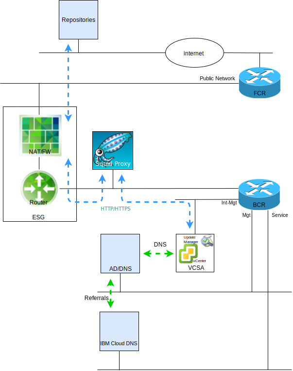

---

copyright:

  years:  2016, 2019

lastupdated: "2019-05-21"

subcollection: vmware-solutions

---

# VMware Update Manager introduction
{: #vum-intro}

The purpose of this document is to provide you, the system administrator of the {{site.data.keyword.vmwaresolutions_full}} vCenter Server instance, with instructions on how to configure VMware Update Manager (VUM) to maintain the currency of your vCenter Server environment.

VUM enables centralized, automated patch and version management for VMware vSphere and allows you to complete the following tasks in your VMware vCenter Server on {{site.data.keyword.cloud_notm}} environment:
* Upgrade and patch the vSphere ESXi hosts.
* Install and update third-party software on the hosts.
* Upgrade virtual machine hardware, VMware Tools, and virtual appliances.

This document also describes the processes to maintain the following components of your vCenter Server instance:
* vCenter Server Appliance
* NSX
* vSAN

This document describes the use of a proxy server implementation, based on CentOS and Squid, to enable VUM to access the VMware repositories. When VUM requests a resource from the update server at VMware, the request is sent to the proxy server first and the proxy server then sends the request to the update server via the External Services Gateway (ESG). After the resource is obtained by the proxy server, it sends the resource to VUM.

{: caption="Figure 1. Overview diagram" caption-side="bottom"}

vCenter Server currently deploys vSphere 6.5, which means VUM is now integrated within the vCenter Server Appliance (VCSA), and as the VUM client component is a plug-in that runs on the vSphere Web Client it is automatically enabled after deployment of the VCSA. However, VUM has no access to the internet to access the VMware repositories.

This documented configuration uses the “all-in-one”, internet-connected VUM deployment model that uses the {{site.data.keyword.cloud_notm}} public network to provide internet access to download upgrades and patches.

Clients requiring the use of alternative internet connections must investigate the VMware vSphere Update Manager Download Service (UMDS), which is beyond the scope of this publication.

While VUM can be configured to import updates from a shared repository or import patches and extensions manually from a compressed file, these topics aren't discussed in this document.

In vSphere 6.5, it's no longer supported to register VUM to a VCSA during installation of the VUM server on a separate Windows system you can't deploy VUM in a VM within the vCenter Server environment.

This document is organized into the following sections:
* [VMware Update Manager overview](/docs/services/vmwaresolutions/archiref/vum?topic=vmware-solutions-vum-overview) - Describes the VUM process and introduces key terms that are needed to understand the operations and UI of the tool.
* **Installation, Configuration, and Usage** - Describes the steps that are required to get VUM working in a vCenter Server instance:
  - [Initial configuration](/docs/services/vmwaresolutions/archiref/vum?topic=vmware-solutions-vum-init-config) - A one-time task to:
      - Configure NSX networking to allow the proxy server access to the internet.
      - Install and configure a proxy server to provide internet access for VUM.
      - The initial setup of VUM to use the proxy server.
  - [Collecting the metadata](/docs/services/vmwaresolutions/archiref/vum?topic=vmware-solutions-vum-metadata) - VUM downloads metadata about the upgrades, patches, or extensions via a predefined automatic process that you can modify. At regular configurable intervals, VUM contacts VMware, or third-party sources, to gather the latest metadata about available upgrades, patches, or extensions.
  - [Creating baselines](/docs/services/vmwaresolutions/archiref/vum?topic=vmware-solutions-vum-baselines) - Use the pre-defined baselines and baseline groups or create custom ones. Baselines and baseline groups are then attached to inventory objects.
  - [Scanning and review](/docs/services/vmwaresolutions/archiref/vum?topic=vmware-solutions-vum-scanning) - Inventory objects are scanned, and the results are reviewed to determine how they comply with the baselines and baseline groups. Scan results can be filtered by text search, group selection, baseline selection, and compliance status selection.
  - [Staging and remediation](/docs/services/vmwaresolutions/archiref/vum?topic=vmware-solutions-vum-staging) - Patches and extensions can be optionally staged before remediation to ensure that they are downloaded to the host. During remediation, VUM applies the patches, extensions, and upgrades to the inventory objects.

This document assumes that you have one Primary vCenter Server instance that is deployed, or a number of separate Primary vCenter Server instances. If you have Primary and Secondary vCenter Server instances that are deployed and that use Single Sign On (SSO), see [SSO-linked vCenters](/docs/services/vmwaresolutions/archiref/vum?topic=vmware-solutions-vum-updating-vcsa).

If you have deployed a vCenter Server by using vSAN, see [Updating vSAN Clusters](/docs/services/vmwaresolutions/archiref/vum?topic=vmware-solutions-vum-updating-vsan) first.

If you want to update the {{site.data.keyword.cloud_notm}} infrastructure management automation, use the {{site.data.keyword.vmwaresolutions_short}} console.

The [{{site.data.keyword.vmwaresolutions_short}} console](https://cloud.ibm.com/infrastructure/vmware-solutions/console) enables you to carry out the following actions:
*	Upgrade licenses for example, upgrade NSX Base to another version
*	Initiate updates to the vCenter Server platform for example, move to version 2.5
*	View the status of updates
*	View the installed updates

This facility enables the automated updating for the management components of the vCenter Server instances only. VMware product updates must be applied by using the procedures that are detailed in this document.

## Related links
{: #vum-intro-related}

* [VMware HCX on {{site.data.keyword.cloud_notm}} solution architecture](/docs/services/vmwaresolutions/services?topic=vmware-solutions-hcx-archi-intro#hcx-archi-intro)
* [{{site.data.keyword.vmwaresolutions_full}} Demos](https://www.ibm.com/demos/collection/IBM-Cloud-for-VMware-Solutions/) (demonstrations)
