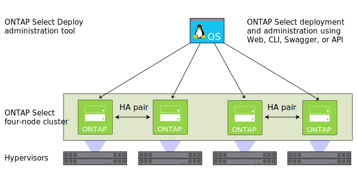

---

copyright:

  years:  2016, 2019

lastupdated: "2019-06-26"

keywords: NetApp ONTAP, NetApp, tech specs NetApp ONTAP

subcollection: vmware-solutions

---

{:external: target="_blank" .external}
{:tip: .tip}
{:note: .note}
{:important: .important}

# NetApp ONTAP Select overview
{: #np_netappoverview}

Review the architecture and components of the NetApp ONTAP Select on {{site.data.keyword.cloud}} deployment.

## NetApp ONTAP Select architecture
{: #np_netappoverview-archi}

The NetApp ONTAP Select on {{site.data.keyword.cloud_notm}} offering complements the vCenter Server deployment by providing storage virtualization services.

The following graphic illustrates the overall architecture of the NetApp ONTAP Select on vCenter Server deployment.

{: caption="Figure 1. High-level architecture of NetApp ONTAP Select on IBM Cloud" caption-side="bottom"}

### Physical infrastructure
{: #np_netappoverview-physical-infras}

This layer provides the physical infrastructure (compute, network, and storage resources) to be used by the virtual infrastructure.

### Virtualization infrastructure (Compute, Network, and NetApp ONTAP Select)
{: #np_netappoverview-virtual-infras}

This layer virtualizes the physical infrastructure through the following VMware products and the NetApp ONTAP Select product:
* VMware vSphere virtualizes the physical compute resources
* VMware NSX is the network virtualization platform that provides logical networking components and virtual networks.
* NetApp ONTAP Select on {{site.data.keyword.cloud_notm}} deploys an ONTAP Select cluster, which consists of four VMs for the four hosts.

The following graphic illustrates the components of the NetApp ONTAP Select deployment.

{: caption="Figure 2. NetApp ONTAP Select components" caption-side="bottom"}

### Virtualization management
{: #np_netappoverview-virtualization-mgmt}

The virtualization management layer consists of the following components:

* vCenter Server Appliance (vCSA) with embedded Platform Services Controller (PSC)
* NSX Manager
* Two NSX Edge Services Gateways (ESGs)
* Three NSX Controllers
* IBM CloudDriver virtual server instance (VSI)

NetApp ONTAP Select runs in a VMware cluster and virtualizes the local storage on the hosts. NetApp ONTAP Select is deployed in the dedicated model, where other workloads are not expected to share the cluster with it. As a result, the hardware configuration of the NetApp ONTAP Select on {{site.data.keyword.cloud_notm}} offering is sized only based on the requirements of NetApp ONTAP Select.

## Technical specifications for NetApp ONTAP Select instances
{: #np_netappoverview-specs}

The following components are included in your NetApp ONTAP Select instance.

The availability and pricing of standardized configurations might vary based on the {{site.data.keyword.CloudDataCent_notm}} that is selected for deployment.
{:note}

### Storage
{: #np_netappoverview-storage}

* Choose between **High Performance (Medium)**, **High Performance (Large)**, and **High Capacity**
* RAID 5 with hot spare
* Two 1-TB SATA drives ESXi OS – RAID 1
* Management datastore – 500 GB for management VMs

### Preset configurations
{: #np_netappoverview-preset-config}

Four {{site.data.keyword.cloud_notm}} {{site.data.keyword.baremetal_short}} with the following configuration options are provided:
* **High Performance (Medium)** – Premium license / Dual Intel Xeon E5-2650 v4 (24 cores total, 2.2 GHz) / 128 GB RAM / 22 1.9 TB SSD drives capacity per node / Effective capacity of a 4-node cluster – 59 TB
* **High Performance (Large)** – Premium license / Dual Intel Xeon E5-2650 v4 (24 cores total, 2.2 GHz) / 128 GB RAM / 22 3.8 TB SSD drives capacity per node / Effective capacity of a 4-node cluster – 118 TB
* **High Capacity** – Standard license / Dual Intel Xeon E5-2650 v4 (24 cores total, 2.2 GHz) / 64 GB RAM / Thirty Four 4 TB SATA drives capacity per node / Effective capacity of a 4-node cluster – 190 TB

3.8 TB SSD (Solid-State Disk) drives are supported when they are made generally available in a data center.
{:note}

### Hardware
{: #np_netappoverview-hardware}

* Three RAM and disk options: **High Performance (Medium)**, **High Performance (Large)**, and **High Capacity**
* Two 1 TB SATA drives ESXi OS
* One RAID disk controller
* VMware Server Virtualization 6.5

### Networking
{: #np_netappoverview-network}

* 10 Gbps dual public and private network uplinks
* Three VLANs (Virtual LANs): one public VLAN and two private VLANs
* One secure VMware NSX Edge Services Gateway

### Virtual Server Instances
{: #np_netappoverview-vsi}

Two VSIs (Virtual Server Instances):
* A VSI for Microsoft Active Directory (AD) and Domain Name System (DNS) services.
* A VSI for IBM CloudBuilder, which is shut down after the instance deployment is completed.

### Licenses and fees
{: #np_netappoverview-license-and-fee}

*  Four Premium or Standard Edition NetApp ONTAP Select licenses (user-provided)
*  VMware vSphere 6.5 Enterprise Plus edition
*  VMware vCenter Server 6.5
*  VMware NSX Service Providers Edition (Base, Advanced, or Enterprise) 6.4
*  Support and Services fee (one license per node)

You must manage the {{site.data.keyword.vmwaresolutions_short}} components that are created in your {{site.data.keyword.cloud_notm}} account only from the {{site.data.keyword.vmwaresolutions_short}} console, not the {{site.data.keyword.slportal}}, or any other means outside of the console. If you change these components outside of the {{site.data.keyword.vmwaresolutions_short}} console, the changes are not synchronized with the console.
{:important}

**CAUTION:** Managing any {{site.data.keyword.vmwaresolutions_short}} components (which were installed into your {{site.data.keyword.cloud_notm}} account when you ordered the instance) from outside the {{site.data.keyword.vmwaresolutions_short}} console can make your environment unstable. These management activities include:
*  Adding, modifying, returning, removing, or powering off components
*  Expanding or contracting instance capacity through adding or removing ESXi servers
*  Restarting services

   Exceptions to these activities include managing the shared storage file shares from the {{site.data.keyword.slportal}}. Such activities include: ordering, deleting (which might impact data stores if mounted), authorizing, and mounting shared storage file shares.

## Firewall considerations
{: #np_netappoverview-firewall-considerations}

If you're using firewalls, you must configure rules for all communications from the {{site.data.keyword.IBM}} CloudDriver virtual server instance (VSI) and the SDDC Manager virtual machines (VMs). These rules must allow all protocols to communicate on the IP addresses `10.0.0.0/8` and `161.26.0.0/16`. Examples of such firewalls are NSX Distributed Firewalls (DFW) or Vyatta firewalls.

## Related links
{: #np_netappoverview-related}

* [Planning NetApp ONTAP Select instances](/docs/services/vmwaresolutions/netapp?topic=vmware-solutions-np_planning#requirements-and-planning-for-netapp-ontap-select-instances)
* [Ordering NetApp ONTAP Select instances](/docs/services/vmwaresolutions/netapp?topic=vmware-solutions-np_orderinginstances)
* [vCenter Server overview](/docs/services/vmwaresolutions/vcenter?topic=vmware-solutions-vc_vcenterserveroverview)
* [NetApp ONTAP Documentation Center](http://docs.netapp.com/ontap-9/index.jsp?topic=%2Fcom.netapp.doc.exp-clus-peer%2Fhome.html){: external}
