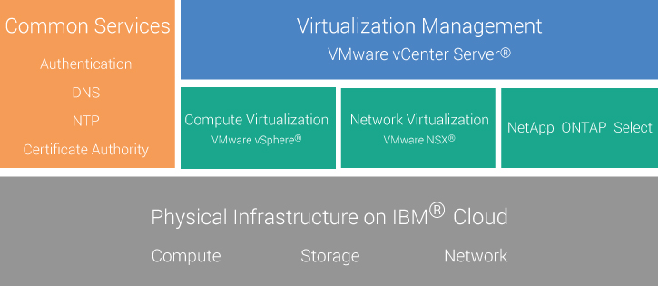
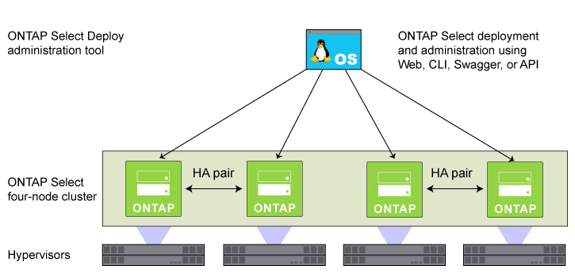

---

copyright:

  years:  2016, 2017

lastupdated: "2017-10-12"

---

# NetApp ONTAP Select on IBM Cloud overview

Review the architecture and components of the NetApp ONTAP Select on IBM® Cloud deployment.

## NetApp ONTAP Select architecture

The NetApp ONTAP Select on IBM Cloud offering complements the vCenter Server deployment by providing storage virtualization services.

The following graphic depicts the overall architecture of the NetApp ONTAP Select on vCenter Server deployment.

Figure 1. High-level architecture of NetApp ONTAP Select on IBM Cloud

### Physical infrastructure

This layer provides the physical compute, network, and storage resources to be used by the virtual infrastructure.

### Virtualization infrastructure (Compute, Network, and NetApp ONTAP Select)

This layer virtualizes the physical infrastructure through different VMware products and the NetApp ONTAP Select product:
* VMware vSphere virtualizes the physical compute resources.
* VMware NSX is the network virtualization platform that provides logical networking components and virtual networks.
* NetApp ONTAP Select on IBM Cloud deploys an ONTAP Select cluster which consists of four VMs for the four hosts.

The following graphic depicts the components of the NetApp ONTAP Select deployment.

Figure 2. NetApp ONTAP Select components

### Virtualization management

This layer consists of vCenter Server virtual appliance, NSX Manager, two NSX ESGs, 3 NSX Controllers, Platform Services Controller (PSC) virtual appliance, vCSA, and the IBM® CloudDriver virtual machine.

NetApp ONTAP Select runs in a VMware cluster and virtualizes the local storage on the hosts. NetApp ONTAP Select is deployed in the dedicated model, where other workloads are not expected to share the same cluster with it. As a result, the hardware configuration of the NetApp ONTAP Select on IBM Cloud offering is sized only based on the requirements of NetApp ONTAP Select.

<!--For details about the architecture, see the _Reference architecture_ document in the [Architecture Center](https://www.ibm.com/devops/method/content/architecture/virtVCenterServerPlatform){:new_window}.-->

## NetApp ONTAP Select instance components

The following components are included in your NetApp ONTAP Select instance.

**Note**: The availability and pricing of standardized hardware configurations might vary based on the data center that is selected for deployment.

### Hardware

Four IBM Cloud bare metal servers with the following hardware options to choose from:
*  High Performance cluster - 15 TB SSD (10 × 1.2 TB RAID 5)
*  High Capacity cluster - 24 TB SATA (10 × 2 TB RAID 5)

### Networking

*  Three VLANs (Virtual LANs): one public VLAN and two private VLANs
*  One VXLAN (Virtual eXtensible LAN) with DLR (Distributed Logical Router)
*  Two secure VMware NSX Edge Services Gateways

### Virtual Server Instances

Two VSIs (Virtual Server Instances):
* A VSI for IBM CloudBuilder, which is shut down after the instance deployment is completed.
* A VSI for Microsoft Active Directory (AD) and Domain Name System (DNS) services.

### Storage

*  High performance:
   * Two 1 TB SATA drives ESXi OS – RAID 1
   * Ten 1.2 TB SSD drives capacity - RAID 5 with hot spare
   * Effective capacity – 15 TB
   * Management datastore – 500 GB for management VMs
*  High capacity:
   * Two 1 TB SATA drives ESXi OS – RAID 1
   * Ten 2 TB SATA drives capacity - RAID 5 with hot spare
   * Effective capacity – 24 TB
   * Management datastore – 500 GB for management VMs

### Licenses and fees

*  Four Premium/Standard Edition NetApp ONTAP Select licenses (user-provided)
*  VMware vSphere 6.0 Enterprise Plus edition
*  VMware vCenter Server 6.0
*  VMware NSX Base for Service Providers edition
*  Support and Services fee (one license per node)

<!--For details about the components, see the _Bill of Materials_ document in
the [Architecture Center](https://www.ibm.com/devops/method/content/architecture/virtualizationArchitecture/virtualizationRefArch){:new_window}.-->

**Important**: You must manage the {{site.data.keyword.vmwaresolutions_short}} components that are created in your IBM Bluemix Infrastructure (SoftLayer) account only from the {{site.data.keyword.vmwaresolutions_short}} console, not the Bluemix Infrastructure (SoftLayer) portal or any other means outside of the console. If you change these components outside of the {{site.data.keyword.vmwaresolutions_short}} console, the changes are not synchronized with the console.

**CAUTION**: Managing any {{site.data.keyword.vmwaresolutions_short}} components (which were installed into your Bluemix Infrastructure account when you ordered the instance) from outside the {{site.data.keyword.vmwaresolutions_short}} console can make your environment unstable. These management activities include:
*  Adding, modifying, returning, removing, or powering off components
*  Expanding or contracting instance capacity through adding or removing ESXi servers
*  Restarting services

   Exceptions to these activities include managing the shared storage file shares from the Bluemix Infrastructure (SoftLayer) portal. Such activities include: ordering, deleting (which might impact data stores if mounted), authorizing, and mounting shared storage file shares.

## Related links

* [Planning NetApp ONTAP Select instances](np_planning.html)
* [Ordering NetApp ONTAP Select instances](np_orderinginstances.html)
* [vCenter Server overview](../vcenter/vc_vcenterserveroverview.html)
* [NetApp ONTAP Documentation Center](http://docs.netapp.com/ontap-9/index.jsp?topic=%2Fcom.netapp.doc.exp-clus-peer%2Fhome.html){:new_window}
