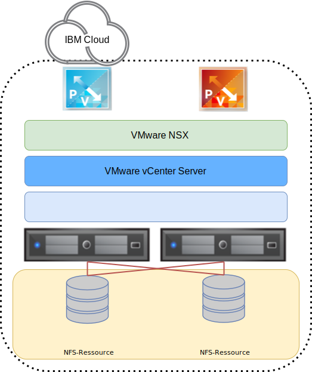

---

copyright:

  years:  2016, 2019

lastupdated: "2019-04-03"

subcollection: vmware-solutions

---

{:tip: .tip}
{:note: .note}
{:important: .important}

# Design der Infrastruktur für angehängten Speicher
{: #storage-infra-design}

{{site.data.keyword.vmwaresolutions_full}} bietet VMware-Technologie, die weltweit automatisiert in {{site.data.keyword.CloudDataCents_notm}} bereitgestellt wird. Innerhalb des {{site.data.keyword.cloud_notm}}-Lösungsportfolios besteht das VMware vCenter Server on {{site.data.keyword.cloud_notm}}-Basisangebot aus bis zu 10 Clustern, von denen jeder bis zu 59 vSphere-Hosts, einen einzelnen Platform Services Controller (PSC) und eine vCenter Server Appliance enthält, die in der Lage ist, bis zu 400 Hosts und 4.000 virtuelle Maschinen zu verwalten.

Die Architektur, die hier dargestellt wird, ergänzt die vCenter Server-Lösung durch Hinzufügen von angehängtem Speicher als gemeinsam genutzte Speichereinheit für die Umgebung. Die angehängte Speichereinheit befindet sich innerhalb desselben {{site.data.keyword.CloudDataCent_notm}} wie die vCenter Server-Bereitstellung und besteht aus einer einzelnen gemeinsam genutzten NFS-Ressource (NFS = Network File System) oder mehreren NFS-Exporten aus {{site.data.keyword.cloud_notm}}.

In der folgenden Abbildung ist die Gesamtarchitektur des angehängten Speichers für die vCenter Server-Bereitstellung dargestellt.

Abbildung 1. Allgemeine Architektur des angehängten Speichers in {{site.data.keyword.cloud_notm}}

## Design der physischen Infrastruktur
{: #storage-infra-design-phys-infra-design}

Die physische Infrastruktur besteht aus drei Hauptkomponenten: physische Rechenleistung, physischer Speicher und physisches Netz. Die physische Infrastruktur umfasst das {{site.data.keyword.cloud_notm}}-Servicenetz und den physischen Speicher, der von der Infrastruktur verwendet wird.

## Design des physischen Netzes
{: #storage-infra-design-phys-net-design}

Der physische Netzbetrieb wird von {{site.data.keyword.cloud_notm}} gesteuert. Im folgenden Abschnitt wird das physische Netz beschrieben, das von {{site.data.keyword.cloud_notm}} bereitgestellt wird, da es in Zusammenhang zum angehängten Speicher steht.

### Netzübersicht für IBM Cloud
{: #storage-infra-design-ibm-cloud-net-ovw}

Das physische Netz von {{site.data.keyword.cloud_notm}} ist in drei verschiedene Netze unterteilt: öffentliches Netz, privates Netz und Managementnetz. Weitere Informationen über das öffentliche, das private und das Managementnetz finden Sie in der [Lösungsübersicht](/docs/services/vmwaresolutions/archiref/solution?topic=vmware-solutions-solution_overview).

Weitere Informationen zum {{site.data.keyword.cloud_notm}}-Netz finden Sie im Abschnitt [Globale {{site.data.keyword.cloud_notm}}-Rechenzentren](https://www.ibm.com/cloud/data-centers/){:new_window}.

Lesen Sie die folgenden Informationen, um eine Beschreibung des Servicenetzes zu erhalten, das Teil des privaten Netzes ist.

### Privates Servicenetz
{: #storage-infra-design-private-net}

{{site.data.keyword.cloud_notm}} besitzt ein privates Servicenetz, das häufig verwendete Services wie beispielsweise Blockspeicher-, Dateispeicher- und Objektspeicherservices, DNS-Auflösungsservices und NTP-Server zur Verfügung stellt. Dieses private Netz arbeitet vom privaten Netz des Kunden getrennt und ermöglicht Umgebungen die reibungslose Verbindung zu Services, die sich in {{site.data.keyword.cloud_notm}} befinden. Das private Netz ist mehrschichtig gestaltet, sodass Server und andere Infrastrukturkomponenten mit zusammengefassten Back-end-Kundenswitches (BCS - Back-end Customer Switch) verbunden sind. Diese zusammengefassten Switches sind mit einem Paar separater Router (z. B. Back-end-Kundenrouter, BCR) für den L3-Netzbetrieb verbunden. Das private Netz unterstützt zudem die Möglichkeit, Jumbo-Frames (z. B. MTU 9000) für physische Hostverbindungen zu verwenden.

### VLANs
{: #storage-infra-design-vlans}

Weitere Informationen zu VLANs finden Sie im Abschnitt zum _physischen Netzdesign_ unter [Design der physischen Infrastruktur](/docs/services/vmwaresolutions/archiref/solution?topic=vmware-solutions-design_physicalinfrastructure).

## Design des physischen Speichers
{: #storage-infra-design-phys-storage-design}

In folgenden Abschnitt ist die Konfiguration der angehängten Speichereinheit beschrieben, die in {{site.data.keyword.cloud_notm}} vorhanden ist. Die angehängte Speichereinheit ergänzt die vorhandene vCenter-Server-Lösung. Demzufolge werden lokal angeschlossene Platteneinheiten, die interne Komponenten der physischen Hosts sind, nicht dargestellt.

## Leistung des angehängten Speichers
{: #storage-infra-design-perf}

Leistungs- und Endurance-Speicher stellen {{site.data.keyword.cloud_notm}}-Speicherlösungen dar, die zur Unterstützung von Anwendungen mit hohem E/A-Aufkommen entworfen werden, bei denen verlässliche Leistungsstufen gewährleistet werden müssen. Diese verlässliche Leistung wird durch die Zuordnung von IOPS (E/A-Operationen pro Sekunde) auf Protokollebene zu einzelnen Datenträgern erreicht.

Mit den Speichergrößen 20 GB bis 24 TB kann eine Anzahl E/A-Operationen pro Sekunde im Bereich von 100 bis 96.000 bestellt werden. Leistungs- und Endurance-Speicherdatenträger stehen sowohl für Block Storage als auch für File Storage zur Verfügung.

In diesem Design bietet die vCenter Server-Lösung Endurance-Speicher für den angehängten Speicher. Demzufolge können Sie (via Automatisierung) Endurance NFS-Exporte auswählen und anhängen, deren Größe zwischen 20 GB und maximal 24 TB liegen kann. Mit {{site.data.keyword.cloud_notm}} können bis zu 64 vSphere ESXi-Hosts mit einem einzigen Endurance NFS-Export verbunden werden.

Endurance steht in drei IOPS-Leistungsstufen zur Unterstützung unterschiedlicher Anwendungsanforderungen zur Verfügung.

Die Größe einer gemeinsam genutzten NFS-Ressource kann nach der Bestellung geändert oder neu konfiguriert werden, um eine größere oder geringere Anzahl von IOPS zu ermöglichen.
{:note}

Detaillierte Informationen zu den IOPS-Optionen finden Sie im Abschnitt mit den _Speichereinstellungen_ unter dem Thema zum [Bestellen von vCenter Server-Instanzen](/docs/services/vmwaresolutions/vcenter?topic=vmware-solutions-vc_orderinginstance).

Zusätzlich zu den Speicherstufen unterstützt der {{site.data.keyword.cloud_notm}}-Endurance-Speicher eine umfangreiche Palette von Anwendungsanforderungen einschließlich der Erstellung von Momentaufnahmen und Replikationen sowie der Verschlüsselung an den {{site.data.keyword.CloudDataCent_notm}}-Standorten.

## Zugehörige Links
{: #storage-infra-design-related}

* [Lösungsübersicht](/docs/services/vmwaresolutions/archiref/solution?topic=vmware-solutions-solution_overview)
