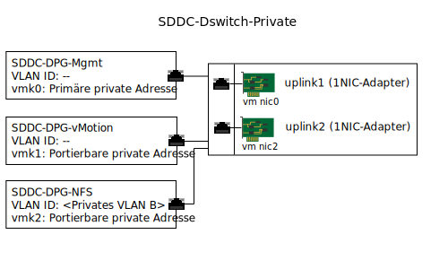

---

copyright:

  years:  2016, 2019

lastupdated: "2019-02-13"

---

{:tip: .tip}
{:note: .note}
{:important: .important}

# Management der Infrastruktur für angehängten Speicher
{: #storage-infra-mgmt}

Das Infrastrukturmanagement bezieht sich auf die VMware-Komponenten, die zum Management der vSphere ESXi-Infrastruktur eingesetzt werden.

Weitere Informationen zu den Komponenten finden Sie in Abbildung 2 "Netzübersicht für NSX Manager" unter [Design der virtuellen Infrastruktur](/docs/services/vmwaresolutions/archiref/solution?topic=vmware-solutions-design_virtualinfrastructure).

## Design des virtuellen Netzbetriebs
{: #storage-infra-mgmt-visual-net-design}

Die Netzvirtualisierung, die in diesem Design eingesetzt wird, nutzt einen bereits vorhandenen vSphere Distributed Switch (vDS), der dem privaten Netz zugeordnet und in der [{{site.data.keyword.vmwaresolutions_full}}-Architektur](/docs/services/vmwaresolutions/archiref/solution?topic=vmware-solutions-solution_overview) angegeben ist.

## vSphere Distributed Switch (vDS)
{: #storage-infra-mgmt-vsphere-ds}

In der vCenter Server-Lösung wird ein weiteres VLAN erstellt und zum Anhängen des NFS-Mountpunkts an die ESXi-Hosts im vorhandenen Cluster verwendet. Da die vCenter Server-Lösung über einen vSphere Distributed Switch (vDS) verfügt, der dem privaten Netz zugeordnet ist, wird eine weitere Portgruppe erstellt und mit der Nummer für zusätzliche VLANs markiert, da es sich bei diesem zusätzlichen VLAN nicht um ein natives VLAN handelt.

In der folgenden Tabelle werden die Standardeinstellungen für die neue Portgruppe beschrieben.

Diese Standardeinstellungen dürfen nicht geändert werden.
{:important}

Tabelle 1. Zusammenfassung zur NFS-Portgruppe

| Portgruppenname | SDDC-DPG-NFS |
|:--------------- |:------------ |
| Portbindung | Statisch |
| VLAN-Typ | Privates VLAN B |
| Lastausgleich | Route basierend auf virtuellem Ursprungsport |
| Aktive Uplinks | uplink1 und uplink2 |

Zusätzlich zur Erstellung der vDS-Portgruppe für den NFS-Speicherdatenverkehr wird auf jedem vSphere ESXi-Host während der Bereitstellung ein VMkernel-Port erstellt und der Portgruppe SDDC-DPG-NFS zugewiesen. Darüber hinaus wird dem VMkernel-Port eine IP-Adresse aus dem privaten portierbaren Teilnetz zugewiesen, das dem VLAN für den angehängten Speicher zugeordnet ist. Dies bedeutet, dass das private VLAN B und die zugehörige MTU auf den Wert "9000" gesetzt wird, um Jumbo-Frames zu unterstützen.

Abbildung 1. Private vDS-Portgruppen und Uplinks

### Statisches Routing für vSphere-Host
{: #storage-infra-mgmt-vsphere-routing}

Obwohl der vDS mit einer neuen Portgruppe konfiguriert und der Portgruppe ein VMkernel-Port zugewiesen wurde, erstellt die Lösung eine statische Route auf jedem vSphere ESXi-Host in der Bereitstellung, sodass der gesamte NFS-Datenverkehr das VLAN und das Teilnetz für NFS durchläuft. Die statische Route wird in `/etc/rc.local.d/local.sh` erstellt, sodass sie auch nach einem Neustart des Hosts erhalten bleibt.

## Zugehörige Links
{: #storage-infra-mgmt-related}

* [Lösungsübersicht](/docs/services/vmwaresolutions/archiref/solution?topic=vmware-solutions-solution_overview)
