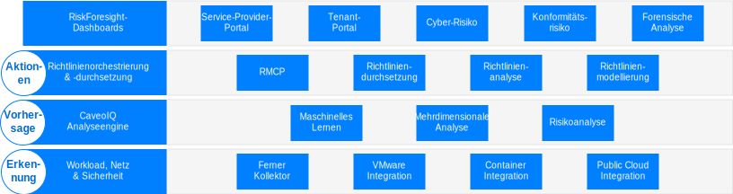
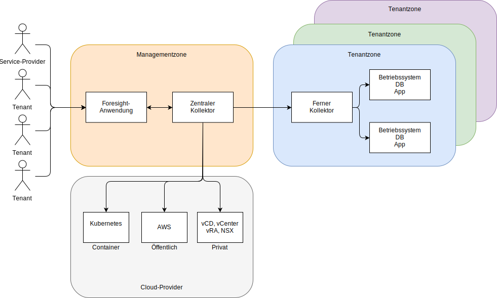

---

copyright:

  years:  2016, 2019

lastupdated: "2019-02-14"

---

# Architekturübersicht für Caveonix RiskForesight
{: #caveonix-arch}

Die Caveonix RiskForesight-Architektur ist im folgenden Diagramm dargestellt.

Abbildung 1. Architektur für Caveonix RiskForesight

Die Caveonix RiskForesight-Architektur setzt sich aus vier Schichten zusammen:
-	Erkennung: Das Erkennungsmodul ist in den VMware-Stack und in viele öffentliche Clouds voll integriert. Durch die Verwendung von Plug-ins verwendet RiskForesight vCenter und den NSX-Manager als Asset-Repositorys, wobei Details zu virtuellen Maschinen (VMs), zu Netzen und Netzflüssen erfasst werden. Ferne Kollektoren scannen Workloads, Betriebssysteme und Anwendungen, um eine vollständige Ansicht der Konformität und Sicherheitslücken zu ermöglichen.
-	Vorhersage: Das Vorhersagemodul verwendet Analytik, um risikobehaftete Assets und Risikominderungsschritte mit Risikominderungsmodellen zu ermitteln und damit die Risikoneigung zu verbessern.
-	Aktionen: Das Aktionsmodul implementiert die Risikominderungsschritte auf Grundlage der Priorisierung und automatisierten Schutzaktionen, um einen proaktiven Workloadschutz vor Risiken aufgrund von Cyberbedrohungen bereitzustellen.
    - RMCP: Die Risikomanagement-Steuerebene (Risk Management Control Plane, RMCP) bietet einen kontinuierlichen und proaktiven Schutz der Workloads, indem der vollständige Stack in privaten, öffentlichen und verwalteten Cloud-Rechenzentren überwacht wird.
    - Richtlinienmanager: Unterstützt derzeit drei Typen von Jobs für maschinelles Lernen pro Organisation: Caveo-Protokolle, Caveo-Netze und Caveo-Scan. Auf Grundlage von in den Daten gefundenen Anomalien kann der Benutzer die Richtlinien für Aktionen basierend auf benutzerdefinierten Bedingungen konfigurieren. Wählen Sie den Jobtyp aus, konfigurieren Sie boolesche Bedingungen für den Anomalie-Score und definieren Sie die auszuführende Aktion bei einer wahren Bedingung. Beispiel:
        - Job: "Caveo-Protokolle". Wenn der Anomalie-Score bei > 90 liegt, markieren Sie das Asset für die Quarantäne und senden Sie eine Benachrichtigung an den Slack-Kanal.
        - Job: "Caveo-Netz". Wenn der Anomalie-Score bei > 95 liegt, markieren Sie das Asset für die Quarantäne und senden Sie sowohl eine E-Mail- als auch eine UI-Benachrichtigung.
- Dashboards: Die Dashboards bieten über rollenbasierten Zugriff die Möglichkeit für einen Service-Provider (z. B. eine IT-Abteilung), IT-Assets für Tenants oder Geschäftsbereiche zuzuordnen. Anschließend ordnen die Geschäftseinheiten diese IT-Assets den Anwendungen zu. Diese Anwendungen entsprechen Geschäfts- und IT-Services, unterliegen einer Bewertung des Einflusses auf die Geschäftsabläufe und auch Konformitätsvorschriften wie NIST, NESA, PCI, ISO und HIPAA. Anschließend werden diese Anwendungen einer Reihe von Scans unterzogen, wie Scans auf Sicherheitslücken, NSX-Datenflüsse, Software und Protokolldaten, um eine Transparenz der laufenden Prozesse zu erhalten und die Cyber- und Konformitätsrisiken zu ermitteln, die mit einer Anwendung verbunden sind. Mit einem Drilldown durch diese Dashboards, Konformität und Sicherheit, können Benutzer eine nach Prioritäten geordnete Liste der Aktionen anzeigen, mit denen automatisierbare Durchsetzungskationen im Vorhersage- und im Aktionsmodul gemindert und aktiviert werden können. RiskForesight bietet sowohl ein einheitliches Dashboard zur Erkennung von Assets in der Hybrid-Cloud als auch eine Heat-Map-Analyse für Cyberrisiken, Konformitäts-Konfigurationsrisiken, wichtige Trends sowie Metriken der Sicherheitsoperation. Es ermöglicht es dem Benutzer, die Art und den Ort von Risiken schnell zu ermitteln und die Maßnahmen zu bestimmen, die ein intuitives und leistungsstarkes Visualisierungstool verwenden. Diese Dashboards stellen Folgendes bereit:
  - Eine priorisierte Ansicht von Cyber- und Konformitätsrisiken in der gesamten Hybrid-Cloud mit Dashboard-Ansichten für Erkennung, Vorhersage und Aktionen.
  - Die Möglichkeit für Benutzer, visuell mit Daten zu interagieren, um gefährdete Assets auf Grundlage von Risikoprioritäten schnell zu identifizieren.
  - Benutzerfreundliche Grafiken, Metriken und Filter für eine Transparenz der ermittelten Risiken.
  - Interaktive Drilldowns für eine größere Informationstiefe zu Anwendungsdatenflüssen, Sicherheitslücken oder Konfigurationsproblemen über verschiedene Standorte, Organisationen, Anwendungen und Assets hinweg.
  - Die Möglichkeit für den Benutzer, vollständige Kenntnisse über den aktiven Stack zu erhalten, darunter Infrastruktur, Plattform, Anwendung und Daten.
  - Die Möglichkeit, Richtlinien für die Segmentierung von Netzen, virtuellen Maschinen oder Anwendungen in der ganzen Hybrid-Cloud zu visualisieren und umzusetzen.

## Zonen
{: #caveonix-arch-zones}

Caveonix RiskForesight besitzt ein Zonenkonzept:

Abbildung 2. Caveonix RiskForesight-Zonen

-	Management- oder Service-Provider-Zone: Die Management- oder Service-Provider-Zone umfasst die folgenden Komponenten:
    - RiskForesight-Anwendung: Enthält mehrere Komponenten und wird im Abschnitt zu den Anwendungskomponenten detailliert beschrieben.
    - Zentraler Kollektor: Sammelt Informationen von den Cloud-Providern und Tenantzonen.
- Cloud-Provider: Diese Zone stellt die Infrastruktur bereit, in der Anwendungen gehostet werden:
    - Privat: VMware on {{site.data.keyword.cloud}} sowie lokale VMware-Infrastrukturplattformen. Diese Plattformen sind in RiskForesight integriert durch vCenter, NSX-Manager, VMware Cloud Director (vCD) oder vRealize Automation (vRA).
    - Öffentlich: Derzeit ist AWS der einzige unterstützte öffentliche Cloud-Provider. {{site.data.keyword.cloud_notm}} ist demnächst verfügbar.
    - Container: Derzeit wird nur AWS Elastic Kubernetes Service (EKS) unterstützt. {{site.data.keyword.cloud_notm}} Private und {{site.data.keyword.cloud_notm}} Kubernetes Services (IKS) sind in Kürze verfügbar.
-	Tenant- oder Kundenumgebungszone: Diese Zonen werden zur Trennung von Tenants, von Kunden- oder Geschäftseinheiten verwendet. In diesen Zonen gibt es Workloads, weshalb ein ferner Kollektor erforderlich ist. Für eine Mindestbereitstellung benötigen Sie einen fernen Kollektor; für eine allgemeine Bereitstellung hingegen benötigen Sie einen fernen Kollektor pro Tenant/Kunden/Geschäftseinheit.

## Zugehörige Links
{: #caveonix-arch-related}

*   [VMware vCenter Server on {{site.data.keyword.cloud_notm}} mit Hybridity Bundle](/docs/services/vmwaresolutions/archiref/vcs/vcs-hybridity-intro.html)
*   [Caveonix - Details zum Design](/docs/services/vmwaresolutions/archiref/caveonix/caveonix-detailed.html)
