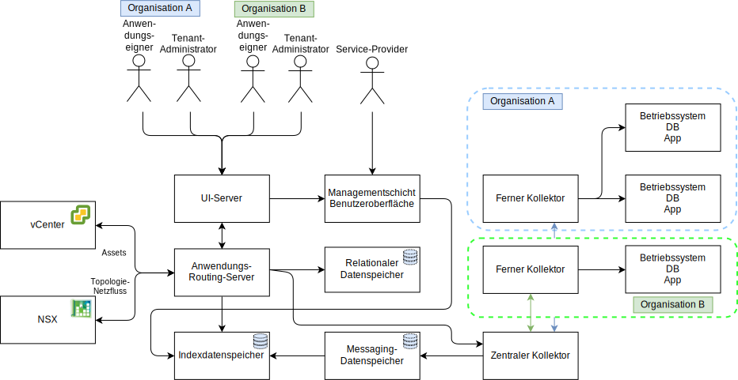

---

copyright:

  years:  2016, 2019

lastupdated: "2019-02-14"

---

# Detailliertes Design
{: #caveonix-detailed}

Das folgende Diagramm und die Beschreibungen geben Informationen zu den Anwendungskomponenten von RiskForesight.

Abbildung 1. Anwendungskomponenten

-	Grafische Benutzerschnittstelle: Webschnittstelle für den Zugriff auf die RiskForesight-Anwendung.
-	Zentraler Kollektor: sammelt verschiedene Nutzdatentypen aus den Plug-ins und stellt sie im Messaging-Speicher zur Verfügung. RiskForesight unterstützt die folgenden Typen von Nutzdaten:
    - Prüfung
    - Protokolle
    - Netzflüsse
    - Software
    - Workload-Metadaten
- Zentraler Router: verwaltet alle Berührungspunkte der Integration mit der VMware-Orchestrierungsschicht. Alle RiskForesight-Plug-ins müssen mit dem zentralen Router kommunizieren, um die Berechtigung für die Kommunikation mit dem RiskForesight-Ökosystem zu erhalten.
-	API-Server: bildet die Middleware für den REST-Endpunkt, die die GUI mit den Back-End-Datenspeichern verbindet. Außerdem prüft er die Benutzerzugriffsanforderungen und verwaltet die rollenbasierte Zugriffssteuerung (RBAC = Role-Based Access Control).
-	vCenter-Datenkollektor: Plug-in, das die Details der virtuellen Maschine (VM) aus vCenter extrahiert. Das generische Plug-in verwendet die VMware-APIs für eine Verbindung zu vCenter und extrahiert Workload-relevante Informationen. Sobald die Informationen verfügbar sind, packt das Plug-in die Nutzdaten und sendet sie an den zentralen Kollektor.
-	vCD-Datenkollektor: Plug-in, das die Details der VM aus VMware vCloud Director extrahiert. Das generische Plug-in verwendet die VMware-APIs für eine Verbindung zu VMware vCloud Director und extrahiert Workload-relevante Informationen. Sobald die Informationen verfügbar sind, packt das Plug-in die Nutzdaten und sendet sie an den zentralen Kollektor.
-	vCD-Netz-Datenkollektor: Plug-in, das Netzfluss-Details aus VMware vCD extrahiert. Das generische Plug-in verwendet die VMware-APIs für eine Verbindung zu VMware NSX und extrahiert Daten zum Netz, zu FW, zu Sicherheitsregeln und Sicherheitsgruppen. Sobald die Informationen verfügbar sind, packt das Plug-in die Nutzdaten und sendet sie an den zentralen Kollektor.
-	Netz-Datenkollektor: Plug-in, das Netzfluss-Details aus VMware vCenter extrahiert. Das generische Plug-in verwendet VMware-APIs für eine Verbindung zu VMware NSX und extrahiert Daten zum Netz, zur Firewall, zu Sicherheitsregeln und Sicherheitsgruppen. Sobald die Informationen verfügbar sind, packt das Plug-in die Nutzdaten und sendet sie an den zentralen Kollektor.
-	Ferner Kollektor: befindet sich in der Tenant-Umgebung oder an einer anderen Position, wo er über Netzzugriff zu Tenant-VMs verfügt. Er führt alle Prüfungen auf Konformitäts- und Cyberrisiken durch.
-	Relationaler Datenspeicher: verwaltet die folgenden Typen von Metadaten:
    - Cloud-Service-Provider
    - Tenant
    - Assets
    - Ergebnisprüfung
    - Software
    - Täglich oder wöchentlich zusammengefasster Datensatz
-	Messaging-Datenspeicher: RiskForesight verwendet eine Warteschlange für persistente Nachrichten, um Datenverluste vollständig zu vermeiden und Rückstaue zu den Komponenten auszulagen. Die Nutzdaten der eingehenden Daten werden zuerst persistent gespeichert und dann zur späteren Verarbeitung aus dem persistenten Speicher entnommen.
-	Indexdatenspeicher: indexiert und speichert die eingehenden Rohdaten für jeden Tenant zur weiteren Analyse und unterstützt damit die Multi-Tenant-Fähigkeit.
-	Plug-ins: befinden sich im Routing-Server der Anwendung und umfassen das Setup und die Integration in VMware-Komponenten zur Synchronisierung aller VMs zusammen mit ihren Tenant-Informationen.

In der folgenden Tabelle sind die Ports und Protokolle aufgeführt, die für die einzelnen Komponenten erforderlich sind.

Tabelle 1. Ports und Protokolle

|Komponente	|Protokoll/Ports|
|---|---|
|Benutzerschnittstelle|443|
|API|443, 1337|
|RiskForesight|8082, 8083, 8084|
|Zentraler Kollektor (Cluster)|8080|
|Ferner Kollektor|8081|
|Relationaler Datenspeicher, primär oder sekundär|5432|
|Messaging-Datenspeichercluster|9092|
|Hauptknoten für Indexdatenspeicher|9200, 9300, 5601, 443|

Das folgende Diagramm zeigt die Netztopologie mit dem portierbaren privaten Caveonix-Teilnetz, das dem privaten VLAN A zugeordnet ist. Die Verwaltung des IP-Adressraums für dieses Teilnetz liegt bei Ihnen, sodass Sie nach Bedarf manuell vom umfassenden Modell auf das Modell mit vollständig verteilter Bereitstellung skalieren können, gegebenenfalls durch das teilweise verteilte Modell.

Abbildung 2. Netzdiagramm

Das IP-Teilnetz und die VLAN-Zuordnungen sind in der folgenden Tabelle beschrieben.

Tabelle 2. VLAN und Teilnetze

|VLAN 	|Teilnetztyp 	|Beschreibung|
|---|---|---|
|Öffentlich 	|Primär 	|Physischen Hosts für öffentlichen Netzzugriff zugeordnet. Bei der Erstbereitstellung nicht verwendet.|
|Öffentlich	|Portierbar 	|Für Uplink- und NAT-Verwendung in customer-nsx-esg zugeordnet.|
|Öffentlich	|Portierbar 	|Für Uplink-NAT-Verwendung in mgmt-nsx-esg zugeordnet.|
|Öffentlich	|Portierbar 	|Zugeordnet für die Uplink-NAT-Verwendung in hcx-mgmt-esg, falls Hybridity Bundle ausgewählt ist.|
|Privat A 	|Primär 	|Zugeordnet zu physischen Hosts, die von {{site.data.keyword.cloud}} zugeordnet wurden. Von der Managementschnittstelle für vSphere-Managementdatenverkehr verwendet.|
|Privat A 	|Portierbar 	|Zugeordnet zu VMs, die als Managementkomponenten fungieren.|
|Privat A 	|Portierbar 	|Zugeordnet zu NSX VTEP.|
|Privat A 	|Portierbar 	|Zugeordnet zu HCX für die interne Verwendung, falls Hybridity Bundle ausgewählt ist.|
|Privat A 	|Portierbar 	|Für Uplink-Verwendung in customer-nsx-esg zugeordnet.|
|Privat A 	|Portierbar 	|Zugeordnet zu HCX, falls Hybridity Bundle ausgewählt ist.|
|Privat A 	|Portierbar 	|Zugeordnet zu Zerto VRAs, falls die Option für Zerto ausgewählt ist.|
|Privat A 	|Portierbar 	|Zugeordnet zu Caveonix RiskForesight, falls die Option für Caveonix ausgewählt ist.|
|Privat B	|Primär	|Bei der Erstbereitstellung nicht verwendet.|
|Privat B 	|Portierbar 	|Zugeordnet zu vSAN, falls verwendet.|
|Privat B 	|Portierbar 	|Zugeordnet zu NAS, falls verwendet.|
|Privat B 	|Portierbar 	|Zugeordnet für vMotion.|

## Zugehörige Links
{: #caveonix-detailed-related}

* [VMware vCenter Server on {{site.data.keyword.cloud_notm}} mit Hybridity Bundle](/docs/services/vmwaresolutions/archiref/vcs?topic=vmware-solutions-vcs-hybridity-intro)
